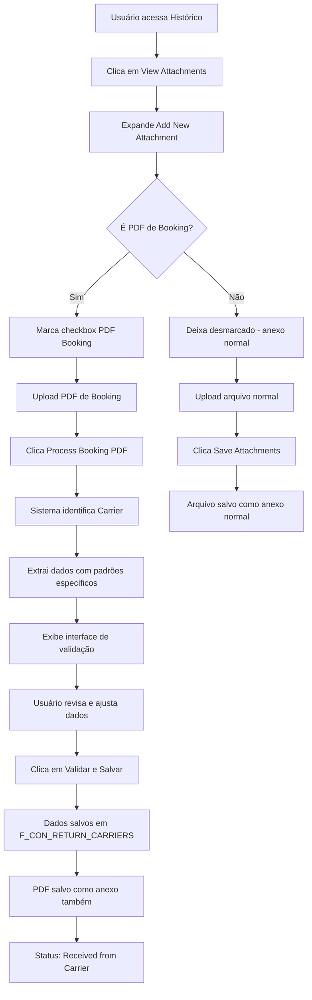

# 📄 PDF Booking Processor - Guia de Uso

## ✅ Funcionalidade Implementada

O sistema agora possui uma funcionalidade completa para processamento automático de PDFs de Booking recebidos por e-mail, integrando perfeitamente com o sistema de anexos existente.

## 🚀 Como Usar

### 1. **Acesso à Funcionalidade**
- Na tela de **Histórico** (`history.py`), clique no botão **"📎 View Attachments"**
- Expanda a seção **"📤 Add New Attachment"**

### 2. **Upload e Processamento do PDF**
1. **Marque o checkbox**: "📄 Este é um PDF de Booking para processamento automático"
2. **Selecione o arquivo**: O uploader mudará para "📄 Selecione o PDF de Booking" (apenas PDFs)
3. **Processe**: Clique em "🔍 Process Booking PDF" para extrair os dados automaticamente

### 2.1. **Upload de Outros Arquivos**
- **Deixe desmarcado** o checkbox para enviar outros tipos de arquivo (Word, Excel, imagens, etc.)
- Use "💾 Save Attachments" para arquivos normais

### 3. **Validação dos Dados Extraídos**
O sistema exibirá uma interface de validação com os dados extraídos:

#### **🚢 Informações do Navio**
- **Carrier/Armador**: Identificação automática (HAPAG-LLOYD, MAERSK, MSC, etc.)
- **Nome do Navio**: Extraído automaticamente do PDF
- **Voyage**: Código da viagem
- **Booking Reference**: Referência do booking do armador

#### **📦 Informações da Carga**
- **Quantidade de Containers**: Número extraído do PDF
- **Porto de Origem (POL)**: Port of Loading
- **Porto de Destino (POD)**: Port of Discharge

#### **📅 Datas**
- **ETD**: Estimated Time of Departure
- **ETA**: Estimated Time of Arrival

### 4. **Validação e Salvamento**
1. **Revise os dados**: Verifique se as informações extraídas estão corretas
2. **Ajuste se necessário**: Edite qualquer campo que precise de correção
3. **Salve**: Clique em "✅ Validar e Salvar" para confirmar

### 5. **Resultado**
- Os dados são salvos na tabela `F_CON_RETURN_CARRIERS`
- Status automaticamente definido como **"Received from Carrier"**
- Registro fica disponível na tela de histórico

## 🎯 Carriers Suportados

### **Identificação Automática**
O sistema identifica automaticamente os seguintes armadores:

- **HAPAG-LLOYD**
- **MAERSK** 
- **MSC**
- **CMA CGM**
- **COSCO**
- **EVERGREEN**
- **GENERIC** (para outros armadores)

### **Padrões de Extração**
Cada armador possui padrões específicos de extração otimizados para seus formatos de PDF.

## 🔧 Recursos Técnicos

### **Extração Inteligente**
- **Regex Patterns**: Padrões específicos por armador
- **Normalização**: Limpeza e formatação automática dos dados
- **Validação**: Verificação de tipos de dados (datas, números, etc.)

### **Interface de Usuário**
- **Validação Visual**: Interface amigável para revisão
- **Campos Editáveis**: Possibilidade de ajustar dados extraídos
- **Feedback Visual**: Indicadores de sucesso/erro

### **Integração**
- **Sistema de Anexos**: Totalmente integrado ao sistema existente
- **Banco de Dados**: Inserção direta na `F_CON_RETURN_CARRIERS`
- **Status Management**: Definição automática de status

## 📋 Campos Extraídos e Mapeados

| Campo PDF | Campo Sistema | Descrição |
|-----------|---------------|-----------|
| Booking Reference | Splitted Booking Reference | Referência do armador |
| Vessel Name | Vessel Name | Nome da embarcação |
| Voyage | Voyage Code | Código da viagem |
| Carrier | Voyage Carrier | Nome do armador |
| Quantity | Quantity of Containers | Número de containers |
| POL | Port of Loading POL | Porto de origem |
| POD | Port of Delivery POD | Porto de destino |
| ETD | ETD | Data de partida |
| ETA | ETA | Data de chegada |

## ⚠️ Requisitos Técnicos

### **Dependências**
- **PyPDF2**: Biblioteca para extração de texto de PDFs
- **Streamlit**: Framework da interface
- **Pandas**: Manipulação de dados
- **SQLAlchemy**: Conexão com banco de dados

### **Instalação**
```bash
pip install PyPDF2
```

## 🎉 Benefícios

### **Automação**
- ✅ **Extração automática** de dados de PDFs
- ✅ **Identificação inteligente** de armadores
- ✅ **Normalização** automática de dados

### **Eficiência**
- ✅ **Reduz tempo** de entrada manual de dados
- ✅ **Minimiza erros** de digitação
- ✅ **Padroniza informações**

### **Integração**
- ✅ **Totalmente integrado** ao sistema de anexos existente
- ✅ **Interface única** para todos os tipos de arquivo
- ✅ **Fluxo intuitivo** com flag de seleção
- ✅ **Mantém** compatibilidade com anexos normais

## 🔄 Fluxo Completo



## 📞 Suporte

Para dúvidas ou problemas:
1. Verifique se o PyPDF2 está instalado
2. Confirme que o PDF contém texto extraível (não é apenas imagem)
3. Teste com PDFs de diferentes armadores
4. Verifique os logs do sistema para erros específicos

---

**🎯 A funcionalidade está pronta para uso e totalmente integrada ao sistema existente!**
