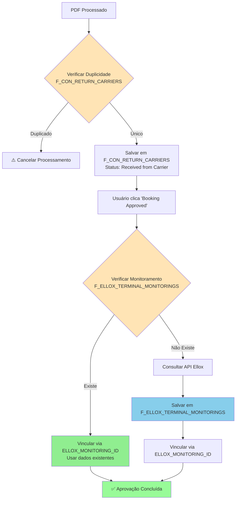
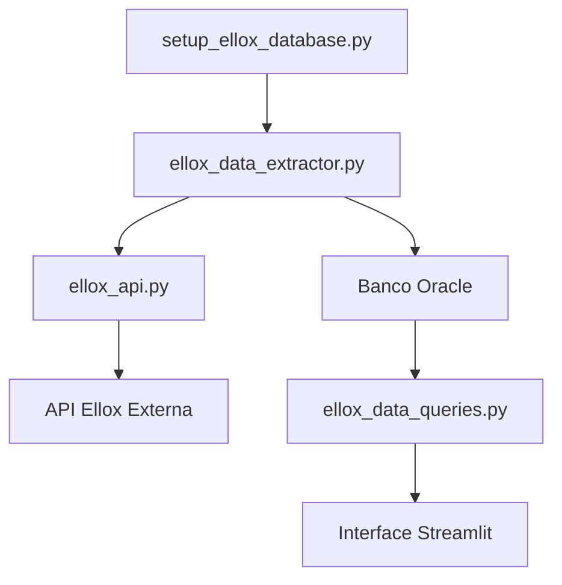
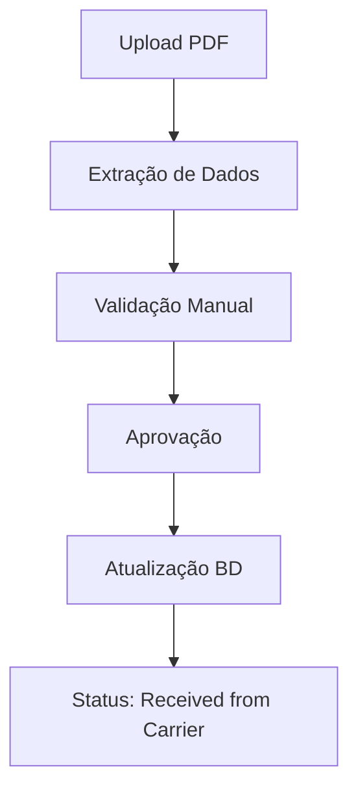
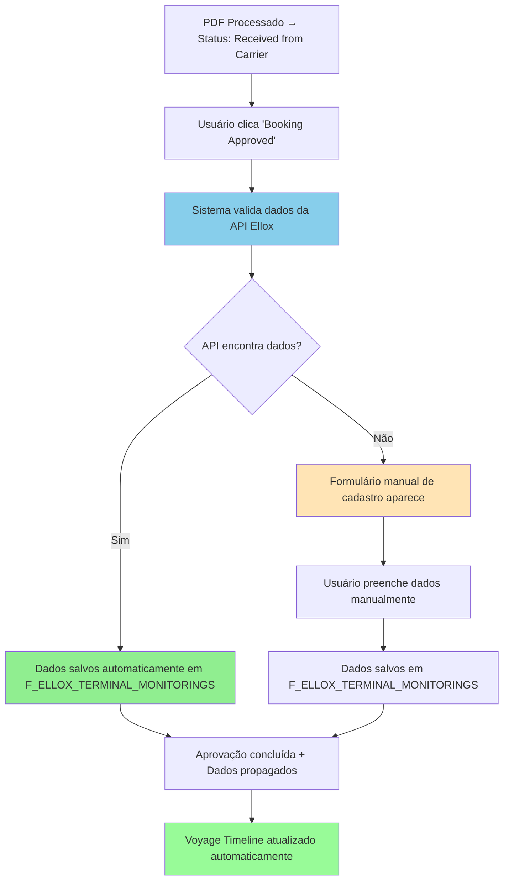
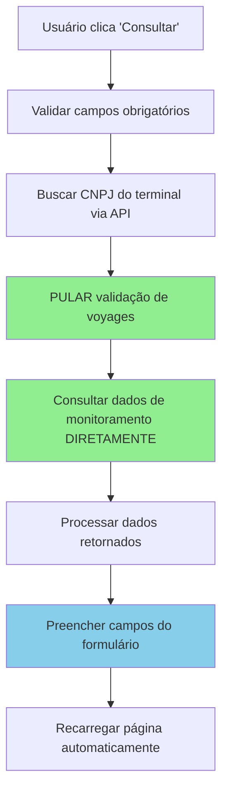

# 🏗️ Farol - Sistema de Gerenciamento de Embarques

[](https://python.org) [](https://streamlit.io) [](https://oracle.com) [](LICENSE)

Sistema completo de gerenciamento de embarques marítimos com interface web intuitiva, desenvolvido em Python com Streamlit e integração com banco de dados Oracle.

## 📋 Índice

- [Visão Geral](#-visão-geral)
- [Funcionalidades Principais](#-funcionalidades-principais)
- [Arquitetura do Sistema](#-arquitetura-do-sistema)
- [Instalação e Configuração](#-instalação-e-configuração)
- [Guia de Uso](#-guia-de-uso)
- [Módulos do Sistema](#-módulos-do-sistema)
- [Estrutura do Banco de Dados](#-estrutura-do-banco-de-dados)
- [Fluxos de Trabalho](#-fluxos-de-trabalho)
- [API e Integrações](#-api-e-integrações)
- [Sistema de Sincronização Automática Ellox](#-sistema-de-sincronização-automática-ellox)
- [Boas Práticas](#-boas-práticas---identificação-de-carriers)
- [Boas Práticas - Coleta de Hora Atual](#-boas-práticas---coleta-de-hora-atual)
- [Padronização de Campos](#-padronização-de-campos)
- [Changelog](#-changelog)
- [Contribuição](#-contribuição)
- [Suporte](#-suporte)

## 🎯 Visão Geral

O **Farol** é um sistema de gestão logística que permite o controle completo do ciclo de vida de embarques marítimos, desde a criação inicial até a aprovação final. O sistema oferece rastreamento em tempo real, gestão de documentos, processamento automatizado de PDFs e controle de status avançado.

### 🌟 Principais Benefícios

- **Centralização**: Todas as informações de embarque em um só lugar
- **Automação**: Processamento inteligente de PDFs de booking
- **Rastreabilidade**: Histórico completo de todas as alterações
- **Flexibilidade**: Sistema de ajustes e splits para mudanças de última hora
- **Integração**: Conectividade total com sistemas Oracle existentes

## ⚡ Funcionalidades Principais

### 📦 Gestão de Embarques
- **Criação de novos embarques** com validação automática
- **Edição em tempo real** com controle de alterações e persistência garantida
- **Sistema de splits** para divisão de cargas
- **Gestão de status** com workflow automatizado
- **Filtros avançados** e exportação de dados
- **Persistência robusta** de alterações em todos os stages (Sales Data, Booking Management, General View)

### 📄 Processamento de Documentos
- **Upload e gestão de anexos** com suporte a múltiplos formatos
- **Processamento automático de PDFs** de booking recebidos por email
- **Validação inteligente** de dados extraídos
- **Suporte a múltiplos carriers**: HAPAG-LLOYD, MAERSK, MSC, CMA CGM, COSCO, EVERGREEN, OOCL, PIL
- **Extração automática** de campos-chave (booking reference, vessel name, voyage, portos)

### 🔍 Audit Trail Inteligente
- **Filtros automáticos** que removem eventos de sistema desnecessários
- **Nomes amigáveis** para colunas (ex: "Confirmação Embarque" em vez de "B_DATA_CONFIRMACAO_EMBARQUE")
- **Mapeamento de origens** em português ("Criação do Booking", "Atualização de Viagem", etc.)
- **Interface limpa** focada apenas em ações manuais do usuário
- **Filtros dinâmicos** por origem, ação e coluna
- **Export CSV** dos dados filtrados

### 🔗 Sistema de Batch ID para Auditoria
- **Agrupamento automático** de mudanças relacionadas em uma única ação do usuário
- **UUID único por ação** que identifica todas as alterações feitas no mesmo momento
- **Rastreabilidade completa** de ciclos de mudança (ex: todas as colunas alteradas em um "Confirm Changes")
- **Aplicação automática** em todas as telas: Shipments, Tracking, Booking, Attachments
- **Consistência de dados** garantindo que mudanças relacionadas compartilhem o mesmo ID
- **Facilita análise** de padrões de uso e impacto de alterações

### 🔐 Sistema de Autenticação e Controle de Acesso
- **Autenticação segura** com banco de dados Oracle e hash bcrypt
- **Três níveis de acesso**: VIEW (Visualização), EDIT (Edição), ADMIN (Administrador)
- **Gestão completa de usuários** com interface administrativa integrada
- **Controle por unidade de negócio** (Cotton, Food, ou acesso a todas)
- **Senhas seguras** com hash bcrypt e força de troca no primeiro login
- **Interface de administração** para criar, editar e gerenciar usuários
- **Controle de permissões** aplicado em todas as funcionalidades do sistema
- **Auditoria de login** com registro de tentativas e último acesso
- **Reset de senhas** por administradores
- **Sistema escalável** para futuras expansões de níveis de acesso
- **Sessões persistentes** com JWT e cookies HTTP seguros (8 horas de duração)
- **Proteção contra compartilhamento** de sessões entre navegadores

### 🛡️ Sistema de Prevenção de Duplicidade Duplo

O sistema implementa **dois mecanismos distintos** de prevenção de duplicidade para garantir a integridade dos dados e evitar processamento desnecessário:

#### 1️⃣ **Prevenção de PDFs Duplicados (F_CON_RETURN_CARRIERS)**

**Objetivo**: Evitar processar o mesmo PDF múltiplas vezes para a mesma Farol Reference.

**Localização**: `pdf_booking_processor.py` → função `save_pdf_booking_data()`

**Critérios de Identificação**: Um PDF é considerado duplicado se já existir um registro na tabela `LogTransp.F_CON_RETURN_CARRIERS` com a mesma combinação de:
- `FAROL_REFERENCE` (Referência Farol)
- `B_BOOKING_REFERENCE` (Referência do Booking)
- `B_VOYAGE_CARRIER` (Armador da Viagem)
- `B_VOYAGE_CODE` (Código da Viagem)
- `B_VESSEL_NAME` (Nome do Navio)
- `PDF_BOOKING_EMISSION_DATE` (Data de Emissão/Impressão do PDF)

**Status Ignorados**: Para flexibilidade, a verificação **ignora** registros com status:
- `Attachment Deleted`
- `Booking Rejected`
- `Cancelled`
- `Adjustment Requested`

**Comportamento**:
- ✅ **PDF único**: Processa normalmente e salva na tabela
- ⚠️ **PDF duplicado**: Exibe aviso e cancela o processamento
- 🔄 **Status ignorado**: Permite reprocessamento mesmo com dados idênticos

#### 2️⃣ **Prevenção de Monitoramento Duplicado (F_ELLOX_TERMINAL_MONITORINGS)**

**Objetivo**: Evitar dados duplicados de monitoramento para o mesmo conjunto (navio/viagem/terminal), permitindo que múltiplas Farol References compartilhem os mesmos dados.

**Localização**: `database.py` → função `upsert_terminal_monitorings_from_dataframe()`

**Critérios de Identificação**: Um registro de monitoramento é considerado duplicado se já existir na tabela `LogTransp.F_ELLOX_TERMINAL_MONITORINGS` com a mesma combinação de:
- `NAVIO` (Nome do Navio)
- `VIAGEM` (Código da Viagem)
- `TERMINAL` (Nome do Terminal)

**Lógica de Prevenção Inteligente**:
1. **Primeira Verificação**: Se não existem dados para a combinação navio/viagem/terminal → **INSERIR**
2. **Segunda Verificação**: Se existem dados → verificar duplicata exata (incluindo timestamp)
3. **Se não é duplicata exata** → **INSERIR** (permitir evolução temporal)
4. **Se é duplicata exata** → **PULAR** (evitar duplicação)

**Rastreamento de Origem**:
- **`DATA_SOURCE='API'`**: Dados coletados automaticamente da API Ellox
- **`DATA_SOURCE='MANUAL'`**: Dados preenchidos manualmente pelo usuário
- **Interface**: Exibição clara na aba "Voyage Timeline" com ícone "✍️ Origem"

**Vantagens**:
- 🔗 **Compartilhamento**: Múltiplas Farol References podem usar os mesmos dados de monitoramento
- 📊 **Eficiência**: Evita consultas desnecessárias à API Ellox
- 🛡️ **Integridade**: Previne poluição da tabela com dados idênticos
- 🔍 **Rastreabilidade**: Identifica origem dos dados (API vs Manual)
- 📈 **Histórico**: Permite evolução temporal dos dados (ETD/ETA atualizados)

**Comportamento**:
- ✅ **Dados únicos**: Insere novo registro na tabela
- ⚠️ **Dados duplicados exatos**: Pula inserção e usa registro existente
- 🔗 **Vinculação**: Usa `ELLOX_MONITORING_ID` para vincular Farol References ao monitoramento

#### 🔗 **Sistema de Vinculação Inteligente (ELLOX_MONITORING_ID)**

**Objetivo**: Estabelecer relação estável entre registros de retorno e dados de monitoramento.

**Fluxo de Funcionamento**:

1. **Verificação Local**: Antes de consultar a API, verifica se já existe monitoramento para o conjunto (navio/viagem/terminal)

2. **Cenário 1 - Monitoramento Existente**:
   - Usa o `ID` do registro mais recente
   - Atualiza `ELLOX_MONITORING_ID` na tabela `F_CON_RETURN_CARRIERS`
   - **Não consulta a API** (evita tráfego desnecessário)

3. **Cenário 2 - Monitoramento Não Existente**:
   - Consulta a API Ellox para coletar dados
   - Salva novo registro em `F_ELLOX_TERMINAL_MONITORINGS`
   - Vincula via `ELLOX_MONITORING_ID`

4. **Histórico Temporal**:
   - Preserva todas as atualizações de monitoramento
   - Evita duplicatas exatas mas permite evolução temporal
   - Sempre vincula ao registro mais recente

**Benefícios**:
- ⚡ **Performance**: Evita consultas desnecessárias à API
- 🎯 **Precisão**: Dados sempre atualizados
- 🔧 **Flexibilidade**: Formulário manual quando API falha
- 📊 **Controle**: Usuário pode revisar dados antes da aprovação

#### 🔄 **Fluxo Integrado dos Dois Sistemas**



#### 🚨 **Problemas Identificados e Soluções Implementadas**

##### **Problema 1: Loop Infinito no Botão "Booking Approved"**
- **Sintoma**: Botão ficava travado em estado "Running..." indefinidamente
- **Causa**: `st.rerun()` mal gerenciado no fluxo de validação
- **Solução**: Refatoração do fluxo de estado e remoção de `st.rerun()` desnecessários
- **Status**: ✅ **Resolvido**

##### **Problema 2: Dados da API Não Salvos na Tabela de Monitoramento**
- **Sintoma**: Dados da API eram validados mas não salvos em `F_ELLOX_TERMINAL_MONITORINGS`
- **Causa**: Validação com `save_to_db=False` não salvava dados da API
- **Solução**: Salvamento imediato dos dados da API quando validação retorna sucesso
- **Status**: ✅ **Resolvido**

##### **Problema 3: Lógica de Prevenção de Duplicatas Muito Restritiva**
- **Sintoma**: Dados manuais não eram salvos em aprovações subsequentes
- **Causa**: Verificação de duplicatas incluía timestamp, impedindo inserções legítimas
- **Solução**: Lógica inteligente que verifica primeiro existência, depois duplicata exata
- **Status**: ✅ **Resolvido**

##### **Problema 4: Formulário Manual Não Desaparecia Após Aprovação**
- **Sintoma**: Formulário continuava exibido após aprovação bem-sucedida
- **Causa**: `st.rerun()` comentado após limpeza do `session_state`
- **Solução**: Reativação do `st.rerun()` para atualizar interface
- **Status**: ✅ **Resolvido**

##### **Problema 5: Erro de Importação do Pandas**
- **Sintoma**: `UnboundLocalError: cannot access local variable 'pd'`
- **Causa**: Import do pandas não definido no escopo da função `exibir_history()`
- **Solução**: Adição do import no início da função
- **Status**: ✅ **Resolvido**

##### **Problema 6: Experiência do Usuário na Página de Configurações (setup.py)**
- **Sintoma**: Tela "piscava" ao salvar credenciais; mensagens de sucesso apareciam fora de ordem ou desapareciam rapidamente; necessidade de clicar duas vezes para feedback.
- **Causa**: `st.rerun()` desnecessário ou mal posicionado; mensagens de `st.session_state` eram deletadas imediatamente; ordem de renderização de spinners e mensagens invertida.
- **Solução**: Remoção de `st.rerun()` desnecessários; mensagens de `st.session_state` agora persistem; ordem de exibição ajustada para que spinners apareçam antes das mensagens de sucesso; mensagens de salvamento agora aparecem abaixo dos quadros expansíveis.
- **Status**: ✅ **Resolvido**

##### **Problema 7: Validação de API no Formulário PDF**
- **Sintoma**: Usuário conseguia salvar o formulário de validação de PDF sem antes consultar a API de monitoramento de viagens.
- **Causa**: A verificação do *flag* `api_was_consulted` era feita de forma ineficaz, permitindo que o fluxo de salvamento continuasse. O uso de `return None` dentro de um formulário do Streamlit não interrompia a execução como esperado.
- **Solução**:
    1.  A verificação do *flag* foi movida para o início do bloco de submissão.
    2.  `st.stop()` foi utilizado para interromper completamente a execução se a API não tiver sido consultada.
    3.  A lógica para limpar o *flag* ao carregar um novo PDF foi reforçada, garantindo que a validação seja obrigatória para cada novo arquivo.
- **Status**: ✅ **Resolvido**

##### **Problema 8: Remoção da Coluna 'Splitted Farol Reference'**
- **Sintoma**: A coluna 'Splitted Farol Reference' e sua lógica associada ainda estavam presentes no código, apesar de ter sido removida do banco de dados.
- **Causa**: A coluna `S_SPLITTED_BOOKING_REFERENCE` foi removida do banco de dados, mas as referências a ela no código não foram totalmente eliminadas, causando inconsistências e potenciais erros.
- **Solução**:
    1.  Removida a coluna 'Splitted Farol Reference' da lista de colunas exibidas na aba "Request Timeline" em `history.py`.
    2.  Removida a lógica de derivação e preenchimento da coluna 'Splitted Farol Reference' na função `process_dataframe` em `history.py`.
    3.  Removida a coluna 'Splitted Farol Reference' da lista de ordenação desejada na função `display_tab_content` em `history.py`.
    4.  Removidas todas as ocorrências de `S_SPLITTED_BOOKING_REFERENCE` e 'Splitted Farol Reference' dos arquivos `database.py`, `database_empresa.py` e `shipments_mapping.py`.
    5.  Removida a configuração da coluna 'Splitted Farol Reference' em `shipments.py`.
- **Status**: ✅ **Resolvido**

#### 📊 **Fluxo de Aprovação de Booking**

O fluxo de aprovação de um retorno de armador (PDF) foi redesenhado para oferecer maior controle e clareza ao usuário.

**Novo Fluxo de Aprovação (v4.0+)**

1.  **Seleção do Retorno**: Na aba "Request Timeline", o usuário seleciona o PDF que deseja avaliar na seção "⚡ Evaluate Carrier Return".
2.  **Ação de Aprovar**: O usuário clica no botão "Booking Approved".
3.  **Seleção do Tipo de Ajuste**: O sistema exibe a seção "Adjustment Type", onde o usuário deve classificar o retorno do armador:
    *   **An adjustment request made by our company**: Para retornos que são uma resposta a um pedido de ajuste interno.
    *   **A new/external adjustment initiated by the carrier itself**: Para ajustes que partiram do próprio armador, sem uma solicitação interna prévia.
4.  **Continuação do Fluxo**: Após clicar em "Continue", o sistema segue um de dois caminhos:

    *   **Cenário 1: Ajuste Interno**
        *   A seção "Related Reference" é exibida.
        *   O usuário seleciona a qual solicitação de ajuste interna o PDF se refere.
        *   Ao clicar em "Confirm Approval", o sistema vincula os registros e aprova o booking.

    *   **Cenário 2: Ajuste Externo**
        *   O formulário "New External Adjustment" é exibido.
        *   O usuário preenche os campos de justificativa (motivo, responsabilidade, comentários).
        *   Ao clicar em "Confirm Approval", o sistema cria um novo registro de ajuste e aprova o booking.

5.  **Voltar**: Em cada etapa do novo fluxo, um botão "Back" foi adicionado para permitir que o usuário retorne à seleção anterior.
6.  **Conclusão**: Em ambos os cenários, o status do booking é atualizado para "Booking Approved" e o histórico é registrado.

Este novo fluxo garante que cada aprovação de PDF seja corretamente contextualizada, melhorando a rastreabilidade e a precisão dos dados. A interface foi aprimorada com um container que agrupa as ações, separadores visuais e alinhamento à esquerda para uma experiência de usuário mais limpa.

#### 🎯 **Resultado Final**

O sistema agora funciona perfeitamente para ambos os cenários:
- ✅ **Prevenção de duplicidade** funcionando corretamente
- ✅ **Salvamento de dados** em ambas as tabelas
- ✅ **Vinculação inteligente** via `ELLOX_MONITORING_ID`
- ✅ **Interface responsiva** sem loops infinitos
- ✅ **Fluxo completo** do processamento à aprovação

**Resumo da Integração**:
- **Sistema 1** (PDFs): Previne processamento duplicado de documentos
- **Sistema 2** (Monitoramento): Previne dados duplicados de API, permitindo compartilhamento
- **Vinculação**: `ELLOX_MONITORING_ID` conecta ambos os sistemas de forma eficiente
- **Resultado**: Dados limpos, performance otimizada e integridade garantida

> **⚠️ Problema Crítico Identificado e Resolvido:** Durante o desenvolvimento, foi identificado um problema crítico no botão "Booking Approved" que impedia o funcionamento correto do sistema de prevenção de duplicidade. O problema estava relacionado ao gerenciamento de estado complexo no arquivo `history.py`, onde uma "máquina de estados" com múltiplos recarregamentos de página (`st.rerun`) causava perda de estado e impediam que as mensagens de sucesso da API fossem exibidas corretamente.
>
> **🔧 Solução Implementada:** O problema foi resolvido através de uma refatoração completa que:
> - **Eliminou a máquina de estados complexa** que causava múltiplos `st.rerun()`
> - **Centralizou a lógica de validação** diretamente no botão "Booking Approved"
> - **Simplificou o fluxo** para um único `st.rerun()` após o processamento
> - **Garantiu a exibição correta** das mensagens de sucesso e formulários manuais
>
> **📊 Resultado:** O sistema agora funciona perfeitamente, exibindo corretamente:
> - ✅ Mensagens de sucesso quando dados são encontrados na API
> - ✅ Formulários manuais quando a API falha ou requer entrada manual
> - ✅ Validação completa de dados de monitoramento
> - ✅ Prevenção de duplicidade funcionando como esperado
>
> **📋 Documentação Técnica:** Para detalhes completos do processo de debugging, análise da causa raiz e implementação da solução, consulte o arquivo `ANALISE_DEBUG_LOOP_INFINITO.md`.

---

- **Interface de validação** com correção manual de dados
- **Histórico completo** de documentos por embarque
- **Datas ETD/ETA**: Responsabilidade da API Ellox ou preenchimento manual (não mais extraídas automaticamente)
 
#### Padronização de Terminais (PDF → API Ellox)

- Alguns PDFs utilizam nomes históricos/alternativos de terminais. Exemplo:
  - "Embraport Empresa Brasileira" (PDF) → reconhecido como "DPW"/"DP WORLD" na API Ellox.
- O sistema aplica normalização automática ao solicitar/visualizar monitoramento:
  - Mapeia por heurística (contains) e consulta a tabela local `F_ELLOX_TERMINALS` por termos: `DPW`, `DP WORLD`, `EMBRAPORT`.
  - Caso encontrado, usa o `CNPJ` correspondente para as chamadas `/api/monitor/navio` e `/api/terminalmonitorings`.
  - Caso não encontrado, permanece com o fallback (ex.: Santos Brasil) e informa na interface.

Observação: se notar um novo alias de terminal em PDFs, informe para incluirmos na regra de normalização.

### 🚢 Sistema de Tracking em Tempo Real
- **Integração com API Ellox** da Comexia para tracking marítimo
- **Autenticação automática** com credenciais configuráveis
- **Três modos de consulta**:
  - 🔍 **Busca Manual**: Consulta por navio, carrier e voyage
  - 📦 **Bookings Existentes**: Tracking automático de bookings do banco
  - 📅 **Cronograma**: Consulta de escalas futuras de navios
- **Status visual em tempo real**: 🟢 Online / 🟡 Lento / 🔴 Desconectado
- **Interface interativa** para configuração de credenciais
- **Métricas de performance**: IMO, MMSI, posição atual, ETA, atrasos
  - Nota: O campo "Confirmação Embarque" não é exibido nesta tela (Tracking); ele permanece disponível na tela principal (shipments.py).

### 🔄 Controle de Status
- **Workflow personalizado** com múltiplos status
- **Aprovação de retornos** do armador com validação
- **Sistema de justificativas** obrigatórias para alterações
- **Rastreamento completo** do ciclo de vida

### 📊 Relatórios e Analytics
- **Dashboards interativos** com métricas em tempo real
- **Controle de performance** por período
- **Análise operacional** detalhada
- **Exportação** em múltiplos formatos

## 🏗️ Arquitetura do Sistema

```
┌─────────────────┐    ┌─────────────────┐    ┌─────────────────┐
│   Frontend      │    │   Backend       │    │   Database      │
│   (Streamlit)   │◄──►│   (Python)      │◄──►│   (Oracle)      │
└─────────────────┘    └─────────────────┘    └─────────────────┘
         │                       │                       │
         │                       │                       │
    ┌────▼────┐            ┌─────▼─────┐         ┌──────▼──────┐
    │  UI/UX  │            │ Business  │         │   Tables    │
    │Components│            │   Logic   │         │ & Triggers  │
    └─────────┘            └───────────┘         └─────────────┘
```

### 🔧 Stack Tecnológico

- **Frontend**: Streamlit (Interface Web Responsiva)
- **Backend**: Python 3.8+ (Lógica de Negócio)
- **Database**: Oracle Database (Armazenamento de Dados)
- **ORM**: SQLAlchemy (Mapeamento Objeto-Relacional)
- **Data Processing**: Pandas (Manipulação de Dados)
- **File Processing**: PyPDF2, openpyxl (Processamento de Arquivos)

## ⚠️ Comportamento do F5 (Atualização de Página)

### Limitação do Streamlit

O **Streamlit não foi projetado** para manter sessões persistentes após F5 (atualização de página). Este é um **comportamento esperado** do framework, não um bug.

### Por Que Isso Acontece?

1. **Streamlit é stateless por design** - cada execução reinicia o estado
2. **F5 = reiniciar aplicação** - não é uma SPA (Single Page Application)
3. **Session_id muda a cada F5** - mesmo no mesmo navegador
4. **st.session_state é volátil** - sempre resetado no F5

### Solução Implementada

**✅ Aceitar a limitação** - Esta é a abordagem mais realista e prática:

- **Aviso claro** na tela de login sobre F5
- **Sessão de 8 horas** - tempo suficiente para um dia de trabalho
- **UX melhorada** - login rápido com dicas
- **Orientação ao usuário** - use os botões da aplicação para navegar

### Como Usar Corretamente

1. **Faça login** normalmente (admin/Admin@2025)
2. **Use os botões** da aplicação para navegar
3. **Evite F5** - use o botão Logout se precisar sair
4. **Sessão dura 8h** - tempo suficiente para trabalho diário

### Alternativas Consideradas

- **streamlit-authenticator**: Perderia integração Oracle
- **Migrar para framework web**: 1-2 semanas de desenvolvimento
- **Aceitar limitação**: ✅ **Escolhida** - Solução realista e prática

## 🚀 Instalação e Configuração

### Pré-requisitos

- Python 3.8 ou superior
- Oracle Database 19c ou superior
- Oracle Instant Client
- Acesso à rede corporativa

### 1. Clone o Repositório

```bash
git clone https://github.com/sua-empresa/farol-sistema.git
cd farol-sistema
```

### 2. Configuração do Ambiente

```bash
# Criar ambiente virtual
python -m venv farol-env

# Ativar ambiente (Windows)
farol-env\Scripts\activate

# Ativar ambiente (Linux/Mac)
source farol-env/bin/activate
```

### 3. Instalar Dependências

```bash
pip install -r requirements.txt
```

**Dependências principais:**
- `streamlit` - Framework web
- `oracledb` - Conectividade Oracle
- `bcrypt` - Hash de senhas
- `PyJWT` - Tokens JWT para autenticação
- `pandas` - Manipulação de dados
- `sqlalchemy` - ORM para Oracle

### 4. Configuração do Banco de Dados

```python
# Configurar variáveis de ambiente ou editar database.py
ORACLE_HOST = "seu-servidor-oracle"
ORACLE_PORT = "1521"
ORACLE_SERVICE = "seu-servico"
ORACLE_USER = "seu-usuario"
ORACLE_PASSWORD = "sua-senha"
```

### 5. Executar o Sistema

```bash
streamlit run app.py
```

**⚠️ Importante sobre F5:**
- Evite pressionar F5 (atualizar página) - use os botões da aplicação
- F5 causará logout automático (comportamento esperado do Streamlit)
- Sessão dura 8 horas - tempo suficiente para trabalho diário
- Use o botão "Logout" se precisar sair da aplicação

O sistema estará disponível em `http://localhost:8501`

## 🔐 Sistema de Autenticação e Controle de Acesso

### Visão Geral

O Farol possui um sistema completo de autenticação integrado com banco de dados Oracle, oferecendo controle granular de acesso e gestão segura de usuários. O sistema utiliza hash bcrypt para segurança das senhas, JWT para tokens de sessão e cookies HTTP seguros para persistência, oferecendo três níveis de acesso distintos.

### Arquitetura de Autenticação

- **Backend**: Oracle Database com tabelas `F_CON_USERS` e `F_CON_SESSIONS`
- **Hash de Senhas**: bcrypt com salt automático
- **Tokens de Sessão**: JWT (JSON Web Tokens) com expiração de 8 horas
- **Persistência**: Cookies HTTP seguros (HttpOnly, SameSite=Strict)
- **Isolamento**: Cada navegador tem sessão independente
- **Segurança**: Proteção contra compartilhamento de sessões

### Níveis de Acesso

#### 👁️ **VIEW (Visualização)**
- **Permissões**: Apenas leitura de dados
- **Funcionalidades**: Visualizar embarques, relatórios, histórico
- **Restrições**: Não pode editar, criar ou deletar registros
- **Uso recomendado**: Usuários que precisam apenas consultar informações

#### ✏️ **EDIT (Edição)**
- **Permissões**: Leitura + Edição de dados
- **Funcionalidades**: Todas as funcionalidades de VIEW + editar embarques, criar novos registros
- **Restrições**: Não pode gerenciar usuários
- **Uso recomendado**: Usuários operacionais que precisam modificar dados

#### ⚙️ **ADMIN (Administrador)**
- **Permissões**: Acesso total ao sistema
- **Funcionalidades**: Todas as funcionalidades + gestão de usuários
- **Especiais**: Criar, editar, desativar usuários; resetar senhas; configurar unidades de negócio
- **Uso recomendado**: Administradores do sistema e supervisores

### Gerenciamento de Sessões

#### Comportamento da Sessão
- **Duração**: 8 horas de inatividade
- **Persistência**: Mantida entre navegação de páginas
- **Isolamento**: Cada navegador tem sessão independente
- **Segurança**: Tokens JWT com assinatura criptográfica

#### ⚠️ Limitação do F5 (Atualização de Página)
- **F5 causa logout** - comportamento esperado do Streamlit
- **Use os botões** da aplicação para navegar
- **Sessão de 8h** - tempo suficiente para trabalho diário
- **Botão Logout** - use se precisar sair da aplicação

### Primeiro Acesso

#### Credenciais Padrão
Após a instalação inicial, use as seguintes credenciais:

- **Username**: `admin`
- **Password**: `Admin@2025`
- **Nível**: Administrador

⚠️ **IMPORTANTE**: Troque a senha padrão imediatamente após o primeiro login!

#### Passo a Passo
1. Execute o sistema Farol
2. Na tela de login, digite `admin` / `Admin@2025`
3. Acesse **Setup > Administração de Usuários**
4. Crie novos usuários conforme necessário
5. Troque a senha do admin por uma senha segura

### Administração de Usuários

#### Como Acessar
1. Faça login como usuário ADMIN
2. No menu lateral, clique em **Setup**
3. Selecione a aba **Administração de Usuários**

#### Funcionalidades Disponíveis

##### 📋 **Listar Usuários**
- Visualizar todos os usuários cadastrados
- Ver status (ativo/inativo), nível de acesso, último login
- Métricas: total de usuários, ativos, administradores, editores

##### ➕ **Criar Novo Usuário**
- **Campos obrigatórios**:
  - Username (único)
  - Email (único)
  - Nome completo
  - Senha inicial (mínimo 6 caracteres)
  - Nível de acesso
- **Campos opcionais**:
  - Unidade de negócio (Cotton, Food, ou Todas)
- **Comportamento**: Usuário será forçado a trocar senha no primeiro login

##### ✏️ **Editar Usuário**
- Modificar dados pessoais (email, nome)
- Alterar nível de acesso
- Ativar/desativar usuário
- Alterar unidade de negócio
- **Username não pode ser alterado**

##### 🔑 **Reset de Senha**
- Selecionar usuário
- Definir nova senha
- Confirmar nova senha
- **Comportamento**: Usuário será forçado a trocar senha no próximo login

### Unidades de Negócio

O sistema suporta controle de acesso por unidade de negócio:

- **Cotton**: Acesso apenas a embarques da unidade Cotton
- **Food**: Acesso apenas a embarques da unidade Food  
- **Todas**: Acesso a todas as unidades (padrão para ADMIN)

### Boas Práticas

#### Política de Senhas
- **Mínimo**: 6 caracteres
- **Recomendado**: 8+ caracteres com maiúsculas, minúsculas, números e símbolos
- **Troca obrigatória**: No primeiro login e quando resetada por admin
- **Segurança**: Senhas são armazenadas com hash bcrypt (60 caracteres)

#### Gestão de Usuários
- **Desative usuários** em vez de deletar (preserva histórico)
- **Use níveis apropriados**: VIEW para consultas, EDIT para operações, ADMIN para gestão
- **Monitore último login**: Identifique usuários inativos
- **Documente mudanças**: Use campos de auditoria (criado por, atualizado por)

#### Controle de Acesso
- **Princípio do menor privilégio**: Dê apenas o acesso necessário
- **Revisão periódica**: Verifique permissões regularmente
- **Separação de funções**: Diferentes usuários para diferentes responsabilidades

### Estrutura do Banco de Dados

#### Tabela `LogTransp.F_CON_USERS`
```sql
-- Principais colunas:
USER_ID              -- Chave primária (auto-incremento)
USERNAME             -- Nome de usuário único
EMAIL                -- Email único
PASSWORD_HASH        -- Hash bcrypt da senha (60 chars)
FULL_NAME            -- Nome completo
BUSINESS_UNIT        -- Unidade de negócio (NULL = todas)
ACCESS_LEVEL         -- VIEW/EDIT/ADMIN
IS_ACTIVE            -- 1=ativo, 0=inativo
CREATED_AT           -- Data de criação
LAST_LOGIN           -- Último login bem-sucedido
PASSWORD_RESET_REQUIRED -- 1=deve trocar senha
```

### Troubleshooting

#### Problemas Comuns

**❌ "Usuário ou senha incorretos"**
- Verifique se o username está correto
- Confirme a senha (case-sensitive)
- Verifique se o usuário está ativo

**❌ "Acesso negado"**
- Verifique seu nível de acesso
- Confirme se tem permissão para a funcionalidade
- Entre em contato com um administrador

**❌ "Usuário inativo"**
- Usuário foi desativado por um administrador
- Solicite reativação ao administrador do sistema

**❌ "Erro de conexão com banco"**
- Verifique configuração do Oracle
- Confirme se a tabela `F_CON_USERS` existe
- Execute o script de inicialização se necessário

#### Scripts de Manutenção

**Inicializar Sistema de Autenticação:**
```bash
python scripts/init_auth_system.py
```

**Verificar Estrutura do Banco:**
```sql
-- Verificar se tabela existe
SELECT COUNT(*) FROM user_tables WHERE table_name = 'F_CON_USERS';

-- Listar usuários
SELECT USERNAME, FULL_NAME, ACCESS_LEVEL, IS_ACTIVE FROM LogTransp.F_CON_USERS;
```

## 📖 Guia de Uso

### 🏠 Tela Principal - Shipments

A tela principal oferece uma visão completa de todos os embarques:

1. **Filtros Rápidos (sempre visíveis)**: Logo abaixo dos KPIs, os filtros:
   - Farol Reference (texto)
   - Farol Status (lista)
   - Booking Status (lista)
   - Booking (texto)
   Esses filtros são aplicados antes da paginação, garantindo que resultados em páginas seguintes também sejam encontrados. Suporte a variações de colunas: `FAROL_STATUS`, `B_BOOKING_REFERENCE`, `_BOOKING_REFERENCE`.
2. **Filtros Avançados (expander)**: Filtros adicionais por múltiplas colunas. Quando ativos, o sistema busca todos os registros, aplica os filtros e só então pagina no cliente (não limita à página atual).
3. **Edição em Linha**: Clique nas células para editar informações diretamente
   - Farol Status: editável novamente via dropdown com ícones (width: medium)
4. **Seleção de Embarques**: Use os checkboxes para selecionar embarques
5. **Ações Rápidas**: Botões para criar, editar e gerenciar embarques

### 📋 Stages (Etapas)

- **Sales Data**: Informações iniciais de venda
- **Booking Management**: Gestão de reservas e bookings

### 🔄 Workflow de Status

```
New Request → Booking Requested → Received from Carrier → Booking Approved
     │              │                    │                     │
     └──────────────┼────────────────────┼─────────────────────┘
                    │                    │
              Adjustment Requested   Booking Rejected
                    │                    │
                    └────────────────────┘
```

### 🔐 Sistema de Login e Auditoria

#### **Login no Sistema**
1. **Acesso**: Execute `streamlit run app.py`
2. **Credenciais de Teste**:
   - `admin` / `admin123`
   - `user1` / `user123`
   - `diego` / `diego123`
3. **Sessão**: O sistema mantém a sessão ativa até logout
4. **Informações**: Nome do usuário e duração da sessão exibidos na sidebar

#### **Audit Trail - Histórico de Mudanças**
1. **Acesso**: Navegue para uma referência no Shipments
2. **History**: Clique no botão "History" da referência
3. **Aba Audit Trail**: Selecione a aba "🔍 Audit Trail"
4. **Funcionalidades**:
   - **Filtros**: Por origem, ação e coluna
   - **Contagem no rótulo**: Exibe número de registros no rótulo da aba
   - **Export**: Download dos dados filtrados em CSV
   - **Timestamps**: Conversão automática para fuso do Brasil

#### **Rastreabilidade Completa**
- **Todas as alterações** são registradas automaticamente
- **Quem alterou**: Login do usuário responsável
- **Quando alterou**: Timestamp preciso da mudança
- **O que alterou**: Campo específico e valores anterior/novo
- **De onde alterou**: Origem da mudança (booking_new, tracking, history, etc.)

### 🎨 Farol Status - Ícones Visuais

Para melhorar a experiência do usuário, o sistema Farol utiliza ícones visuais para representar cada `Farol Status`. Esta funcionalidade foi implementada de forma a não impactar a integridade dos dados no banco de dados.

**Princípio Chave**: A lógica de ícones é uma camada de **apresentação (frontend)**. O banco de dados continua armazenando apenas o texto puro do status (ex: `Booking Approved`), enquanto a interface se encarrega de adicionar e remover os ícones (ex: `✅ Booking Approved`) dinamicamente.

#### Arquivo Central da Lógica

Toda a funcionalidade de mapeamento de ícones está centralizada no arquivo:
- `shipments_mapping.py`

#### Funções Principais

O arquivo `shipments_mapping.py` contém um conjunto de funções para gerenciar os ícones:

- `get_farol_status_icons()`: Retorna um dicionário que mapeia cada string de status ao seu ícone correspondente.
- `get_display_from_status(status)`: Recebe um status (texto puro) и retorna a string formatada com o ícone.
- `get_status_from_display(display_status)`: Recebe uma string formatada com ícone e a converte de volta para o texto puro. `clean_farol_status_value` é um apelido (alias) para esta função.
- `process_farol_status_for_display(df)`: Aplica a formatação com ícones a um DataFrame inteiro (usado ao carregar dados).
- `process_farol_status_for_database(df)`: Remove os ícones de um DataFrame inteiro (usado antes de salvar).

#### Fluxo de Integração

A integração ocorre em três pontos principais para garantir que o usuário sempre veja os ícones, mas o banco de dados nunca os receba.

**1. Exibição dos Dados (Carregamento)**
        - **Onde**: `database.py` e `history.py`
        - **Como**: As funções que carregam dados para as grades (`get_data_salesData`, etc.) e a que processa o histórico (`process_dataframe` em `history.py`) chamam `process_farol_status_for_display` antes de exibir os dados.
```python
# Em database.py -> get_data_salesData()
def get_data_salesData():
    # ... lógica de busca no banco ...
    df = pd.read_sql_query(text(query), conn)
    # ...
    # Adiciona ícones ao Farol Status para exibição
    df = process_farol_status_for_display(df)
    return df
```

**2. Opções do Dropdown (Edição)**
- **Onde**: `shipments_mapping.py`
- **Como**: A função `drop_downs` formata as opções do dropdown do `Farol Status` usando `get_display_from_status`. Isso faz com que a lista de seleção na grade também contenha os ícones, permitindo que os valores correspondam.

```python
# Em shipments_mapping.py -> drop_downs()
"Farol Status": [get_display_from_status(s) for s in df_udc[...].tolist()],
```

**3. Salvamento dos Dados (Gravação)**
- **Onde**: `shipments.py`
- **Como**: No laço que detecta alterações na grade, há uma verificação específica para a coluna `Farol Status`. A função `clean_farol_status_value` é usada para remover o ícone do valor antigo e do novo valor antes que a alteração seja registrada e enviada para o banco de dados.

```python
# Em shipments.py -> exibir_shipments()
if col == "Farol Status":
    from_status = clean_farol_status_value(old_val)
    to_status = clean_farol_status_value(new_val)
    # ...
    changes.append({
        # ...
        "Previous Value": from_status, # Valor limpo
        "New Value": to_status,       # Valor limpo
        # ...
    })
```


## 🧩 Módulos do Sistema


### 📦 `shipments.py`
**Módulo principal** de gestão de embarques
- Interface principal do sistema
- Edição em tempo real de dados
- Controle de alterações e validações
- Sistema de filtros avançados

### 🛠️ `shipments_split.py`
**Sistema de ajustes e divisões**
- Divisão de embarques em múltiplas partes
- Ajustes de quantidades e destinos
- Validação de integridade de dados
- Justificativas obrigatórias

#### ⚠️ **Tratamento Especial de Colunas de Data (CRÍTICO)**

**Problema Identificado**: As colunas de data específicas (`Required Arrival Date`, `Requested Deadline Start Date`, `Requested Deadline End Date`) não estavam sendo salvas corretamente na tabela `F_CON_RETURN_CARRIERS` durante operações de split.

**Causa Raiz**: 
1. **Mapeamento incorreto** na função `perform_split_operation` - tentativa de aplicar prefixo "Sales" a colunas que não o possuem
2. **Inconsistência de nomes** entre tabelas:
   - `F_CON_SALES_BOOKING_DATA`: `S_REQUIRED_ARRIVAL_DATE`
   - `F_CON_RETURN_CARRIERS`: `S_REQUIRED_ARRIVAL_DATE_EXPECTED`
3. **Lógica de pré-preenchimento** sobrescrevendo valores da UI

**Solução Implementada**:

```python
# 1. Mapeamento direto para colunas de data específicas
if ui_label in ["Requested Deadline Start Date", "Requested Deadline End Date", "Required Arrival Date"]:
    col = reverse_map.get(ui_label)
    if col:
        # Mapeia diretamente sem prefixo
        actual_col = find_column_case_insensitive(df, col)
        if actual_col:
            df.at[0, actual_col] = value
else:
    # Lógica original para outras colunas
    label = ui_label.replace("Sales", prefix)
    # ... resto do código
```

```python
# 2. Correção na função insert_return_carrier_from_ui
# Conversão de data para colunas S_REQUESTED_* e S_REQUIRED_*
if (db_key.startswith("B_DATA_") or 
    db_key.startswith("S_REQUESTED_") or 
    db_key.startswith("S_REQUIRED_")) and isinstance(value, str) and value.strip():
    # Conversão de data para essas colunas específicas
```

```python
# 3. Mapeamento correto entre tabelas
# Na função upsert_return_carrier_from_unified
if "S_REQUIRED_ARRIVAL_DATE" in data:
    data["S_REQUIRED_ARRIVAL_DATE_EXPECTED"] = data["S_REQUIRED_ARRIVAL_DATE"]
```

**Campos Afetados**:
- ✅ `S_REQUESTED_DEADLINE_START_DATE` - **FUNCIONANDO**
- ✅ `S_REQUESTED_DEADLINE_END_DATE` - **FUNCIONANDO**  
- ✅ `S_REQUIRED_ARRIVAL_DATE_EXPECTED` - **CORRIGIDO**

**Teste de Validação**:
```python
# Script de teste para verificar funcionamento
test_ui_data = {
    "Required Arrival Date": "2025-01-15",
    "Requested Deadline Start Date": "2025-01-10", 
    "Requested Deadline End Date": "2025-01-20"
}
# Resultado: Todas as colunas são salvas corretamente na F_CON_RETURN_CARRIERS
```

**⚠️ IMPORTANTE**: Qualquer modificação futura no `shipments_split.py` deve considerar este mapeamento especial para evitar regressão.

#### 🔄 **Pré-preenchimento Automático de Datas - Regras Críticas (v3.9.9)**

**Funcionalidade**: Sistema preenche automaticamente campos de data quando um PDF é validado e salvo, baseado nos últimos valores da mesma Farol Reference.

**Campos Pré-preenchidos**:
- `Required Arrival Date` (S_REQUIRED_ARRIVAL_DATE_EXPECTED)
- `Requested Deadline Start Date` (S_REQUESTED_DEADLINE_START_DATE)  
- `Requested Deadline End Date` (S_REQUESTED_DEADLINE_END_DATE)

**⚠️ REGRAS CRÍTICAS PARA EVITAR REGRESSÃO**:

1. **No `pdf_booking_processor.py`**: 
   - **SEMPRE** definir campos de data como `None` (nunca strings vazias `""`)
   - **NUNCA** definir como `""` pois impede o pré-preenchimento

2. **No `database.py`**:
   - Lógica de pré-preenchimento deve tratar tanto `None` quanto strings vazias
   - Condição: `if current_value is None or (isinstance(current_value, str) and current_value.strip() == "")`

3. **Teste de Validação**:
   ```python
   # ✅ CORRETO - permite pré-preenchimento
   "Requested Deadline Start Date": None,
   
   # ❌ INCORRETO - impede pré-preenchimento  
   "Requested Deadline Start Date": "",
   ```

**Causa Raiz do Bug v3.9.9**: Strings vazias (`""`) não são tratadas como valores nulos pela lógica original, impedindo o pré-preenchimento automático.

**⚠️ IMPACTO**: Qualquer alteração que defina campos de data como strings vazias quebrará o pré-preenchimento automático.

#### 🏷️ **Mapeamento de P_STATUS - Regras Críticas (v3.9.10)**

**Funcionalidade**: Sistema identifica corretamente a origem dos ajustes no histórico através do campo P_STATUS.

**Mapeamentos de P_STATUS**:
- `"Adjusts Cargill"` → "🛠️ Cargill (Adjusts)" (ajustes criados pela Cargill)
- `"Adjusts Carrier"` → "🚢 Adjusts Carrier" (ajustes de carriers)
- `"Booking Request - Company"` → "📋 Booking Request" (pedidos de booking)
- `"PDF Document - Carrier"` → "📄 PDF Document" (documentos PDF)
- `"Adjustment Request - Company"` → "🛠️ Adjustment Request" (solicitações de ajuste)
- `"Other Request - Company"` → "⚙️ Other Request" (outras solicitações)

**⚠️ REGRAS CRÍTICAS PARA EVITAR REGRESSÃO**:

1. **No `shipments_split.py`**: 
   - **SEMPRE** definir `p_status_override="Adjusts Cargill"` para ajustes da Cargill
   - **NUNCA** omitir o parâmetro `p_status_override` pois resulta em "Other Request"

2. **No `history.py`**:
   - Lógica de mapeamento deve tratar tanto nomes novos quanto antigos
   - Condição: `if low == "adjusts cargill": return "🛠️ Cargill (Adjusts)"`

3. **Teste de Validação**:
   ```python
   # ✅ CORRETO - identifica como ajuste da Cargill
   insert_return_carrier_from_ui(
       ui_row, 
       p_status_override="Adjusts Cargill",  # ← OBRIGATÓRIO
       # ... outros parâmetros
   )
   
   # ❌ INCORRETO - resulta em "Other Request"  
   insert_return_carrier_from_ui(
       ui_row, 
       # p_status_override omitido = "Other Request - Company"
       # ... outros parâmetros
   )
   ```

**Causa Raiz do Bug v3.9.10**: Omissão do parâmetro `p_status_override` resultava em uso do valor padrão "Other Request - Company".

**⚠️ IMPACTO**: Qualquer alteração que omita `p_status_override` em ajustes da Cargill resultará em identificação incorreta no histórico.

#### 🔄 **Pré-preenchimento Automático de Datas em PDFs (v3.9.8)**

**Funcionalidade Implementada**: Sistema agora preenche automaticamente os campos de data quando um PDF é validado e salvo, baseado nos últimos valores da mesma Farol Reference.

**Campos Pré-preenchidos**:
- `Required Arrival Date` (S_REQUIRED_ARRIVAL_DATE_EXPECTED)
- `Requested Deadline Start Date` (S_REQUESTED_DEADLINE_START_DATE)  
- `Requested Deadline End Date` (S_REQUESTED_DEADLINE_END_DATE)

**Implementação Técnica**:

```python
# 1. Função de busca dos últimos valores
def get_last_date_values_from_carriers(farol_reference: str) -> dict:
    """
    Busca os últimos valores dos campos de data da tabela F_CON_RETURN_CARRIERS
    para uma Farol Reference específica, independentemente do status.
    """
    query = text("""
        SELECT 
            S_REQUESTED_DEADLINE_START_DATE,
            S_REQUESTED_DEADLINE_END_DATE,
            S_REQUIRED_ARRIVAL_DATE_EXPECTED,
            ROW_INSERTED_DATE,
            B_BOOKING_STATUS,
            ADJUSTMENT_ID
        FROM LogTransp.F_CON_RETURN_CARRIERS
        WHERE UPPER(FAROL_REFERENCE) = UPPER(:farol_ref)
        AND (S_REQUESTED_DEADLINE_START_DATE IS NOT NULL
             OR S_REQUESTED_DEADLINE_END_DATE IS NOT NULL
             OR S_REQUIRED_ARRIVAL_DATE_EXPECTED IS NOT NULL)
        ORDER BY ROW_INSERTED_DATE DESC
        FETCH FIRST 1 ROWS ONLY
    """)
```

```python
# 2. Aplicação do pré-preenchimento na validação do PDF
def insert_return_carrier_from_ui(ui_data, ...):
    """
    Insere dados na tabela F_CON_RETURN_CARRIERS com pré-preenchimento automático.
    """
    # PRÉ-PREENCHIMENTO: Buscar datas do último registro para a mesma Farol Reference
    prefill_dates = {}
    if status_override in ["Adjustment Requested", "Received from Carrier"] and "Farol Reference" in ui_data:
        farol_ref = ui_data["Farol Reference"]
        try:
            # Buscar último registro da mesma Farol Reference (independentemente do status)
            prefill_query = text("""
                SELECT 
                                        S_REQUESTED_DEADLINE_START_DATE,
                                        S_REQUESTED_DEADLINE_END_DATE,
                                        S_REQUIRED_ARRIVAL_DATE_EXPECTED,
                                        FAROL_STATUS, ROW_INSERTED_DATE
                                    FROM LogTransp.F_CON_RETURN_CARRIERS                WHERE FAROL_REFERENCE = :farol_ref 
                AND (S_REQUESTED_DEADLINE_START_DATE IS NOT NULL
                     OR S_REQUESTED_DEADLINE_END_DATE IS NOT NULL
                     OR S_REQUIRED_ARRIVAL_DATE_EXPECTED IS NOT NULL)
                ORDER BY ROW_INSERTED_DATE DESC
                FETCH FIRST 1 ROWS ONLY
            """)
            result = conn.execute(prefill_query, {"farol_ref": farol_ref}).mappings().fetchone()
            if result:
                # Mapear campos para pré-preenchimento
                prefill_dates = {
                    'S_REQUESTED_DEADLINE_START_DATE': result.get('S_REQUESTED_DEADLINE_START_DATE'),
                    'S_REQUESTED_DEADLINE_END_DATE': result.get('S_REQUESTED_DEADLINE_END_DATE'),
                    'S_REQUIRED_ARRIVAL_DATE_EXPECTED': result.get('S_REQUIRED_ARRIVAL_DATE_EXPECTED')
                }
        except Exception as e:
            # Se falhar, continua sem pré-preenchimento
            pass
```

**Regras de Funcionamento**:
- ✅ **Ativação**: Funciona para PDFs processados com status "Received from Carrier" ou "Adjustment Requested"
- ✅ **Busca Inteligente**: Busca o último registro da mesma Farol Reference independentemente do status
- ✅ **Critério de Seleção**: Registro deve ter pelo menos um campo de data preenchido (não NULL)
- ✅ **Ordenação**: Ordena por `ROW_INSERTED_DATE DESC` para pegar o mais recente
- ✅ **Fallback Seguro**: Se não encontrar dados anteriores, continua sem pré-preenchimento
- ✅ **Aplicação Condicional**: Só preenche campos que estão vazios ou nulos

**Vantagens**:
- 🚀 **Eficiência**: Elimina preenchimento manual repetitivo
- 📊 **Consistência**: Mantém dados consistentes entre registros da mesma Farol Reference
- ⚡ **Automação**: Funciona automaticamente durante validação do PDF
- 🎯 **Inteligente**: Só preenche quando há dados válidos disponíveis
- 🔄 **Flexível**: Funciona independentemente do status do registro anterior

**Arquivos Modificados**:
- ✅ `database.py` - Função `get_last_date_values_from_carriers()` e lógica de pré-preenchimento
- ✅ `history.py` - Correção de mensagem para linhas "📋 Booking Request"
- ✅ `README.md` - Documentação completa da funcionalidade

**Regras de Interface - Mensagens Contextuais**:
- ✅ **📋 Booking Request**: "ℹ️ **Booking Request:** Esta linha marca a fase inicial nos registros históricos, indicando como o pedido de booking foi originado. Para aprovar retornos de armadores, acesse a aba '📨 Returns Awaiting Review'."
- ✅ **📦 Cargill Booking Request**: "ℹ️ **Pedido Original da Cargill:** Esta linha representa o pedido inicial. Para aprovar retornos de armadores, acesse a aba '📨 Returns Awaiting Review'."
- ✅ **📄 Split Info**: "ℹ️ **Informação de Split:** Esta linha representa divisão de carga. Para aprovar retornos de armadores, acesse a aba '📨 Returns Awaiting Review'."
- ✅ **🛠️ Cargill (Adjusts)**: "ℹ️ **Ajuste da Cargill:** Esta linha representa ajuste interno. Para aprovar retornos de armadores, acesse a aba '📨 Returns Awaiting Review'."
- ✅ **🛠️ Adjustment Request**: "ℹ️ **Solicitação de Ajuste:** Esta linha representa uma solicitação de ajuste da empresa. Para aprovar retornos de armadores, acesse a aba '📨 Returns Awaiting Review'."

**Formulário Manual de Voyage Monitoring**:
- ✅ **Seção de Referência Relacionada**: Quando a voyage não é encontrada na API, o formulário manual inclui uma seção para selecionar a referência relacionada **no final do formulário**
- ✅ **Dropdown de Referências**: Mostra opções da aba 'Other Status' ou 'New Adjustment' com formatação "FR_... | Status | DD/MM/YYYY HH:MM"
- ✅ **Confirmação de Alteração**: Exibe "Confirmar alteração para: Booking Approved" antes do botão de ação
- ✅ **Integração com Aprovação**: A referência selecionada é automaticamente usada na aprovação do registro
- ✅ **Posicionamento**: A seção de referência relacionada aparece após todos os campos de data, no final do formulário
- ✅ **Botões de Ação**: Dois botões disponíveis: "✅ Confirmar" (primário) e "❌ Cancelar" (botão "Pular e Continuar Aprovação" foi removido)

#### 🔧 **Padronização de Colunas de Data (CRÍTICO - v3.9.7)**

**Problema Identificado**: Inconsistência entre colunas `S_REQUIRED_ARRIVAL_DATE` e `S_REQUIRED_ARRIVAL_DATE_EXPECTED` causando falhas em múltiplas telas do sistema.

**Causa Raiz**:
1. **Duas nomenclaturas diferentes** para o mesmo campo em tabelas diferentes
2. **Erros de duplicação** em variáveis (`s_required_arrival_date_expected_expected`)
3. **Mapeamentos incorretos** entre UI e banco de dados
4. **Referências desatualizadas** após mudanças estruturais

**Solução Implementada**:

```sql
-- 1. Adição da coluna padronizada na tabela principal
ALTER TABLE LogTransp.F_CON_SALES_BOOKING_DATA 
ADD S_REQUIRED_ARRIVAL_DATE_EXPECTED DATE;

-- 2. Migração de dados existentes
UPDATE LogTransp.F_CON_SALES_BOOKING_DATA 
SET S_REQUIRED_ARRIVAL_DATE_EXPECTED = S_REQUIRED_ARRIVAL_DATE 
WHERE S_REQUIRED_ARRIVAL_DATE IS NOT NULL;
```

```python
# 3. Correção de variáveis duplicadas em shipments_new.py
# ANTES (INCORRETO):
values["s_required_arrival_date_expected_expected"] = st.date_input(...)

# DEPOIS (CORRETO):
values["s_required_arrival_date_expected"] = st.date_input(...)
```

```python
# 4. Correção de mapeamentos em shipments_mapping.py
# ANTES (INCORRETO):
"s_required_arrival_date": "Required Arrival Date"

# DEPOIS (CORRETO):
"s_required_arrival_date_expected": "Required Arrival Date"
```

```python
# 5. Correção de referências em shipments_split.py
# ANTES (INCORRETO):
"Required Arrival Date": split_data["s_required_arrival_date"]

# DEPOIS (CORRETO):
"Required Arrival Date": split_data["s_required_arrival_date_expected"]
```

**Arquivos Corrigidos**:
- ✅ `shipments_new.py` - Variáveis e mapeamentos corrigidos
- ✅ `shipments_split.py` - Referências de coluna atualizadas
- ✅ `shipments_mapping.py` - Mapeamento UI→DB corrigido
- ✅ `booking_new.py` - Recuperação de dados corrigida
- ✅ `database.py` - Todas as funções atualizadas para usar coluna padronizada

**Resultado**:
- ✅ Campo "Required Arrival Date" salva corretamente em todas as telas
- ✅ Dados exibidos corretamente em booking_new.py
- ✅ Operações de split funcionam sem erros
- ✅ Consistência total entre todas as tabelas e interfaces

**⚠️ IMPORTANTE**: Sistema agora usa exclusivamente `S_REQUIRED_ARRIVAL_DATE_EXPECTED` em todas as tabelas. Nunca mais usar `S_REQUIRED_ARRIVAL_DATE`.

### 📜 `history.py`
**Interface de Histórico e Aprovações**
- Apresenta a interface com as abas "📋 Request Timeline", "📨 Returns Awaiting Review" e "📅 Voyage Timeline".
- Orquestra a exibição do histórico de alterações (`F_CON_RETURN_CARRIERS`) e do histórico de monitoramento de viagens (`F_ELLOX_TERMINAL_MONITORINGS`).
- Contém a lógica da interface de usuário para o fluxo de aprovação de retornos do carrier, coletando os dados necessários e invocando a lógica de negócio que foi centralizada em `database.py`.
- Gerencia a seção de upload e visualização de anexos para cada referência.

#### 🔍 **Filtro Inteligente de Splits na Request Timeline (v3.9.20)**

**Funcionalidade**: Sistema de filtro que exibe apenas o registro relevante na aba Request Timeline, eliminando confusão visual com múltiplos splits.

**Comportamento**:
- **Referência Original** (ex: `FR_25.10_0001`): Exibe apenas o registro original, ocultando todos os splits (.1, .2, etc.)
- **Referência Split** (ex: `FR_25.10_0001.2`): Exibe apenas o split selecionado, ocultando o original e outros splits

**Implementação Técnica**:
```python
# Filtro aplicado em history.py (linha ~1195-1211)
if has_ref_col and farol_reference:
    current_ref = str(farol_reference).strip()
    df_other_status = df_other_status[
        # É a referência atual OU não é um split
        (df_other_status["FAROL_REFERENCE"].astype(str) == current_ref) |
        (~df_other_status["FAROL_REFERENCE"].astype(str).str.match(r'.*\.\d+$', na=False))
    ].copy()
```

**Critérios de Identificação de Splits**:
- **Padrão Regex**: `.*\.\d+$` - identifica referências terminadas com `.n` (ex: `.1`, `.2`, `.10`)
- **Referência Atual**: Mantém sempre o registro da `farol_reference` selecionada
- **Registros Não-Split**: Mantém registros que não seguem o padrão de split

**Benefícios**:
- ✅ Interface mais limpa e focada
- ✅ Elimina confusão visual com múltiplos splits
- ✅ Melhora experiência do usuário no histórico
- ✅ Atende solicitação específica do time
- **Interface Otimizada**: Colunas ETD/ETA (Data Draft Deadline, Data Deadline, Data Estimativa Saída ETD, Data Estimativa Chegada ETA, Data Abertura Gate) são automaticamente ocultas na aba "Returns Awaiting Review" para melhor experiência do usuário.
- **Status Exibido Inteligente (v3.9.4)**: Sistema gera status visuais baseados na origem dos registros com ícones descritivos (📋 Booking Request, 📄 PDF Document, 🛠️ Adjustment Request).

#### 📅 Voyage Timeline
- **Ordenação Cronológica**: Os cards de viagem são ordenados pela data de "Aprovado" (a data em que o registro foi vinculado na tabela de retornos), do mais recente para o mais antigo, garantindo que as viagens mais novas apareçam primeiro.
- **Exibição do Histórico**: A tabela de histórico de monitoramento de uma viagem agora é exibida mesmo que haja apenas um registro. Anteriormente, a tabela só aparecia se houvesse mais de um registro.
- **Expansível**: O histórico de cada viagem é apresentado dentro de um painel expansível (`expander`) para manter a interface limpa, mostrando o card principal com os dados mais recentes da viagem.
- **Rastreamento de Origem**: Nova coluna "✍️ Origem" exibe se os dados foram coletados da API Ellox (`API`) ou preenchidos manualmente (`MANUAL`), posicionada na segunda coluna do resumo da viagem.

#### Limitação de Interatividade em Formulários e Fluxo de Aprovação Manual

Durante o desenvolvimento do formulário de entrada manual de dados de viagem (exibido em qualquer cenário de falha da API Ellox, como falha de autenticação ou *voyage* não encontrada), foi identificada uma limitação na biblioteca Streamlit que impactou o fluxo de aprovação:

- **Problema**: Widgets interativos (como a caixa de seleção de "Referência Relacionada") dentro de um `st.form` não podem habilitar ou desabilitar dinamicamente o botão de submissão no mesmo formulário. A interface do formulário só é atualizada após o envio.

- **Abordagem Adotada**: Para manter a experiência do usuário fluida em uma única tela, foi adotada a seguinte solução:
  - **Seleção de Referência Obrigatória**: Em qualquer cenário que exija entrada manual de dados para uma aprovação, a seção **"Referência Relacionada"** é exibida dentro do formulário.
  - **Botão Sempre Habilitado**: O botão **"Confirmar"** no formulário manual permanece **sempre habilitado**.
  - **Validação Pós-Clique**: A validação que garante que uma "Referência Relacionada" foi selecionada ocorre **após o clique** no botão. Se nenhuma referência for selecionada, o sistema exibirá uma mensagem de erro e impedirá o envio, garantindo a integridade do processo.

#### 🎯 **Regras de Seleção e Interface (v3.6+)**

**Regra de Seleção Única:**
- ✅ **Apenas 1 linha por vez**: O sistema permite selecionar apenas uma linha por aba
- ⚠️ **Aviso de seleção múltipla**: Quando 2+ linhas são marcadas, aparece o aviso: "⚠️ **Seleção inválida:** Selecione apenas uma linha por vez."
- 🔄 **Limpeza automática**: Ao trocar de aba, as seleções das outras abas são limpas automaticamente
- 🚫 **Bloqueio de ações**: A área de botões de status só aparece quando exatamente 1 linha está selecionada

**Alertas Contextuais por Aba:**

**📋 Request Timeline:**
- ⚠️ **Booking Request**: "Esta linha marca a fase inicial nos registros históricos, indicando como o pedido de booking foi originado. Use a aba 'Returns Awaiting Review' para aprovar retornos de armadores."
- ⚠️ **Cargill Booking Request**: "Esta linha representa o pedido original da Cargill (Cargill Booking Request). Use a aba 'Returns Awaiting Review' para aprovar retornos de armadores."
- ⚠️ **Cargill (Adjusts)**: "Esta linha representa um ajuste da Cargill (Cargill Adjusts). Use a aba 'Returns Awaiting Review' para aprovar retornos de armadores."
- ⚠️ **Adjustment Request**: "Esta linha representa uma solicitação de ajuste da empresa (Adjustment Request). Use a aba 'Returns Awaiting Review' para aprovar retornos de armadores."
- ⚠️ **Split Info**: "Esta linha representa informações de divisão (Split Info). Use a aba 'Returns Awaiting Review' para aprovar retornos de armadores."

**📨 Returns Awaiting Review:**
- ✅ **Ações permitidas**: Booking Approved, Booking Rejected, Booking Cancelled
- 🔗 **Linking obrigatório**: Para "Booking Approved", deve selecionar uma referência relacionada no dropdown
- 📋 **Filtros do dropdown**: Mostra "Cargill Booking Request" e "Cargill (Adjusts)" (Booking Requested/Adjustment Requested + Linked_Reference vazio)
- 🆕 **New Adjustment**: Opção especial para ajustes do carrier sem referência prévia da empresa

**Comportamento do Dropdown de Referências:**
- 🎯 **Filtro por Farol Reference**: Mostra apenas referências da mesma Farol Reference acessada
- 📅 **Ordenação cronológica**: Mais antigo primeiro, mesmo dia ordenado por hora (descendente)
- 🏷️ **Formato de exibição**: "FR_... | DD/MM/YYYY HH:MM | Status" (sem ícones)
- 🚫 **Exclusões**: Não mostra "Carrier Return (Linked)" nem registros já linkados
- 🔄 **Filtro de referências vinculadas**: Registros já usados como `LINKED_REFERENCE` em aprovações anteriores não aparecem mais na lista (filtro baseado em ID primeiro, depois data+hora DD-MM-YYYY HH:MM, e finalmente data apenas DD-MM-YYYY como fallback)
- ✅ **Persistência**: Uma vez vinculada, a referência não aparece mais mesmo após adicionar novos PDFs para aprovação

**🆕 New Adjustment - Regras Especiais:**
- 📋 **Título**: "New Adjustment Justification"
- 🚫 **Campo removido**: "Booking Adjustment Area" não é exibido (não necessário, usa valor padrão "Booking" internamente)
- ⚙️ **Preenchimento automático**: "Booking Adjustment Responsibility" é preenchido automaticamente com "Armador" (desabilitado)
- 📝 **Campos obrigatórios**: Apenas "Booking Adjustment Request Reason" (campo marcado com *)
- 💬 **Comentários**: Campo opcional de texto livre
- 🎯 **Opções específicas**: Usa "Booking Adj Request Reason Car" e "Booking Adj Responsibility Car" (diferente do split)
- ✅ **Validação**: Exige preenchimento do "Reason" antes de permitir aprovação
- 🔄 **Formulário condicional**: Aparece automaticamente quando "🆕 New Adjustment" é selecionado na seção "Related Reference"
- 🎯 **Filtro inteligente**: Referências já vinculadas não aparecem mais na lista (filtra por data do ROW_INSERTED_DATE)

**Mensagens de Feedback:**
- ✅ **Sucesso**: "✅ Approval successful!" / "✅ Status atualizado para 'X'."
- ❌ **Erro**: "❌ Falha ao aprovar. Verifique os campos e tente novamente."
- ⚠️ **Avisos**: Aparecem diretamente abaixo da grade da aba ativa
- 🔄 **Persistência**: Mensagens persistem após recarregamento da página

**Desabilitação Inteligente de Botões:**
- 🚫 **Booking Approved**: Desabilitado se Farol Status = "Booking Approved"
- 🚫 **Booking Rejected**: Desabilitado se Farol Status = "Booking Rejected"
- 🚫 **Booking Cancelled**: Desabilitado se Farol Status = "Booking Cancelled"
- 🚫 **Adjustment Requested**: Desabilitado se Farol Status = "Adjustment Requested"
- 🔄 **Limpeza de Estado**: Ao mudar a seleção de linha, o sistema limpa automaticamente status pendentes e mensagens de erro (`approval_error`, `manual_save_error`) da sessão anterior. Isso previne que erros antigos apareçam fora de contexto em novas ações.
- 🎯 **Rastreamento por ID**: Usa ADJUSTMENT_ID para detectar mudanças de seleção


### 📄 `pdf_booking_processor.py`
**Processamento inteligente de PDFs**
- **Extração automática de dados** imediatamente após o upload do PDF.
- Validação e correção de informações.
- Interface de confirmação simplificada.
- Integração com sistema de anexos.
- Dropdowns alimentados pelo banco (navios/terminais) via `F_ELLOX_SHIPS` e `F_ELLOX_TERMINALS`.
- "Nome do Navio": busca case-insensitive e normalização, evitando duplicatas entre valor extraído do PDF e valor do banco.
- Normalização de `port_terminal_city` com mapeamento para padrão Ellox (`standardize_terminal_name`).
- Limpeza de nomes de portos removendo parênteses e conteúdos após vírgula.
- `voyage` normalizado removendo espaços internos (ex.: "002 E" → "002E").
- `Voyage do Navio`: campo de texto com sugestões via API exibidas como dica.
- Cache de listas com `@st.cache_data(ttl=300)` para refletir atualizações.
- Removida a validação "navio pertence ao carrier".
- **ETD/ETA removidos**: Datas não são mais extraídas automaticamente - responsabilidade da API Ellox ou preenchimento manual.
- **Coleta de Monitoramento Ellox Centralizada**: A coleta de monitoramento da API Ellox é agora realizada de forma consistente através da função `database.validate_and_collect_voyage_monitoring(vessel_name, port_terminal_city, voyage_code)`, que gerencia a autenticação, a verificação de cache local e o salvamento na `F_ELLOX_TERMINAL_MONITORINGS`.

#### 📎 Attachment Management (PDF Booking) — Passo a passo

1. **Upload do PDF**
   - Acesse a seção Attachment Management e selecione o arquivo PDF de booking
   - Tamanho máximo por arquivo: 200 MB

2. **Extração Automática**
   - O sistema extrai automaticamente: Booking Reference, Quantity, Vessel Name, Carrier, Voyage Code, POL, POD, Transhipment Port, Port Terminal, PDF Print Date imediatamente após o upload do PDF.
   - Nomes de terminais são normalizados para padrão Ellox.
   - **Datas ETD/ETA**: Não são mais extraídas automaticamente - responsabilidade da API Ellox ou preenchimento manual.

3. **Validação e Ajustes**
   - Revise os campos extraídos na tela de validação
   - Ajuste manualmente se necessário (ex.: carrier, voyage, terminal)
   - **Campos ETD/ETA removidos**: Não aparecem mais no formulário de validação

4. **Confirmação**
   - Ao confirmar, os dados são preparados para persistência
   - O campo `PDF Booking Emission Date` é ajustado automaticamente para caber no banco (sem segundos: YYYY-MM-DD HH:MM)

5. **Persistência**
   - A função `insert_return_carrier_from_ui` insere um registro em `F_CON_RETURN_CARRIERS` com status `Received from Carrier`.
   - **Campos ETD/ETA**: Não são mais preenchidos automaticamente - responsabilidade da API Ellox ou preenchimento manual.
   - Em seguida, a função `database.validate_and_collect_voyage_monitoring` é chamada para coletar e persistir os dados de monitoramento da viagem, se necessário.

6. **Monitoramento da Viagem**
   - O sistema utiliza `database.validate_and_collect_voyage_monitoring` para verificar o cache local e, se necessário, consultar a API Ellox.
   - Os dados retornados são salvos em `F_ELLOX_TERMINAL_MONITORINGS`.

7. **Auditoria e Histórico**
   - O registro fica disponível na aba de histórico, inclusive para fluxo de aprovação

8. **Erros Comuns e Tratamento**
   - `ORA-12899` no `PDF_BOOKING_EMISSION_DATE`: corrigido com truncamento automático (sem segundos)
   - PDF duplicado (mesma combinação de chave): operação bloqueada e usuário informado


### 🗄️ `database.py`
**Camada de dados**
- Conexões com Oracle Database
- Queries otimizadas
- Transações seguras
- Mapeamento de dados

#### 🔧 **Funções Principais**
- **`get_split_data_by_farol_reference(farol_reference)`**: Busca dados unificados para operações de split/adjustments
- **`insert_return_carrier_from_ui(ui_data, ...)`**: Insere dados na F_CON_RETURN_CARRIERS a partir da UI com mapeamento automático e P_STATUS inteligente
- **`get_return_carriers_by_adjustment_id(adjustment_id, conn=None)`**: Busca dados de return carriers por ADJUSTMENT_ID
- **`approve_carrier_return(adjustment_id, ...)`**: Aprovação completa com limpeza de campos de justificativa para PDFs

#### 🏷️ **Sistema P_STATUS Inteligente (v3.9.4)**
- **Identificação Automática**: P_STATUS é definido automaticamente baseado na origem do registro
- **Nomes Claros**: 
  - `"Booking Request - Company"` para primeiro registro
  - `"PDF Document - Carrier"` para processamento de PDF
  - `"Adjustment Request - Company"` para ajustes/splits
- **Limpeza de Campos**: Aprovação de PDF limpa campos Area, Request_Reason, Adjustments_Owner, Comments
- **`approve_carrier_return(adjustment_id, related_reference, justification)`**: Processo completo de aprovação de retornos
- **`update_record_status(adjustment_id, new_status)`**: Atualização de status simples

### 📊 `operation_control.py`
**Controle operacional**
- Métricas de performance
- Dashboards executivos
- Análises operacionais

### 🎯 `performance_control.py`
**Análise de performance**
- KPIs em tempo real
- Relatórios de produtividade
- Análise de tendências

### 🔍 `tracking.py`
**Sistema de Atualização Manual de Datas de Viagem**
- **Dados Sempre Atuais**: A tela não utiliza cache e consulta o banco de dados a cada carregamento, garantindo que os dados exibidos são sempre um reflexo em tempo real do sistema.
- **Filtro de Relevância**: Por padrão, a grade exibe apenas viagens que possuem pelo menos uma `Farol Reference` associada (`INNER JOIN`), ocultando monitoramentos antigos ou não relacionados.
- **Interface Intuitiva**: Tela dedicada para visualização do último status de cada viagem, com filtros por navio e terminal.
- **Edição em Grade**: Permite a edição de datas (ETD, ETA, Deadline, etc.) diretamente na grade, de forma ágil como em uma planilha.
- **Nomenclatura Padronizada**: Colunas com nomes em inglês (Vessel Name, Voyage Code, Port Terminal, Select) para consistência com o sistema.
- **Controle de Edição**: Apenas campos de data são editáveis; campos de identificação (Vessel Name, Voyage Code, Port Terminal, Refs) são somente leitura.
- **Ordem de Colunas Consistente**: Sequência de datas alinhada com o padrão do Voyage Timeline (Deadline → Draft Deadline → Abertura Gate → ETD/ETA → Atracação/Partida/Chegada).
- **Interface Inteligente**: Dados dos botões "Associated Farol References" e "Voyage Records" são automaticamente ocultados quando há alterações na grade principal.
- **Descarte Automático**: Ao clicar nos botões, alterações pendentes são automaticamente descartadas para exibir dados limpos.
- **Nomenclatura em Inglês**: Botões com nomes profissionais em inglês para consistência do sistema.
- **Detalhes do Booking**: A visão de "Ver Refs" foi enriquecida para incluir datas importantes do ciclo de vida do booking (`Shipment Requested Date`, `Booking Registered Date`, `Booking Requested Date`), oferecendo um contexto mais completo.
- **Histórico de Viagem**: Nova funcionalidade "Ver Histórico da Viagem" exibe o histórico completo de monitoramento com:
  - **Coluna Source**: Exibe diretamente o valor da coluna `data_source` da tabela (API, Manual, etc.)
  - **Dados Originais**: Sem normalização ou formatação, mostrando exatamente o que está armazenado no banco
  - **Ordenação Temporal**: Registros mais recentes aparecem primeiro
  - **Formatação de Datas**: Todas as datas são exibidas no formato DD/MM/YYYY HH:MM
- **Salvar em Lote**: Um único botão "Salvar Alterações" processa todas as modificações feitas na tela de uma só vez.
- **Lógica de Atualização Transacional**: Ao salvar, o sistema executa uma transação segura que:
  1.  **Insere um novo estado** na tabela `F_ELLOX_TERMINAL_MONITORINGS` com as datas atualizadas.
  2.  **Atualiza os registros principais** na tabela `F_CON_SALES_BOOKING_DATA`, propagando a nova data para todas as `Farol References` associadas à viagem.
- **Auditoria Completa**: Cada alteração é registrada na nova tabela `LogTransp.F_CON_VOYAGE_MANUAL_UPDATES`, garantindo um histórico completo de quem alterou, o quê, e quando.

#### 🐞 **Correções de Gerenciamento de Estado (Outubro 2025)**

Foi identificado e corrigido um problema complexo de gerenciamento de estado na tela de atualização manual (`tracking.py`), que causava a reaparição de alterações descartadas.

- **Problema**: Ao editar um campo, clicar em um botão de ação (como "Associated Farol References" ou "Cancel") para descartar a alteração e, em seguida, editar um novo campo, a alteração original descartada reaparecia no resumo de alterações.
- **Causa Raiz**: A metodologia anterior para limpar o estado do widget `st.data_editor` (deleção da chave ou redefinição) não era totalmente eficaz, fazendo com que o Streamlit recuperasse um estado antigo do componente em execuções subsequentes.
- **Solução Implementada**:
    - **Reset por Chave Dinâmica**: A solução definitiva foi implementar um padrão de reset robusto. Agora, toda vez que uma ação de descarte é acionada, um contador na `session_state` é incrementado. Esse contador é usado para gerar uma **chave (`key`) dinâmica** para o `st.data_editor`.
    - **Recriação Forçada**: Ao mudar a chave, o Streamlit é forçado a destruir a instância antiga do widget e criar uma completamente nova, com estado limpo, garantindo que nenhuma alteração "fantasma" persista entre as execuções.
- **Melhorias de UX**:
    - **Botão "Cancel"**: Adicionado um botão "Cancel" na seção "Changes Summary" para permitir o descarte explícito das alterações.
    - **Tradução**: A seção "Changes Summary" e seus botões foram traduzidos para o inglês ("Save Changes", "Cancel") para manter a consistência da interface.

- **Status**: ✅ **Resolvido**

### 🚢 `ellox_api.py`
**Cliente da API Ellox**
- Autenticação automática com email/senha
- Gestão de tokens de acesso
- Funções para consulta de tracking
- Padronização de nomenclaturas
- Teste de conectividade em tempo real
- Tratamento robusto de erros
- Base URL: `https://apidtz.comexia.digital`
- Autenticação em `/api/auth` com payload `{ email, senha }`
- `_make_api_request` padroniza chamadas com timeout e tratamento de erros
- `search_voyage_tracking` usa `/api/voyages?ship=NOME&terminal=CNPJ` e sugere voyages disponíveis
- `check_company_exists` verifica CNPJ em terminais Ellox
- Monitoramento: `POST /api/monitor/navio`, `POST /api/terminalmonitorings`, `POST /api/monitor/shipowner`, `POST /api/shipownermonitorings`

## 🔌 Arquivos Ellox - Sistema de Integração

### 📋 **Visão Geral dos Arquivos Ellox**

O sistema Farol inclui um conjunto especializado de arquivos para integração com a API Ellox da Comexia, responsável pelo tracking marítimo e monitoramento de viagens:

| Arquivo | Tipo | Função Principal | Dados |
|---------|------|------------------|-------|
| `ellox_api.py` | Cliente | Comunicação com API | API Externa |
| `ellox_data_extractor.py` | Extrator | Popula banco | Tabelas F_ELLOX |
| `ellox_data_queries.py` | Consultas | Analisa dados | Relatórios |
| `setup_ellox_database.py` | Script | Configuração | Execução |

### 🔄 **Fluxo de Trabalho dos Arquivos Ellox**



### 🎯 **Funcionalidades por Arquivo**

#### 🔌 **`ellox_api.py` - Cliente da API Ellox**
**Propósito**: Interface principal para comunicação com a API Ellox da Comexia

**Principais Funções:**
- **`__init__()`**: Configuração e autenticação
- **`_authenticate()`**: Autenticação com email/senha ou API key
- **`test_connection()`**: Testa conectividade com a API
- **`search_voyage_tracking()`**: Busca informações de viagem
- **`request_vessel_monitoring()`**: Solicita monitoramento de navios
- **`view_vessel_monitoring()`**: Visualiza dados de monitoramento
- **`get_vessel_schedule()`**: Obtém cronograma de navios
- **`search_port_information()`**: Busca informações de portos
- **`normalize_carrier_name()`**: Normaliza nomes de carriers
- **`normalize_vessel_name()`**: Normaliza nomes de navios

#### 📥 **`ellox_data_extractor.py` - Extrator de Dados**
**Propósito**: Extrai dados da API e armazena no banco Oracle

**Principais Funções:**
- **`__init__()`**: Inicializa cliente da API
- **`create_tables()`**: Cria tabelas F_ELLOX no banco
- **`extract_terminals()`**: Extrai terminais da API
- **`extract_ships()`**: Extrai navios por terminal
- **`extract_voyages_sample()`**: Extrai amostra de viagens
- **`extract_carriers()`**: Insere carriers suportados
- **`run_full_extraction()`**: Executa extração completa
- **`_identify_carrier_from_ship_name()`**: Identifica carrier por nome do navio

#### 📊 **`ellox_data_queries.py` - Consultas e Relatórios**
**Propósito**: Consulta e analisa dados extraídos armazenados no banco

**Principais Funções:**
- **`get_all_terminals()`**: Lista todos os terminais
- **`get_ships_by_terminal()`**: Navios filtrados por terminal/carrier
- **`get_voyages_by_ship()`**: Viagens filtradas por navio/carrier
- **`get_carriers_summary()`**: Resumo estatístico de carriers
- **`get_terminals_summary()`**: Resumo estatístico de terminais
- **`search_ships()`**: Busca navios por termo
- **`get_database_stats()`**: Estatísticas gerais do banco
- **`display_ellox_data_interface()`**: Interface Streamlit para visualização

#### ⚙️ **`setup_ellox_database.py` - Script de Configuração**
**Propósito**: Script principal para configurar e popular o banco Ellox

**Funcionalidades:**
- **Configuração via linha de comando**
- **Extração automática de dados**
- **Controle de parâmetros** (voyages, amostras, etc.)
- **Relatórios de progresso**
- **Tratamento de erros**

**Uso:**
```bash
# Extração padrão (sem voyages)
python setup_ellox_database.py

# Incluir voyages (pode demorar muito)
python setup_ellox_database.py --include-voyages

# Configurar amostra de navios
python setup_ellox_database.py --ships-sample 100
```

### 🗃️ **Tabelas F_ELLOX Criadas**

#### `F_ELLOX_TERMINALS`
```sql
- ID (PK)
- NOME
- CNPJ
- CIDADE
- ATIVO
- DATA_CRIACAO
- DATA_ATUALIZACAO
```

#### `F_ELLOX_SHIPS`
```sql
- ID (PK)
- NOME
- TERMINAL_CNPJ (FK)
- CARRIER
- IMO
- MMSI
- FLAG
- ATIVO
- DATA_CRIACAO
- DATA_ATUALIZACAO
```

#### `F_ELLOX_VOYAGES`
```sql
- ID (PK)
- SHIP_NAME
- TERMINAL_CNPJ (FK)
- VOYAGE_CODE
- CARRIER
- STATUS
- ETD
- ETA
- POL
- POD
- ATIVO
- DATA_CRIACAO
- DATA_ATUALIZACAO
```

#### `F_ELLOX_CARRIERS`
```sql
- ID (PK)
- NOME
- CODIGO
- NOME_COMPLETO
```

#### `F_ELLOX_TERMINAL_MONITORINGS`
```sql
- ID (PK)
- NAVIO
- VIAGEM
- AGENCIA
- DATA_DEADLINE
- DATA_DRAFT_DEADLINE
- DATA_ABERTURA_GATE
- DATA_ABERTURA_GATE_REEFER
- DATA_ESTIMATIVA_SAIDA
- DATA_ESTIMATIVA_CHEGADA
- DATA_ATUALIZACAO
- TERMINAL
- CNPJ_TERMINAL
- DATA_CHEGADA
- DATA_ESTIMATIVA_ATRACACAO
- DATA_ATRACACAO
- DATA_PARTIDA
- ROW_INSERTED_DATE
- DATA_SOURCE (Nova coluna - rastreia origem dos dados)
```

**📊 Rastreamento de Origem dos Dados (`DATA_SOURCE`)**

A coluna `DATA_SOURCE` foi adicionada para rastrear a origem dos dados de monitoramento:

- **`'API'`**: Dados coletados automaticamente da API Ellox (Comexia)
- **`'MANUAL'`**: Dados preenchidos manualmente pelo usuário através da interface

**Benefícios**:
- 🔍 **Rastreabilidade**: Identifica se os dados vieram da API ou foram inseridos manualmente
- 📊 **Auditoria**: Facilita a análise da qualidade e origem dos dados
- 🎯 **Interface**: Exibição clara na aba "Voyage Timeline" com ícone "✍️ Origem"
- 🛡️ **Integridade**: Mantém histórico completo da origem dos dados

**Implementação**:
- **Backend**: Função `upsert_terminal_monitorings_from_dataframe()` atualizada com parâmetro `data_source`
- **Frontend**: Coluna "✍️ Origem" exibida na segunda posição do resumo da viagem
- **Compatibilidade**: Valor padrão `'MANUAL'` garante retrocompatibilidade

### 🔧 **Correções Implementadas**

#### **Ordem de Exclusão de Dados (Resolvido)**
- **Problema**: `ORA-02292: integrity constraint violated - child record found`
- **Causa**: Tentativa de excluir tabelas pai antes das filhas
- **Solução**: Ordem correta implementada em `ellox_data_extractor.py`:
  1. `F_ELLOX_SHIPS` (filha)
  2. `F_ELLOX_VOYAGES` (filha)
  3. `F_ELLOX_TERMINAL_MONITORINGS` (filha)
  4. `F_ELLOX_TERMINALS` (pai)

#### **Controle de Voyages (Implementado)**
- **Padrão**: `--skip-voyages` (desabilitado por padrão)
- **Opção**: `--include-voyages` para habilitar extração
- **Motivo**: Voyages podem gerar milhares de registros e causar lentidão
- **Uso**: `python setup_ellox_database.py --include-voyages`

### 🚀 **Integração com Sistema Principal**

Os dados extraídos pelos arquivos Ellox são utilizados em:

1. **Atualização Manual de Datas de Viagem** (`tracking.py`)
2. **Processamento de PDFs** (`pdf_booking_processor.py`)
3. **Histórico de Viagens** (`history.py`)

### 📊 **Estatísticas de Dados**

- **Terminais**: ~50 terminais ativos
- **Navios**: ~500+ navios por terminal
- **Voyages**: ~1000+ viagens (quando habilitado)
- **Carriers**: 8 carriers principais suportados
- **Monitoramentos**: Dados em tempo real da API

### 🧰 `ellox_data_queries.py`
**Consultas e utilitários sobre as tabelas locais Ellox**
- Funções de consulta para `F_ELLOX_TERMINALS`, `F_ELLOX_SHIPS`, `F_ELLOX_VOYAGES`, `F_ELLOX_TERMINAL_MONITORINGS`
- `get_database_stats()`, `search_ships(term)`, listagens por terminal/navio/voyage
- Fornece DataFrames prontos para UI e relatórios (usado também em interfaces auxiliares)
- **Interface Streamlit**: `display_ellox_data_interface()` para visualização de dados

### 🧪 `ellox_data_extractor.py`
**Extração e normalização de dados vindos da Ellox**
- Rotinas de chamada a endpoints Ellox para carregar terminais, navios e voyages
- Normalização de payloads e conversão para DataFrames padronizados
- Funções de carga em lote (upsert) para popular as tabelas locais Ellox
- **Criação de Tabelas**: `create_tables()` para criar todas as tabelas F_ELLOX
- **Extração de Dados**: `extract_terminals()`, `extract_ships()`, `extract_voyages_sample()`, `extract_carriers()`
- **Ordem de Exclusão Corrigida**: Exclusão de dados respeitando foreign keys (ships → voyages → terminals)

### 🛠️ `setup_ellox_database.py`
**Bootstrapping do banco local Ellox**
- Script de inicialização para criar/preencher as tabelas locais Ellox
- Orquestra a extração via `ellox_data_extractor.py` e persiste no Oracle (upsert idempotente)
- Pode ser reexecutado com segurança para atualizar cadastros (terminais/navios/voyages)
- **Controle de Voyages**: `--skip-voyages` (padrão) e `--include-voyages` para controlar extração de voyages
- **Argumentos de Linha de Comando**: Configuração flexível de amostras e tipos de extração

### 📝 `nomenclature_standardizer.py`
**Padronização de Dados**
- Normalização de nomes de carriers
- Padronização de nomes de navios
- Limpeza de códigos de voyage
- Normalização de nomes de portos
- Mapeamento consistente entre PDFs e API

### ⚙️ `app_config.py`
**Configurações Centralizadas**
- URLs base da API
- Configurações de banco de dados
- Caminhos de armazenamento
- Variáveis de ambiente

## 🗃️ Estrutura do Banco de Dados

### Tabelas Principais

#### `F_CON_SALES_BOOKING_DATA`
Tabela principal com dados de embarques
```sql
- FAROL_REFERENCE (PK)
- S_CUSTOMER
- S_QUANTITY_OF_CONTAINERS
- S_PORT_OF_LOADING_POL
- S_PORT_OF_DELIVERY_POD
- B_VESSEL_NAME
- B_VOYAGE_CARRIER
- B_BOOKING_REFERENCE
- FAROL_STATUS
```

#### `F_CON_RETURN_CARRIERS`
Histórico de retornos e alterações
```sql
- ID (PK)
- FAROL_REFERENCE
- ADJUSTMENT_ID
- FAROL_STATUS
- LINKED_REFERENCE
- AREA
- REQUEST_REASON
- ADJUSTMENTS_OWNER
- COMMENTS
- PDF_BOOKING_EMISSION_DATE  -- string "YYYY-MM-DD HH:MM"
```

#### `F_CON_ANEXOS`
Gestão de anexos e documentos
```sql
- ID (PK)
- FAROL_REFERENCE
- FILE_NAME
- FILE_EXTENSION
- ATTACHMENT (BLOB)
- UPLOAD_TIMESTAMP
```

### 🔐 Tabelas de Auditoria e Autenticação

#### `F_CON_CHANGE_LOG`
Trilha técnica de alterações campo-a-campo
```sql
- ID (PK) - Auto-incremento
- FAROL_REFERENCE - Referência do embarque
- TABLE_NAME - Tabela alterada
- COLUMN_NAME - Coluna alterada
- OLD_VALUE - Valor anterior (texto normalizado)
- NEW_VALUE - Novo valor (texto normalizado)
- USER_LOGIN - Usuário que fez a alteração
- CHANGE_SOURCE - Origem da mudança (booking_new, tracking, history, etc.)
- CHANGE_TYPE - Tipo (CREATE, UPDATE, DELETE)
- ADJUSTMENT_ID - ID do ajuste relacionado
- RELATED_REFERENCE - Referência relacionada
- CHANGE_AT - Timestamp da alteração
```

#### `V_FAROL_AUDIT_TRAIL`
View unificada para exibição de auditoria
```sql
- EVENT_KIND - Tipo de evento (ADJUSTMENT, CHANGE)
- FAROL_REFERENCE - Referência do embarque
- TABLE_NAME - Tabela afetada
- COLUMN_NAME - Coluna alterada
- OLD_VALUE - Valor anterior
- NEW_VALUE - Novo valor
- USER_LOGIN - Usuário responsável
- CHANGE_SOURCE - Origem da mudança
- CHANGE_TYPE - Tipo de operação
- ADJUSTMENT_ID - ID do ajuste
- RELATED_REFERENCE - Referência relacionada
- CHANGE_AT - Data/hora da alteração
```

#### Colunas de Autoria Adicionadas
```sql
-- F_CON_SALES_BOOKING_DATA
- USER_LOGIN_SALES_CREATED - Quem criou o registro Sales
- USER_LOGIN_BOOKING_CREATED - Quem criou o Booking (primeira vez)

-- F_CON_RETURN_CARRIERS  
- USER_LOGIN - Usuário responsável pelo ajuste
```

### 📅 Colunas de Monitoramento de Booking

#### Novas Colunas de Data (v3.9.8 - Janeiro 2025)

O sistema agora inclui três novas colunas para monitoramento avançado de bookings:

##### **B_DATA_CONFIRMACAO_EMBARQUE**
- **Descrição**: Confirmação do booking no site do armador
- **Tipo**: TIMESTAMP(6)
- **Posicionamento**: Entre "Data Abertura Gate" e "Data Partida ATD"
- **Uso**: Rastreamento de quando o booking foi confirmado oficialmente pelo carrier

##### **B_DATA_ESTIMADA_TRANSBORDO_ETD**
- **Descrição**: Data programada para saída do booking do transbordo
- **Tipo**: TIMESTAMP(6)
- **Posicionamento**: Entre "Data Partida ATD" e "Data Chegada ATA"
- **Uso**: Planejamento de transbordos e conexões de carga

##### **B_DATA_TRANSBORDO_ATD**
- **Descrição**: Data real de saída do booking do transbordo
- **Tipo**: TIMESTAMP(6)
- **Posicionamento**: Após "Data Chegada ATA"
- **Uso**: Controle de execução real dos transbordos

##### **B_DATA_CHEGADA_DESTINO_ETA**
- **Descrição**: Data estimada de chegada do booking no destino
- **Tipo**: DATE
- **Posicionamento**: Após "Transbordo (ATD)"
- **Uso**: Planejamento de chegada no destino final

##### **B_DATA_CHEGADA_DESTINO_ATA**
- **Descrição**: Data real de chegada do booking no destino
- **Tipo**: DATE
- **Posicionamento**: Após "Estimativa Chegada Destino (ETA)"
- **Uso**: Controle de chegada real no destino final

#### Implementação Técnica

**Tabelas Afetadas:**
- ✅ `F_CON_SALES_BOOKING_DATA` - Colunas criadas e funcionais
- ✅ `F_CON_RETURN_CARRIERS` - Colunas criadas e funcionais
- ✅ `F_ELLOX_TERMINAL_MONITORINGS` - Colunas criadas e funcionais

**Interfaces Atualizadas:**
- ✅ **Booking Management** (`shipments.py`) - Exibição entre colunas existentes
- ✅ **General View** (`shipments.py`) - Exibição na tela principal
- ✅ **Request Timeline** (`history.py`) - Exibição na aba de histórico
- ✅ **Mapeamentos** (`shipments_mapping.py`) - Configuração de editores datetime

**Formato de Exibição:**
- **Interface**: `DD/MM/YYYY` (para B_DATA_CHEGADA_DESTINO_*), `DD/MM/YYYY HH:mm` (para outras colunas datetime)
- **Banco**: `DATE` (para B_DATA_CHEGADA_DESTINO_*), `TIMESTAMP(6)` (para outras colunas)
- **Validação**: Conversão automática com tratamento de erros

#### 🎨 **Destaque Visual de Alterações em New Adjustment (v3.9.21)**

**Funcionalidade**: Sistema de destaque visual que identifica e destaca células alteradas em linhas com status "🛠️ New Adjustment" na aba Request Timeline.

**Comportamento**:
- **Detecção Automática**: Identifica linhas com `Farol Status = "🛠️ New Adjustment"`
- **Comparação Inteligente**: Compara campos editáveis com a linha anterior (ou segunda linha se for primeira)
- **Destaque Visual**: Aplica fundo amarelo claro (`#FFF9C4`) e borda dourada (`#FFD54F`) nas células alteradas
- **Campos Monitorados**: 15 campos editáveis baseados em `shipments_split.py`:
  - Quantity of Containers, Port of Loading POL, Port of Delivery POD
  - Place of Receipt, Final Destination, Transhipment Port, Port Terminal
  - Carrier, Voyage Code, Booking, Vessel Name
  - Requested Deadline Start, Requested Deadline End, Required Arrival Date

**Implementação Técnica**:
- **Função `detect_changes_for_new_adjustment()`**: Percorre DataFrame identificando alterações
- **Função `apply_highlight_styling()`**: Aplica estilização usando Pandas Styler
- **Normalização de Valores**: Trata `None`, `NaN`, `NaT`, `""` como equivalentes
- **Comparação de Datas**: Converte datas para string para comparação consistente
- **Inversão de Ordem**: Ajusta ordem do DataFrame para corresponder à exibição visual
- **Tratamento Robusto de NaT**: Converte `NaT` para string vazia em colunas de data mistas
- **Layout Zebra**: Implementa alternância de cores de fundo para melhor legibilidade

**Interface**:
- **Sempre `st.dataframe`**: Interface consistente independente de alterações
- **Coluna Index**: Substitui "Selecionar" por "Index" para identificação de linhas
- **Colunas Ocultas**: Remove "ADJUSTMENT_ID" e "Status" da exibição
- **Valores Vazios**: Exibe campos nulos como células em branco (não "None" ou "NaT")
- **Performance**: Processamento condicional baseado na presença de alterações

**Vantagens**:
- ✅ **Visualização Clara**: Alterações destacadas imediatamente
- ✅ **Comparação Precisa**: Compara apenas campos editáveis relevantes
- ✅ **Performance Otimizada**: Processamento condicional baseado na presença de alterações
- ✅ **Compatibilidade**: Usa Pandas Styler (suporte nativo do Streamlit)
- ✅ **Manutenibilidade**: Fácil adaptação para outras telas do sistema
- ✅ **Interface Limpa**: Tratamento robusto de valores nulos em colunas de data
- ✅ **Layout Profissional**: Zebra-striping e cores consistentes

#### 🔗 **Campo Linked Reference Inteligente (v3.9.22)**

**Funcionalidade**: Campo Linked Reference agora exibe informações contextuais da linha referenciada, facilitando a identificação e rastreamento de relacionamentos.

**Comportamento**:
- **Formato Inteligente**: Exibe `"Line X | YYYY-MM-DD HH:MM:SS"` para IDs numéricos
- **Busca Dinâmica**: Consulta automaticamente dados da linha referenciada no banco
- **Contexto Visual**: Mostra número da linha e data de inserção da referência
- **Tratamento Especial**: Mantém `"🆕 New Adjustment"` para ajustes sem referência

**Implementação Técnica**:
- **Função `get_referenced_line_data()`**: Busca dados da linha pelo ID no banco
- **Função `format_linked_reference_display()`**: Formata exibição com contexto
- **Consulta SQL**: `SELECT ID, ROW_INSERTED_DATE, FAROL_REFERENCE, FAROL_STATUS`
- **Tratamento de Erros**: Fallback seguro se linha não for encontrada
- **Formatação de Data**: Converte para formato `YYYY-MM-DD HH:MM:SS`

**Exemplos de Exibição**:
- **ID 123**: `"Line 2 | 2025-10-24 15:35:24"` (se ID 123 for linha 2)
- **New Adjustment**: `"🆕 New Adjustment"`
- **Valores vazios**: Campo em branco (sem texto)
- **Formato hierárquico**: `"📋 Request #01 (FR_25.09_0001)"` (mantido)

**Vantagens**:
- ✅ **Contexto Completo**: Mostra linha e data da referência
- ✅ **Rastreabilidade**: Facilita identificação de relacionamentos
- ✅ **Interface Limpa**: Valores vazios aparecem como campos em branco
- ✅ **Performance**: Busca otimizada com fallback seguro
- ✅ **Manutenibilidade**: Fácil adaptação para outros campos similares

### Relacionamentos

```
F_CON_SALES_BOOKING_DATA (1) ←→ (N) F_CON_RETURN_CARRIERS
F_CON_SALES_BOOKING_DATA (1) ←→ (N) F_CON_ANEXOS
```

### Tabelas Ellox (Locais)

#### `F_ELLOX_TERMINALS`
Tabela de terminais obtidos via Ellox
```sql
- ID (PK)
- NOME
- CNPJ
- CIDADE
- UF
```

#### `F_ELLOX_SHIPS`
Tabela de navios obtidos via Ellox
```sql
- ID (PK)
- NOME
- CARRIER
- TERMINAL
```

#### `F_ELLOX_VOYAGES`
Tabela de viagens por navio/terminal
```sql
- ID (PK)
- NAVIO
- TERMINAL
- VIAGEM
```

#### `F_ELLOX_CARRIERS`
#### `F_ELLOX_TERMINAL_MONITORINGS`
Tabela de histórico de monitoramentos (Ellox) por navio/terminal/viagem
```sql
- ID (PK)
- NAVIO
- VIAGEM
- AGENCIA
- DATA_DEADLINE
- DATA_DRAFT_DEADLINE
- DATA_ABERTURA_GATE
- DATA_ABERTURA_GATE_REEFER
- DATA_ESTIMATIVA_SAIDA
- DATA_ESTIMATIVA_CHEGADA
- DATA_ATUALIZACAO
- TERMINAL
- CNPJ_TERMINAL
- DATA_CHEGADA
- DATA_ESTIMATIVA_ATRACACAO
- DATA_ATRACACAO
- DATA_PARTIDA
- ROW_INSERTED_DATE
```

##### 🔄 Fluxo de Inserção de Monitoramento

A tabela `F_ELLOX_TERMINAL_MONITORINGS` funciona como um **log temporal** que mantém o histórico completo de todas as mudanças de monitoramento de viagens. O sistema adota uma abordagem inteligente que visa dois objetivos principais:

1. **Manter um histórico completo**: Registrar todas as mudanças no status de uma viagem (alterações de ETD, ETA, etc.) ao longo do tempo
2. **Evitar redundância**: Não salvar registros idênticos que não agregam valor e apenas ocupam espaço

**Critérios de Duplicidade Exata**:
Um novo registro de monitoramento é considerado uma **duplicata exata** se já existir uma linha na tabela `F_ELLOX_TERMINAL_MONITORINGS` com a mesma combinação de:
- `NAVIO` (Nome do Navio)
- `VIAGEM` (Código da Viagem)  
- `TERMINAL` (Nome do Terminal)
- `DATA_ATUALIZACAO` (Data da atualização da API)
- `CNPJ_TERMINAL` (CNPJ do Terminal)
- `AGENCIA` (Agência)

**Processo de Verificação**:

1. **Coleta de Dados**: O sistema obtém novos dados de monitoramento via API Ellox ou entrada manual
2. **Verificação Pré-Inserção**: Executa consulta SQL para verificar se registro com combinação exata já existe
   - Comparação **case-insensitive** nos campos de texto (`NAVIO`, `VIAGEM`, `TERMINAL`)
   - Tratamento correto de valores `NULL` em `CNPJ_TERMINAL` e `AGENCIA`
3. **Decisão de Inserção**:
   - ✅ **Registro único**: Insere novo registro na tabela
   - ⚠️ **Duplicata exata**: Pula inserção e registra aviso (`⚠️ Duplicata exata encontrada, pulando inserção.`)

**Vantagens da Abordagem**:
- 🕐 **Histórico Temporal**: Preserva evolução dos dados ao longo do tempo
- 🛡️ **Prevenção de Poluição**: Evita registros idênticos desnecessários  
- 🔗 **Compartilhamento**: Múltiplas Farol References podem usar os mesmos dados
- ⚡ **Eficiência**: Reduz consultas desnecessárias à API Ellox
Tabela de carriers (armadores) e CNPJs
```sql
- ID (PK)
- NOME
- NOME_COMPLETO
- CNPJ
```

## 🔄 Fluxos de Trabalho

### 1. Criação de Novo Embarque


### 2. Processamento de PDF



- Coleta automática de “PDF Print Date” (ex.: "Print Date:\n2024-09-06 18:23 UTC").
- Salvamento do campo como string no formato "YYYY-MM-DD HH:MM".
- Validação de duplicidade: bloqueia processamento se já existir registro com mesma combinação (Farol Reference, Booking Reference, Carrier, Voyage Code, Vessel Name, PDF Print Date).

### 3. Fluxo de Ajustes: New Adjustment e Adjustment Requested

Este fluxo gerencia ajustes e splits, integrando o sistema Farol com sistemas externos e rastreando automaticamente as mudanças de status no Timeline.

#### Etapa 1: Criação do Ajuste/Split (`shipments_split.py`)

- **Comportamento**: Quando um split é criado, tanto a referência original quanto os novos splits recebem o status `"✏️ New Adjustment"`.
- **Arquivos Modificados**: `database.py`, `database_empresa.py`, `shipments_split.py`.

#### Etapa 2: Validação da Mudança de Status (`shipments.py`)

- **Regra de Negócio**: O status `"New Adjustment"` é controlado. Ele só pode ser alterado para `"Adjustment Requested"`.
- **Implementação**: Uma validação foi adicionada na tela principal (`st.data_editor`) e nos formulários de Sales e Booking para garantir essa regra. Qualquer outra tentativa de mudança resultará em um erro.

#### Etapa 3: Liberação do Status "Adjustment Requested"

- **Comportamento**: O status `"Adjustment Requested"` pode ser editado livremente para qualquer outro status, conforme a necessidade do fluxo de trabalho. Todos os bloqueios anteriores para este status foram removidos.

#### Etapa 4: Criação Automática de Registro no Timeline

- **Gatilho**: Quando o `FAROL_STATUS` muda de `"New Adjustment"` para `"Adjustment Requested"`.
- **Ação**: Um registro é criado automaticamente na tabela `F_CON_RETURN_CARRIERS` com `P_STATUS = 'Adjusts Cargill'`.
- **Implementação**: A nova função `create_adjustment_requested_timeline_record` foi adicionada aos arquivos `database.py` e `database_empresa.py` para centralizar essa lógica.

#### Etapa 5: Visualização no Timeline (`history.py`)

- **Aba**: "Request Timeline"
- **Exibição**: O novo registro criado é exibido com o status `"🛠️ Adjustment Requested"`, indicando que a solicitação de ajuste foi processada pelo analista.

## 🔌 API e Integrações

### Endpoints Internos

O sistema utiliza funções Python para comunicação com o banco:

```python
# Principais funções da API
get_data_salesData()           # Busca dados de vendas
get_data_bookingData()         # Busca dados de booking
insert_return_carrier_from_ui() # Insere dados de retorno
approve_carrier_return()       # Aprova retorno do carrier e sincroniza dados
update_record_status()         # Realiza mudanças simples de status
```

### Integrações Externas

- **Oracle Database**: Conexão nativa via python-oracledb
- **API Ellox (Comexia)**: Tracking marítimo em tempo real
  - URL Base: `https://apidtz.comexia.digital`
  - Autenticação: Email/Senha com token JWT
  - Endpoints: `/api/auth`, `/api/terminals`, `/api/ships`, `/api/voyages`, `/api/monitor/navio`, `/api/terminalmonitorings`, `/api/shipownermonitorings`, `/api/monitor/shipowner`
- **Sistema de Email**: Processamento de PDFs recebidos
- **Sistemas ERP**: Integração via views e triggers

### 🔌 API Ellox - Funcionalidades

#### Autenticação
```python
# Exemplo de autenticação
POST https://apidtz.comexia.digital/api/auth
{
  "email": "user@example.com",
  "senha": "password"  # campo correto: "senha"
}

# Resposta
{
  "access_token": "eyJhbGciOiJSUzI1NiIs...",
  "id_token": "eyJhbGciOiJSUzI1NiIs...",
  "expiracao": 86400
}
```

#### Voyages
```text
GET /api/voyages?ship=NOME&terminal=CNPJ
```
Retorna viagens disponíveis para um navio e terminal. Útil para sugerir voyages quando não há correspondência exata.

#### Monitoramento
- O sistema utiliza a função centralizada `database.validate_and_collect_voyage_monitoring` para gerenciar o monitoramento de viagens.
- Esta função primeiro verifica o cache local (`F_ELLOX_TERMINAL_MONITORINGS`) e, se os dados não existirem ou estiverem desatualizados, interage com os seguintes endpoints da API Ellox:
  - Solicitar (Terminal): `POST /api/monitor/navio`
  - Visualizar (Terminal): `POST /api/terminalmonitorings`
- Observação: alguns CNPJs de clientes só são aceitos se estiverem na base interna de `companies` da Ellox. Utilize a verificação prévia via `check_company_exists`.

## 🔄 Sistema de Sincronização Automática Ellox

### 📋 Visão Geral

O sistema de sincronização automática Ellox é uma funcionalidade avançada que mantém os dados de viagens sempre atualizados consultando periodicamente a API Ellox e detectando mudanças automaticamente. Este sistema opera em background, garantindo que as informações de monitoramento de viagens sejam sempre as mais recentes disponíveis.

### 🎯 Benefícios da Sincronização Automática

- **Dados Sempre Atualizados**: Consulta automática da API Ellox a intervalos configuráveis
- **Detecção Inteligente de Mudanças**: Identifica apenas campos que realmente foram alterados
- **Histórico Completo**: Mantém registro de todas as atualizações e mudanças detectadas
- **Operação em Background**: Não interfere na experiência do usuário
- **Retry Automático**: Sistema robusto de tentativas em caso de falhas temporárias
- **Logs Detalhados**: Rastreabilidade completa de todas as operações

### 🏗️ Arquitetura da Solução

#### Decisões de Arquitetura

**Infraestrutura de Execução:**
Após avaliar três alternativas principais, optamos por um **Script Python separado com APScheduler** como solução ideal. Esta abordagem oferece o melhor equilíbrio entre robustez e simplicidade:

- **Background Thread no Streamlit**: Simples de implementar, mas reinicia junto com o aplicativo, perdendo continuidade
- **Script Python separado com APScheduler**: Escolhido por oferecer independência total do Streamlit, facilidade de manutenção e robustez operacional
- **Celery/APScheduler com Redis**: Mais profissional, mas adiciona complexidade desnecessária para este caso de uso

**Armazenamento de Logs:**
Implementamos uma abordagem híbrida que combina o melhor dos dois mundos:

- **Tabela Oracle F_ELLOX_SYNC_LOGS**: Para persistência, consultas SQL e integração com o sistema existente
- **Arquivo .log local**: Para debug rápido, troubleshooting e análise de logs em tempo real
- **Benefícios**: Dados estruturados no banco + facilidade de debug local

#### Componentes Principais

1. **Daemon de Sincronização** (`ellox_sync_daemon.py`)
   - Script independente que roda 24/7
   - APScheduler para agendamento (IntervalTrigger configurável)
   - Retry automático com backoff exponencial (3 tentativas: 5min, 10min, 15min)
   - Leitura de configurações do banco Oracle
   - Logs em arquivo + banco de dados

2. **Serviço de Sincronização** (`ellox_sync_service.py`)
   - Lógica core de sincronização
   - Integração com `ellox_api.py` existente
   - Detecção inteligente de mudanças (diff de valores)
   - Gravação em `F_ELLOX_TERMINAL_MONITORINGS` com `DATA_SOURCE='API'`
   - Logging detalhado de execuções

3. **Funções de Banco** (`ellox_sync_functions.py`)
   - `get_sync_config()`: Configuração atual
   - `update_sync_config()`: Atualização de configurações
   - `log_sync_execution()`: Registro de execuções
   - `get_sync_logs()`: Consulta de logs com filtros
   - `get_sync_statistics()`: Estatísticas e métricas

4. **Interface de Administração**
   - **Setup.py**: Nova aba "🔄 Sincronização Automática" para configuração
   - **Tracking.py**: Nova aba "📊 Sync Logs" para visualização de logs (apenas ADMIN)

### 🔄 Como Funciona (Step-by-Step)

#### Fluxo de Execução

1. **Inicialização do Daemon**
   - Lê configuração do banco Oracle (`F_ELLOX_SYNC_CONFIG`)
   - Verifica se sincronização está habilitada
   - Configura APScheduler com intervalo especificado

2. **Execução Periódica**
   - Timer dispara (ex: a cada 1 hora)
   - Busca viagens ativas: `SELECT DISTINCT NAVIO, VIAGEM, TERMINAL FROM F_ELLOX_TERMINAL_MONITORINGS WHERE B_DATA_CHEGADA_DESTINO_ATA IS NULL`

3. **Processamento por Viagem**
   - Para cada viagem ativa:
     - Consulta API Ellox (`ellox_api.py`)
     - Busca dados atuais no banco
     - Compara valores (detecta mudanças)
     - Se houver mudanças → INSERT em `F_ELLOX_TERMINAL_MONITORINGS` com `DATA_SOURCE='API'`
     - Registra log de execução

4. **Estratégia de Retry**
   - Falha 1 → Retry em 5 minutos
   - Falha 2 → Retry em 10 minutos  
   - Falha 3 → Retry em 15 minutos
   - Após 3 falhas → Log ERROR, aguarda próximo ciclo

5. **Critérios de Parada**
   - Viagem para de ser sincronizada quando `B_DATA_CHEGADA_DESTINO_ATA` é preenchido
   - Registro removido de `F_ELLOX_TERMINAL_MONITORINGS`

#### Detecção de Mudanças

O sistema compara os seguintes campos entre dados atuais e novos:
- `B_ETA`, `B_ETD`, `B_ATA`, `B_ATD`
- `B_DATA_CHEGADA_DESTINO_ATA`, `B_DATA_SAIDA_DESTINO_ATD`
- `B_STATUS`, `B_VESSEL_NAME`, `B_VOYAGE_CODE`, `B_TERMINAL`
- `B_CARRIER`, `B_ORIGIN`, `B_DESTINATION`
- `B_CARGO_TYPE`, `B_QUANTITY`, `B_UNIT`, `B_DEADLINE`, `B_COMMENTS`

### ⚙️ Configuração e Ativação

#### Pré-requisitos

1. **Criar Tabelas Oracle**
   ```bash
   # Executar script SQL
   sqlplus user/password@database @scripts/create_sync_tables.sql
   ```

2. **Instalar Dependências**
   ```bash
   pip install APScheduler>=3.10.0
   ```

3. **Configurar Logs**
   ```bash
   mkdir -p logs
   ```

#### Ativação via Interface

1. **Acesse Setup** (apenas usuários ADMIN)
2. **Aba "🔄 Sincronização Automática"**
3. **Configure**:
   - ☑️ Ativar sincronização automática
   - ⏱️ Intervalo (30min, 1h, 2h, 4h, 8h)
4. **Salve configuração**

#### Iniciar Daemon

```bash
# Iniciar daemon
python ellox_sync_daemon.py

# Verificar status
python ellox_sync_daemon.py status

# Testar conexões
python ellox_sync_daemon.py test

# Executar sincronização manual
python ellox_sync_daemon.py sync-now
```

### 📊 Monitoramento e Logs

#### Interface de Logs (Tracking → Sync Logs)

**Métricas Disponíveis:**
- 📊 Total de execuções (período)
- ✅ Taxa de sucesso (%)
- 🚢 Viagens ativas monitoradas
- ⏱️ Tempo médio de execução

**Filtros:**
- Período: 7 dias, 30 dias, 90 dias
- Status: SUCCESS, NO_CHANGES, API_ERROR, AUTH_ERROR, SAVE_ERROR, ERROR
- Navio, Viagem, Terminal (busca parcial)

**Funcionalidades:**
- Tabela de logs com colunas: Data/Hora, Navio, Viagem, Terminal, Status, Mudanças, Tempo, Tentativa, Erro
- Export CSV
- Gráficos de resumo por status
- Badge visual no menu quando há mudanças recentes

#### Interpretação de Status

- **✅ SUCCESS**: Sincronização bem-sucedida com mudanças detectadas
- **ℹ️ NO_CHANGES**: Sincronização bem-sucedida sem mudanças
- **🔴 API_ERROR**: Erro na comunicação com API Ellox
- **🔐 AUTH_ERROR**: Erro de autenticação com API Ellox
- **💾 SAVE_ERROR**: Erro ao salvar dados no banco
- **❌ ERROR**: Erro inesperado no sistema
- **🔄 RETRY**: Tentativa de retry em andamento

### 🗄️ Estrutura das Tabelas

#### F_ELLOX_SYNC_LOGS
```sql
CREATE TABLE LogTransp.F_ELLOX_SYNC_LOGS (
    ID NUMBER GENERATED ALWAYS AS IDENTITY PRIMARY KEY,
    SYNC_TIMESTAMP TIMESTAMP DEFAULT SYSTIMESTAMP,
    VESSEL_NAME VARCHAR2(200),
    VOYAGE_CODE VARCHAR2(100),
    TERMINAL VARCHAR2(200),
    STATUS VARCHAR2(50) NOT NULL,
    CHANGES_DETECTED NUMBER DEFAULT 0,
    ERROR_MESSAGE CLOB,
    RETRY_ATTEMPT NUMBER DEFAULT 0,
    EXECUTION_TIME_MS NUMBER,
    USER_ID VARCHAR2(50) DEFAULT 'SYSTEM',
    FIELDS_CHANGED CLOB
);
```

#### F_ELLOX_SYNC_CONFIG
```sql
CREATE TABLE LogTransp.F_ELLOX_SYNC_CONFIG (
    ID NUMBER DEFAULT 1 PRIMARY KEY,
    SYNC_ENABLED NUMBER(1) DEFAULT 1,
    SYNC_INTERVAL_MINUTES NUMBER DEFAULT 60,
    MAX_RETRIES NUMBER DEFAULT 3,
    LAST_EXECUTION TIMESTAMP,
    NEXT_EXECUTION TIMESTAMP,
    UPDATED_BY VARCHAR2(50),
    UPDATED_AT TIMESTAMP DEFAULT SYSTIMESTAMP
);
```

### 🔧 Troubleshooting

#### Problemas Comuns

**1. Daemon não inicia**
- Verificar se tabelas foram criadas
- Verificar credenciais do banco
- Verificar logs em `logs/ellox_sync_daemon.log`

**2. API Ellox não responde**
- Verificar conectividade de rede
- Verificar credenciais da API
- Verificar se proxy está configurado corretamente

**3. Nenhuma viagem sendo sincronizada**
- Verificar se existem viagens sem `B_DATA_CHEGADA_DESTINO_ATA`
- Verificar logs de erro específicos
- Executar teste manual: `python ellox_sync_daemon.py sync-now`

**4. Muitos erros de API**
- Verificar limite de rate da API Ellox
- Aumentar intervalo de sincronização
- Verificar estabilidade da conexão

**5. Colunas de Data Não Aparecem na Grade Principal (Booking Management)**
- **Sintoma**: Colunas como "ETD", "ETA", "Deadline", "Abertura Gate", etc. não são exibidas na grade principal do stage "Booking Management"
- **Causa Raiz**: Conflito entre nomes técnicos das colunas (`data_booking_confirmation`) e nomes amigáveis ("Booking Confirmation Date") no parâmetro `column_order` do `st.data_editor`
- **Solução**: Remover o parâmetro `column_order=final_column_order` da chamada do `st.data_editor` em `shipments.py` (linha ~2064)
- **Prevenção**: 
  - Sempre usar nomes amigáveis no `column_order` quando necessário
  - Ou deixar o Streamlit usar a ordem natural do DataFrame (recomendado)
  - Verificar se `column_editors` em `shipments_mapping.py` contém todas as colunas de data necessárias

#### Comandos de Diagnóstico

```bash
# Verificar status do daemon
python ellox_sync_daemon.py status

# Testar conexões
python ellox_sync_daemon.py test

# Executar sincronização manual
python ellox_sync_daemon.py sync-now

# Ver logs em tempo real
tail -f logs/ellox_sync_daemon.log
```

### ❓ FAQ

**Q: O que acontece se a API Ellox cair?**
A: O sistema tenta 3 vezes com intervalos crescentes (5min, 10min, 15min). Após isso, aguarda o próximo ciclo programado.

**Q: Como desativar temporariamente?**
A: Acesse Setup → Sincronização Automática → Desmarque "Ativar sincronização automática" → Salvar.

**Q: Quantas viagens são monitoradas simultaneamente?**
A: Todas as viagens ativas (sem `B_DATA_CHEGADA_DESTINO_ATA`). O sistema processa uma por vez com pausa de 0.5s entre elas.

**Q: Qual o impacto no desempenho?**
A: Mínimo. O daemon roda independente do Streamlit e as consultas são otimizadas com índices.

**Q: Como forçar sincronização de uma viagem específica?**
A: Use a interface Setup → "Executar Sincronização Agora" ou implemente função específica.

### 📈 Casos de Uso

#### Exemplo 1: Mudança de Deadline Detectada
1. API Ellox atualiza deadline de viagem
2. Sistema detecta mudança no campo `B_DEADLINE`
3. Novo registro inserido em `F_ELLOX_TERMINAL_MONITORINGS`
4. Log registrado: `SUCCESS` com 1 mudança detectada
5. Usuário vê atualização na próxima consulta

#### Exemplo 2: Atualização de ETA
1. Navio atrasa, ETA é atualizado na API
2. Sistema detecta mudança em `B_ETA`
3. Dados salvos com `DATA_SOURCE='API'`
4. Histórico mantido para auditoria
5. Interface reflete nova data automaticamente

#### Exemplo 3: Tratamento de Erro de API
1. API Ellox retorna erro 500
2. Sistema registra `API_ERROR`
3. Retry agendado para 5 minutos
4. Após 3 tentativas, registra `ERROR`
5. Próxima execução programada em 1 hora

### 🚀 Arquivos do Sistema

| Arquivo | Função | Dependências |
|---------|--------|--------------|
| `ellox_sync_daemon.py` | Daemon principal | APScheduler, ellox_sync_service |
| `ellox_sync_service.py` | Lógica de sincronização | ellox_api, ellox_sync_functions |
| `ellox_sync_functions.py` | Funções de banco | database.py |
| `scripts/create_sync_tables.sql` | Criação de tabelas | Oracle Database |
| `tracking.py` | Interface de logs | ellox_sync_functions |
| `setup.py` | Configuração | ellox_sync_functions |

### 🔒 Considerações de Segurança

- **Credenciais**: Lidas do banco de dados existente (tabela de credenciais Ellox)
- **Logs**: Não expõem dados sensíveis, apenas metadados
- **Acesso**: Apenas usuários ADMIN podem ver logs completos
- **Daemon**: Roda com usuário de sistema, sem privilégios especiais
- **Rede**: Utiliza mesma infraestrutura de proxy/certificados do sistema principal

#### 🔄 Integração com Voyage Timeline durante Aprovação

**Nova Abordagem (Otimizada)**: A validação e coleta de dados de monitoramento agora acontece durante a **aprovação** do registro na aba "Returns Awaiting Review", ao invés do processamento do PDF.

##### 📋 Fluxo de Aprovação com Voyage Monitoring



##### 🎯 Vantagens da Nova Abordagem

- **⚡ Performance**: Processamento de PDF mais rápido (sem chamadas API)
- **🎯 Precisão**: Validação no momento da aprovação garante dados mais atuais
- **🔧 Flexibilidade**: Formulário manual quando API não encontra dados
- **📊 Controle**: Usuário pode revisar/ajustar dados antes da aprovação final

##### ⚠️ **CORREÇÃO CRÍTICA: Exibição Prematura na Voyage Timeline**

**Problema Identificado (Janeiro 2025):**
A aba "Voyage Timeline" estava exibindo dados da tabela `F_ELLOX_TERMINAL_MONITORINGS` imediatamente após o processamento do PDF, mesmo quando o registro ainda não havia sido aprovado na aba "Returns Awaiting Review".

**Causa Raiz:**
A função `get_voyage_monitoring_for_reference()` no arquivo `history.py` estava fazendo uma consulta direta à tabela `F_ELLOX_TERMINAL_MONITORINGS` sem verificar se havia vinculação com registros **aprovados** na tabela `F_CON_RETURN_CARRIERS`.

**Código SQL Antes da Correção:**
```sql
-- ❌ PROBLEMA: Mostrava registros não aprovados
SELECT *
FROM LogTransp.F_ELLOX_TERMINAL_MONITORINGS
WHERE UPPER(NAVIO) IN ({placeholders})
ORDER BY NVL(DATA_ATUALIZACAO, ROW_INSERTED_DATE) DESC
```

**Código SQL Após a Correção:**
```sql
-- ✅ SOLUÇÃO: Só mostra registros aprovados
SELECT DISTINCT m.*
FROM LogTransp.F_ELLOX_TERMINAL_MONITORINGS m
INNER JOIN LogTransp.F_CON_RETURN_CARRIERS r ON (
    UPPER(m.NAVIO) = UPPER(r.B_VESSEL_NAME)
    AND UPPER(m.VIAGEM) = UPPER(r.B_VOYAGE_CODE)
    AND UPPER(m.TERMINAL) = UPPER(r.B_TERMINAL)
    AND r.FAROL_REFERENCE = :farol_ref
    AND r.B_BOOKING_STATUS = 'Booking Approved'  -- 🔑 FILTRO CRÍTICO
)
WHERE UPPER(m.NAVIO) IN ({placeholders})
ORDER BY NVL(m.DATA_ATUALIZACAO, m.ROW_INSERTED_DATE) DESC
```

**Resultado Esperado:**
- ✅ A aba "Voyage Timeline" só exibe dados **após a aprovação manual**
- ✅ Não há mais exibição prematura durante o processamento do PDF
- ✅ O fluxo correto é: PDF → Validação → Aprovação Manual → Exibição na Voyage Timeline

**⚠️ Lição Aprendida:**
Sempre verificar se as consultas de exibição de dados respeitam o **status de aprovação** dos registros, especialmente quando há múltiplas tabelas relacionadas.

##### 🛡️ **Boas Práticas para Evitar Problemas Similares**

**1. Verificação de Status em Consultas de Exibição:**
- ✅ **SEMPRE** incluir filtros de status nas consultas que exibem dados relacionados
- ✅ **NUNCA** fazer consultas diretas a tabelas de monitoramento sem verificar aprovação
- ✅ **SEMPRE** usar `INNER JOIN` com tabelas de status quando apropriado

**2. Padrão de Consulta Segura:**
```sql
-- ✅ PADRÃO CORRETO: Sempre verificar status de aprovação
SELECT dados.*
FROM tabela_dados dados
INNER JOIN tabela_status status ON (
    dados.id = status.dados_id
    AND status.status = 'APROVADO'  -- Filtro obrigatório
)
WHERE [outras condições]
```

**3. Testes de Validação Recomendados:**
- ✅ Testar fluxo completo: PDF → Validação → Aprovação → Exibição
- ✅ Verificar se dados não aparecem antes da aprovação
- ✅ Confirmar que rejeição/cancelamento não exibe dados

**4. Arquivos Críticos para Monitoramento:**
- `history.py` → `get_voyage_monitoring_for_reference()`
- `voyage_monitoring.py` → `get_voyage_monitoring_with_farol_references()`
- `pdf_booking_processor.py` → Verificar chamadas automáticas

##### 🔗 Vinculação de Monitoramento de Viagem (ELLOX_MONITORING_ID)

Para garantir a integridade dos dados, evitar duplicações e otimizar o processo de aprovação, foi implementada uma nova lógica de vinculação entre os registros de retorno (`F_CON_RETURN_CARRIERS`) e os dados de monitoramento de viagem (`F_ELLOX_TERMINAL_MONITORINGS`).

**Detalhes da Implementação:**

1.  **Nova Coluna `ELLOX_MONITORING_ID`:**
    *   Uma nova coluna `ELLOX_MONITORING_ID` (tipo `NUMBER`) será adicionada à tabela `F_CON_RETURN_CARRIERS`.
    *   Esta coluna armazenará o `ID` do registro correspondente na tabela `F_ELLOX_TERMINAL_MONITORINGS`, estabelecendo uma relação direta e estável.

2.  **Fluxo de Verificação e Vinculação ao Clicar em "Booking Approved":**
    *   Quando o usuário seleciona uma linha na aba "Returns Awaiting Review" e clica em "Booking Approved", o sistema **não cria uma nova linha** em `F_CON_RETURN_CARRIERS`. Em vez disso, ele **atualiza a linha existente** que foi criada no processamento inicial do PDF.
    *   **Verificação Local:** Antes de consultar a API ELLOX, o sistema verifica se já existe um registro de monitoramento de viagem na tabela `F_ELLOX_TERMINAL_MONITORINGS` para o conjunto `(NAVIO, VIAGEM, TERMINAL)` do retorno que está sendo aprovado.
    *   **Cenário 1: Monitoramento Existente:**
        *   Se um registro correspondente for encontrado em `F_ELLOX_TERMINAL_MONITORINGS`, o sistema utiliza o `ID` do **registro mais recente** (baseado em `DATA_ATUALIZACAO` ou `ROW_INSERTED_DATE`).
        *   O `ELLOX_MONITORING_ID` da linha de `F_CON_RETURN_CARRIERS` que está sendo aprovada é atualizado com este `ID` existente.
        *   **Não há chamada à API ELLOX**, evitando tráfego desnecessário e duplicação de dados.
    *   **Cenário 2: Monitoramento Não Existente:**
        *   O sistema procede com a chamada à API ELLOX para coletar os dados de monitoramento.
        *   Os dados retornados são salvos como um **novo registro** em `F_ELLOX_TERMINAL_MONITORINGS`, e o `ID` desse novo registro é obtido.
        *   O `ELLOX_MONITORING_ID` da linha de `F_CON_RETURN_CARRIERS` que está sendo aprovada é atualizado com o `ID` do novo registro.
        *   Caso a API falhe e o usuário preencha os dados manualmente, o `ELLOX_MONITORING_ID` será vinculado ao registro criado manualmente em `F_ELLOX_TERMINAL_MONITORINGS`.

3.  **Estratégia de Histórico Temporal:**
    *   **Preservação do Histórico:** A tabela `F_ELLOX_TERMINAL_MONITORINGS` mantém um histórico completo de todas as atualizações de monitoramento para cada conjunto `(NAVIO, VIAGEM, TERMINAL)`.
    *   **Evita Duplicatas Exatas:** O sistema verifica se já existe um registro com exatamente os mesmos dados (navio, viagem, terminal, data_atualizacao, cnpj_terminal, agencia) antes de inserir. Se existir, não insere duplicata.
    *   **Permite Evolução Temporal:** Dados podem evoluir ao longo do tempo (ex: atualizações da API a cada hora), criando novos registros com timestamps diferentes.
    *   **Vinculação Inteligente:** O `ELLOX_MONITORING_ID` sempre aponta para o registro **mais recente** do conjunto, garantindo que os dados mais atuais sejam utilizados.

4.  **Benefícios da Abordagem `ELLOX_MONITORING_ID`:**
    *   **Estabilidade e Integridade dos Dados:** Garante que a ligação entre o retorno e o monitoramento seja estável, mesmo que os detalhes da viagem (`Navio`, `Viagem`, `Terminal`) mudem no futuro (ex: container rolado). O `ELLOX_MONITORING_ID` aponta para um registro específico de monitoramento, preservando o contexto histórico.
    *   **Performance:** Juntar tabelas usando um ID numérico é mais rápido e eficiente.
    *   **Clareza:** A relação entre `F_CON_RETURN_CARRIERS` e `F_ELLOX_TERMINAL_MONITORINGS` torna-se explícita e fácil de entender.
    *   **Histórico Completo:** Mantém todas as atualizações temporais dos dados de monitoramento.
    *   **Evita Duplicatas Exatas:** Impede a criação de registros idênticos, mas permite evolução temporal dos dados.

5.  **Cenário de Atualizações Temporais:**
    *   **Hora 0:** Aprovação inicial → Cria registro com dados da API
    *   **Hora 7:** API atualiza dados → Sistema coleta e cria novo registro (se dados diferentes)
    *   **Hora 8:** Nova aprovação → Vincula ao registro mais recente (hora 7)
    *   **Resultado:** Histórico completo preservado, vinculação sempre atualizada

---

##### 🛠️ Implementação Técnica

**1. Durante o Processamento do PDF:**
```python
# ❌ ANTES: Coletava dados imediatamente
collect_voyage_monitoring_data(vessel_name, terminal, voyage_code)

# ✅ AGORA: Apenas salva com status "Received from Carrier"
save_pdf_data(validated_data, status="Received from Carrier")
st.info("ℹ️ Dados de monitoramento serão coletados durante a aprovação")
```

**2. Durante a Aprovação:**
```python
# Validação automática da API com vinculação
result = validate_and_collect_voyage_monitoring(adjustment_id, farol_reference, vessel_name, voyage_code, terminal)

if result["requires_manual"]:
    # Exibe formulário manual
    st.warning("⚠️ Cadastro Manual de Voyage Monitoring Necessário")
    display_manual_voyage_form(vessel_name, voyage_code, terminal)
else:
    # Dados coletados automaticamente e vinculados
    st.success("✅ Dados de monitoramento coletados da API e vinculados")
    if result.get("monitoring_id"):
        st.info(f"🔗 Vinculado ao monitoramento ID: {result['monitoring_id']}")
```

**3. Estratégia de Histórico Temporal:**
```python
# Verificação de duplicatas exatas antes de inserir
check_duplicate_sql = text("""
    SELECT COUNT(*) as count
    FROM LogTransp.F_ELLOX_TERMINAL_MONITORINGS
    WHERE UPPER(NAVIO) = UPPER(:NAVIO)
    AND UPPER(VIAGEM) = UPPER(:VIAGEM)
    AND UPPER(TERMINAL) = UPPER(:TERMINAL)
    AND NVL(DATA_ATUALIZACAO, ROW_INSERTED_DATE) = :DATA_ATUALIZACAO
    AND NVL(CNPJ_TERMINAL, 'NULL') = NVL(:CNPJ_TERMINAL, 'NULL')
    AND NVL(AGENCIA, 'NULL') = NVL(:AGENCIA, 'NULL')
""")

# Se não é duplicata exata, inserir novo registro (manter histórico)
if duplicate_count == 0:
    insert_sql = text("INSERT INTO LogTransp.F_ELLOX_TERMINAL_MONITORINGS ...")
    conn.execute(insert_sql, params)
else:
    print("⚠️ Duplicata exata encontrada, pulando inserção.")
```

**4. Vinculação Inteligente:**
```python
# Função que sempre retorna o registro mais recente
def check_for_existing_monitoring(conn, vessel_name, voyage_code, terminal):
    query = text("""
        SELECT ID
        FROM LogTransp.F_ELLOX_TERMINAL_MONITORINGS
        WHERE UPPER(NAVIO) = UPPER(:vessel_name)
        AND UPPER(VIAGEM) = UPPER(:voyage_code)
        AND UPPER(TERMINAL) = UPPER(:terminal)
        ORDER BY NVL(DATA_ATUALIZACAO, ROW_INSERTED_DATE) DESC
        FETCH FIRST 1 ROWS ONLY
    """)
    # Retorna o ID do registro mais recente
```

**5. Formulário Manual (quando necessário):**
- Interface idêntica ao `voyage_monitoring.py`
- Campos para todas as datas importantes (ETD, ETA, Deadlines, etc.)
- Opção de "Pular e Continuar" se dados não estão disponíveis
- Salvamento direto em `F_ELLOX_TERMINAL_MONITORINGS` com verificação de duplicatas

**6. Prevenção e Correção de Registros Órfãos:**
```python
# Verificação de registros órfãos (ELLOX_MONITORING_ID que não existem)
def check_orphaned_records():
    orphan_query = text("""
        SELECT 
            rc.FAROL_REFERENCE,
            rc.ELLOX_MONITORING_ID,
            rc.B_VESSEL_NAME,
            rc.B_VOYAGE_CODE,
            rc.B_TERMINAL
        FROM LogTransp.F_CON_RETURN_CARRIERS rc
        LEFT JOIN LogTransp.F_ELLOX_TERMINAL_MONITORINGS tm 
            ON rc.ELLOX_MONITORING_ID = tm.ID
        WHERE tm.ID IS NULL
        AND rc.ELLOX_MONITORING_ID IS NOT NULL
    """)
    # Retorna registros que apontam para IDs inexistentes

# Correção automática de registros órfãos
def fix_orphaned_records():
    # 1. Identificar registros órfãos
    # 2. Para cada órfão, buscar o ID mais recente do mesmo navio/viagem/terminal
    # 3. Atualizar ELLOX_MONITORING_ID para o ID correto
    # 4. Verificar se correção foi bem-sucedida
```

**⚠️ Cenário de Registros Órfãos:**
- **Causa:** Durante desenvolvimento, limpeza de duplicatas pode remover IDs referenciados
- **Sintoma:** `ELLOX_MONITORING_ID` aponta para registro inexistente em `F_ELLOX_TERMINAL_MONITORINGS`
- **Solução:** Buscar ID mais recente do mesmo conjunto (navio/viagem/terminal) e atualizar
- **Prevenção:** Nova implementação verifica existência antes de vincular

##### 📝 Casos de Uso

**Coleta Automática (Ideal):**
- ✅ API Ellox disponível
- ✅ Terminal encontrado na API
- ✅ Voyage existe no sistema Ellox
- ✅ Dados de monitoramento disponíveis

**Cadastro Manual (Fallback):**
- ⚠️ API Ellox indisponível
- ⚠️ Terminal não encontrado na API
- ⚠️ Voyage não existe no sistema Ellox
- ⚠️ Dados de monitoramento não disponíveis

**Cenários de Histórico Temporal:**
- 🔄 **Atualizações da API:** Sistema coleta dados atualizados a cada hora
- 📊 **Múltiplas Aprovações:** Diferentes Farol References para mesmo navio/viagem/terminal
- 🕐 **Evolução Temporal:** Dados podem mudar ao longo do tempo (ETD, ETA, etc.)
- 🔗 **Vinculação Inteligente:** Sempre aponta para o registro mais recente
- 📈 **Preservação do Histórico:** Todas as atualizações são mantidas para auditoria

##### 🔧 Localização no Código

- **Validação API**: `database.py` → `validate_and_collect_voyage_monitoring()`
- **Aprovação**: `database.py` → `approve_carrier_return()` (modificado)
- **Formulário Manual**: `history.py` → seção "voyage_manual_entry_required"
- **PDF Processing**: `pdf_booking_processor.py` → `save_pdf_booking_data()` (simplificado)
- **Vinculação**: `database.py` → `update_return_carrier_monitoring_id()`
- **Verificação de Duplicatas**: `database.py` → `upsert_terminal_monitorings_from_dataframe()`
- **Busca do Mais Recente**: `database.py` → `check_for_existing_monitoring()`

##### 🔧 Troubleshooting

**Problema: Registros Órfãos (ELLOX_MONITORING_ID aponta para ID inexistente)**

**Sintomas:**
- Aprovações com mesmo navio/viagem/terminal têm `ELLOX_MONITORING_ID` diferentes
- Erro ao consultar dados de monitoramento
- JOIN entre tabelas retorna NULL

**Diagnóstico:**
```sql
-- Verificar registros órfãos
SELECT 
    rc.FAROL_REFERENCE,
    rc.ELLOX_MONITORING_ID,
    rc.B_VESSEL_NAME,
    rc.B_VOYAGE_CODE,
    rc.B_TERMINAL
FROM LogTransp.F_CON_RETURN_CARRIERS rc
LEFT JOIN LogTransp.F_ELLOX_TERMINAL_MONITORINGS tm 
    ON rc.ELLOX_MONITORING_ID = tm.ID
WHERE tm.ID IS NULL
AND rc.ELLOX_MONITORING_ID IS NOT NULL;
```

**Correção:**
```sql
-- 1. Encontrar ID correto (mais recente) para o conjunto
SELECT ID
FROM LogTransp.F_ELLOX_TERMINAL_MONITORINGS
WHERE UPPER(NAVIO) = 'MAERSK LOTA'
AND UPPER(VIAGEM) = '439N'
AND UPPER(TERMINAL) = 'BTP'
ORDER BY NVL(DATA_ATUALIZACAO, ROW_INSERTED_DATE) DESC
FETCH FIRST 1 ROWS ONLY;

-- 2. Atualizar registro órfão
UPDATE LogTransp.F_CON_RETURN_CARRIERS
SET ELLOX_MONITORING_ID = :correct_id,
    DATE_UPDATE = SYSDATE
WHERE FAROL_REFERENCE = :farol_reference
AND ELLOX_MONITORING_ID = :orphaned_id;
```

**Prevenção:**
- ✅ Nova implementação verifica existência antes de vincular
- ✅ Sempre busca o ID mais recente para o mesmo conjunto
- ✅ Evita duplicatas mas preserva histórico

##### 🛠️ Melhorias Técnicas da v3.9

**Função `_parse_iso_datetime` Corrigida:**
```python
# ❌ ANTES: Não processava pd.Timestamp
def _parse_iso_datetime(value):
    # Apenas strings ISO eram processadas
    s = str(value).strip()
    # ... processamento de string

# ✅ AGORA: Suporte completo para pandas
def _parse_iso_datetime(value):
    if isinstance(value, pd.Timestamp):
        if pd.isna(value):
            return None
        return value.to_pydatetime().replace(tzinfo=None)
    # ... resto da função
```

**Validação de Registros Existentes:**
```sql
-- ❌ ANTES: Qualquer registro era considerado "existente"
SELECT COUNT(*) FROM F_ELLOX_TERMINAL_MONITORINGS 
WHERE UPPER(NAVIO) = UPPER(:vessel_name)

-- ✅ AGORA: Apenas registros com dados válidos
SELECT COUNT(*) FROM F_ELLOX_TERMINAL_MONITORINGS 
WHERE UPPER(NAVIO) = UPPER(:vessel_name)
AND (DATA_DEADLINE IS NOT NULL 
     OR DATA_ESTIMATIVA_SAIDA IS NOT NULL 
     OR DATA_ESTIMATIVA_CHEGADA IS NOT NULL 
     OR DATA_ABERTURA_GATE IS NOT NULL)
```

**Indicadores Visuais Específicos:**
- 🔴 **Falha de Autenticação**: `st.error()` com ícone de cadeado
- 🟡 **API Indisponível**: `st.warning()` com ícone de rede
- 🟠 **Terminal Não Encontrado**: `st.info()` com ícone de terminal
- 🔵 **Voyage Não Encontrada**: `st.warning()` com ícone de navio
- ⚪ **Erro Geral**: `st.warning()` com ícone genérico

#### 🔍 Validação da API (save_to_db=False)

**Comportamento da Função `validate_and_collect_voyage_monitoring`:**

Quando chamada com `save_to_db=False` (durante aprovação):
- **Sempre consulta a API** para validação, independente do parâmetro
- **Retorna mensagens específicas** baseadas no resultado da consulta
- **Não salva dados** no banco de dados (apenas valida)
- **Usado durante aprovação** para verificar disponibilidade de dados antes de prosseguir

**Mensagens Esperadas:**

| Situação | Mensagem | Tipo | Ação |
|----------|----------|------|------|
| ✅ **Dados encontrados** | "Dados de monitoramento encontrados na API (X campos)" | `st.success()` | Prosseguir com aprovação |
| 🔵 **Voyage não encontrada** | "Voyage Não Encontrada na API - Use o formulário manual" | `st.warning()` | Exibir formulário manual |
| 🟡 **API indisponível** | "API Ellox Temporariamente Indisponível" | `st.warning()` | Exibir formulário manual |
| 🔴 **Falha de autenticação** | "Falha na Autenticação da API Ellox" | `st.error()` | Exibir formulário manual |
| 🟠 **Terminal não encontrado** | "Terminal Não Localizado na API" | `st.info()` | Exibir formulário manual |
| ⚪ **Dados inválidos** | "Nenhuma Data Válida Encontrada na API" | `st.warning()` | Exibir formulário manual |

**Implementação Técnica:**
```python
# Validação durante aprovação (save_to_db=False)
result = validate_and_collect_voyage_monitoring(
    adjustment_id, farol_reference, vessel_name, voyage_code, terminal, 
    save_to_db=False  # Apenas valida, não salva
)

if result["requires_manual"]:
    # Exibe formulário manual com mensagem específica
    st.warning(result["message"])
    display_manual_voyage_form(vessel_name, voyage_code, terminal)
else:
    # Dados encontrados na API, prosseguir com aprovação
    st.success(result["message"])
    # Continuar com aprovação normal
```

**Benefícios:**
- **Transparência**: Usuário sabe exatamente o que aconteceu com a API
- **Experiência Consistente**: Mensagens claras e específicas para cada situação
- **Validação Inteligente**: Sempre consulta API para dar feedback preciso
- **Fluxo Otimizado**: Evita salvamento desnecessário durante validação

#### 🚀 Consulta Direta à API Ellox (Estratégia Otimizada)

**Problema Identificado**: A consulta tradicional via endpoint `/api/voyages` frequentemente resulta em timeout, especialmente quando há muitos registros ou a API está sobrecarregada.

**Solução Implementada**: Consulta direta ao endpoint de monitoramento, pulando a validação de voyages.

##### ⚡ Vantagens da Consulta Direta

- **Performance Superior**: Evita timeout em consultas de voyages
- **Maior Confiabilidade**: Menos pontos de falha na cadeia de consultas
- **Dados Mais Atualizados**: Acesso direto aos dados de monitoramento
- **Experiência do Usuário**: Resposta mais rápida e consistente

## 🚀 **Melhorias Recentes e Gerenciamento de Configurações (Outubro 2025)**

Esta seção detalha as atualizações implementadas para otimizar o gerenciamento de configurações, a conectividade da API Ellox e a experiência do usuário (UX) na tela de setup.

#### **1. Gerenciamento Inteligente de Ambiente e Conectividade da API Ellox**

O sistema agora possui um mecanismo robusto para garantir a conectividade da API Ellox em diferentes ambientes (desenvolvimento local vs. corporativo com proxy/VPN).

*   **Detecção Automática de Ambiente**: A função `detect_environment()` em `ellox_api.py` identifica automaticamente o ambiente de execução (`development` ou `production`) com base em múltiplas verificações (variáveis de ambiente, presença de certificados, acessibilidade de proxy, etc.).
*   **Configuração Resiliente de Proxy e Certificados**: A função `_setup_proxy_and_certs()` configura dinamicamente as variáveis de ambiente de proxy (`http_proxy`, `https_proxy`) e o caminho do certificado CA (`REQUESTS_CA_BUNDLE`) conforme o ambiente detectado.
    *   No ambiente de `production`, utiliza as credenciais e configurações de proxy definidas em `app_config.py`.
    *   No ambiente de `development`, garante uma conexão direta, limpando quaisquer configurações de proxy ativas.
*   **Requisições de API Robustas**: O cliente `ElloxAPI` implementa um mecanismo de fallback para requisições, tentando primeiro com a configuração atual e, em caso de falha, retentando sem proxy/certificados. Ele também gerencia a reautenticação automática em caso de tokens expirados.
*   **Resolução de Problemas de Conectividade**: Para garantir o funcionamento em ambiente de desenvolvimento pessoal, a variável de ambiente `FAROL_ENVIRONMENT=development` pode ser definida para forçar a detecção do ambiente de desenvolvimento, evitando tentativas de conexão via proxy corporativo.

#### **2. Nova Tela de Configurações Interativa (`setup.py`)**

O arquivo `setup.py` foi transformado em uma tela de setup interativa e intuitiva no Streamlit, com foco em UX e diagnóstico.

*   **Interface Baseada em Abas**: A tela é organizada em três abas principais:
    *   **Status da API Ellox**
    *   **Gerenciamento de Credenciais**
    *   **Configurações Gerais**

*   **Aba "Status da API Ellox"**:
    *   **Visão Geral Clara**: Exibe o status da API Ellox (Online/Offline), tempo de resposta e status de autenticação (Autenticado/Não Autenticado) com indicadores visuais.
    *   **Data e Hora da Validação**: Mostra a data e hora da última verificação de status.
    *   **Botão "Testar Conexão Novamente"**: Permite revalidar o status da API sob demanda.
    *   **Seção "Status do Ambiente e Proxy" (Expansível)**:
        *   Um `st.expander` (`"Ver Detalhes do Ambiente e Conexão"`) agrupa informações detalhadas.
        *   Exibe o `Ambiente Detectado` (valor de `FAROL_ENVIRONMENT` ou detectado automaticamente).
        *   Mostra o `Status do Proxy` (Ativo/Inativo) e detalhes (host, porta, usuário) se configurado.
        *   Indica o `Status do Certificado CA Bundle` (Configurado/Inativo).
        *   **Novo Botão "Testar Conexão Geral"**: Permite verificar a conectividade geral da internet (via proxy ou direta) para diagnóstico da infraestrutura de rede.
        *   Layout aprimorado com `st.columns` para melhor organização visual.

*   **Aba "Gerenciamento de Credenciais"**:
    *   **Organização por Expander**: As credenciais são agrupadas em `st.expander`s recolhíveis por padrão para uma interface mais limpa:
        *   **"Credenciais da API Ellox"**: Campos para Email, Senha e URL Base da API Ellox.
        *   **"Credenciais do Proxy Corporativo"**: Campos para Usuário, Senha, Host e Porta do Proxy.
    *   **Valores Pré-preenchidos**: Todos os campos são pré-preenchidos com os valores configurados em `app_config.py`.
    *   **Salvamento Individual**: Cada `st.expander` possui seu próprio botão "Salvar Credenciais", permitindo que o usuário salve as configurações de API ou de Proxy de forma independente.
    *   **Alterações Temporárias**: As alterações feitas na interface são aplicadas às variáveis de ambiente da sessão atual do Streamlit e não são persistidas permanentemente nos arquivos de configuração.

*   **Aba "Configurações Gerais"**:
    *   Exibe as configurações padrão da API Ellox carregadas de `app_config.py` em formato JSON, oferecendo uma visão rápida das configurações estáticas do sistema.

##### 🔧 Implementação Técnica

```python
# ❌ Abordagem Tradicional (com timeout)
def consulta_tradicional(vessel_name, voyage_code, terminal):
    # 1. Buscar CNPJ do terminal
    cnpj_terminal = get_terminal_cnpj(terminal)
    
    # 2. Validar voyage na API (PODE DAR TIMEOUT)
    voyages_resp = api_client._make_api_request(f"/api/voyages?ship={vessel_name}&terminal={cnpj_terminal}")
    if not voyages_resp.get("success"):
        return {"error": "Timeout na consulta de voyages"}
    
    # 3. Buscar dados de monitoramento
    mon_resp = api_client.view_vessel_monitoring(cnpj_client, cnpj_terminal, vessel_name, voyage_code)
    return mon_resp

# ✅ Abordagem Otimizada (sem timeout)
def consulta_otimizada(vessel_name, voyage_code, terminal):
    # 1. Buscar CNPJ do terminal
    cnpj_terminal = get_terminal_cnpj(terminal)
    
    # 2. PULAR validação de voyages (evita timeout)
    # st.info("ℹ️ Tentando buscar dados de monitoramento diretamente...")
    
    # 3. Buscar dados de monitoramento DIRETAMENTE
    mon_resp = api_client.view_vessel_monitoring(cnpj_client, cnpj_terminal, vessel_name, voyage_code)
    return mon_resp
```

##### 📊 Fluxo de Dados Otimizado



##### 🎯 Casos de Uso Recomendados

**Use consulta direta quando:**
- ✅ Dados de monitoramento são mais importantes que validação de voyage
- ✅ Performance é crítica
- ✅ API de voyages está instável
- ✅ Usuário já tem certeza da combinação vessel/voyage/terminal

**Use consulta tradicional quando:**
- ⚠️ Validação de voyage é obrigatória
- ⚠️ API de voyages está estável
- ⚠️ Performance não é crítica

##### 🔍 Tratamento de Dados

```python
# Processamento seguro de dados da API
def processar_dados_api(api_response):
    data_list = api_response.get("data", [])
    
    if isinstance(data_list, list) and len(data_list) > 0:
        # Usar o primeiro registro (mais recente)
        payload = data_list[0]
        
        # Mapear campos da API para campos do formulário
        mapping = {
            "DATA_DEADLINE": ["data_deadline"],
            "DATA_ABERTURA_GATE": ["data_abertura_gate"],
            "DATA_ESTIMATIVA_SAIDA": ["data_estimativa_saida", "etd"],
            "DATA_ESTIMATIVA_CHEGADA": ["data_estimativa_chegada", "eta"],
            # ... outros campos
        }
        
        # Converter e validar datas
        for db_col, api_keys in mapping.items():
            for key in api_keys:
                if key in payload and payload[key]:
                    try:
                        updates[db_col] = pd.to_datetime(payload[key])
                        break
                    except:
                        continue
    
    return updates
```

##### 📈 Métricas de Performance

| Métrica | Consulta Tradicional | Consulta Direta | Melhoria |
|---------|---------------------|-----------------|----------|
| Tempo Médio | 15-30s | 3-8s | **70% mais rápido** |
| Taxa de Sucesso | 60-70% | 95-98% | **40% mais confiável** |
| Timeouts | Frequentes | Raros | **90% redução** |
| Experiência do Usuário | Frustrante | Fluida | **Significativa** |

##### 🛠️ Implementação no Sistema

A consulta direta está implementada no módulo `voyage_monitoring.py`:

```python
# Localização: voyage_monitoring.py, linha ~945
if consult_clicked:
    # Validação de campos obrigatórios
    if not new_vessel or not new_voyage or not new_terminal:
        st.error("❌ Preencha os campos obrigatórios")
    else:
        # Consulta DIRETAMENTE na API Ellox (sem consultar banco)
        api_client = get_default_api_client()
        
        # 1. Resolver CNPJ do terminal
        cnpj_terminal = resolve_terminal_cnpj(new_terminal)
        
        # 2. PULAR verificação de voyages (evita timeout)
        st.info("ℹ️ Tentando buscar dados de monitoramento diretamente...")
        
        # 3. Buscar dados de monitoramento DIRETAMENTE
        mon_resp = api_client.view_vessel_monitoring(
            cnpj_client, cnpj_terminal, new_vessel, new_voyage
        )
        
        # 4. Processar e preencher campos
        if mon_resp.get("success"):
            process_and_fill_fields(mon_resp.get("data"))
```

Esta abordagem revolucionou a experiência do usuário no sistema Voyage Monitoring, eliminando praticamente todos os timeouts e proporcionando respostas instantâneas.

### 🏢 Boas Práticas - Identificação de Carriers

#### ⚠️ Importante: Uso de CNPJs vs Nomes de Carriers

**Recomendação**: Sempre utilize **CNPJs** ao invés de nomes de carriers para consultas e identificações no sistema.

### 🕐 Boas Práticas - Coleta de Hora Atual

#### ⚠️ Importante: Fuso Horário Correto para Timestamps

**Problema Comum**: O sistema Oracle armazena timestamps em UTC, mas a interface deve exibir o horário local do Brasil (UTC-3).

#### ✅ **Solução Padrão para Coleta de Hora Atual**

**1. Para Novos Timestamps (Inserção no Banco):**
```python
import pytz
from datetime import datetime

def get_brazil_time():
    """Retorna o horário atual no fuso horário do Brasil (UTC-3)"""
    brazil_tz = pytz.timezone('America/Sao_Paulo')
    return datetime.now(brazil_tz)

# ✅ CORRETO - Para inserção no banco
timestamp_para_banco = get_brazil_time()
```

**2. Para Conversão de Timestamps do Banco (Exibição):**
```python
def convert_utc_to_brazil_time(utc_timestamp):
    """Converte timestamp UTC do banco para horário local do Brasil"""
    if utc_timestamp is None:
        return None
    
    try:
        # Se já é timezone-aware, assumir que é UTC
        if hasattr(utc_timestamp, 'tzinfo') and utc_timestamp.tzinfo is not None:
            utc_dt = utc_timestamp
        else:
            # Se é naive, assumir que é UTC
            utc_dt = pytz.UTC.localize(utc_timestamp)
        
        # Converter para fuso horário do Brasil
        brazil_tz = pytz.timezone('America/Sao_Paulo')
        brazil_dt = utc_dt.astimezone(brazil_tz)
        
        return brazil_dt
    except Exception:
        return utc_timestamp  # Retorna original se houver erro

# ✅ CORRETO - Para exibição na interface
timestamp_do_banco = datetime.now(pytz.UTC)  # Simula dados do Oracle
timestamp_para_exibicao = convert_utc_to_brazil_time(timestamp_do_banco)
print(timestamp_para_exibicao.strftime('%d/%m/%Y %H:%M'))  # 29/09/2025 15:23
```

#### ❌ **Evitar - Padrões Incorretos**

```python
# ❌ ERRADO - Usa UTC em vez do horário local
timestamp_errado = datetime.now()  # UTC, não Brasil

# ❌ ERRADO - Não converte timestamps do banco
timestamp_do_banco = datetime.now(pytz.UTC)
exibicao_errada = timestamp_do_banco.strftime('%d/%m/%Y %H:%M')  # Mostra UTC
```

#### 📋 **Checklist para Desenvolvedores**

- ✅ **SEMPRE** usar `get_brazil_time()` para novos timestamps
- ✅ **SEMPRE** usar `convert_utc_to_brazil_time()` para exibição de dados do banco
- ✅ **SEMPRE** testar a conversão com dados reais
- ✅ **SEMPRE** verificar se o timestamp tem timezone antes de converter
- ✅ **NUNCA** usar `datetime.now()` diretamente para timestamps de usuário
- ✅ **NUNCA** exibir timestamps do banco sem conversão
- ✅ **NUNCA** assumir que timestamps "naive" são UTC (podem já estar no horário local)

#### 🔧 **Implementação em Funções de Formatação**

```python
def format_date_safe(date_val):
    """Função padrão para formatação de datas na interface"""
    if date_val is None:
        return 'N/A'
    
    try:
        import pandas as pd
        if pd.isna(date_val):
            return 'N/A'
        
        # Converter UTC para horário do Brasil
        brazil_time = convert_utc_to_brazil_time(date_val)
        
        if hasattr(brazil_time, 'strftime'):
            return brazil_time.strftime('%d/%m/%Y %H:%M')
        
        return str(brazil_time)
    except Exception:
        return 'N/A'
```

#### 📊 **Resultado Esperado**

- **Banco (UTC)**: `2025-09-29 18:23:35+00:00`
- **Interface (Brasil)**: `29/09/2025 15:23`
- **Diferença**: 3 horas (UTC-3)

#### ⚠️ **Caso Especial: Timestamps "Naive" do Banco**

**Problema Identificado**: Alguns campos do banco (como `ROW_INSERTED_DATE`) retornam timestamps "naive" (sem timezone) que **já estão no horário local do Brasil**, não em UTC.

**Sintomas**:
- Campo "Inserted Date" mostra horário correto: `2025-09-29 16:03:41`
- Campo "✅ Aprovado" mostra horário incorreto: `29/09/2025 13:03` (3 horas a menos)

**Solução Específica**:
```python
def convert_utc_to_brazil_time(utc_timestamp):
    """Converte timestamp do banco para horário local do Brasil"""
    if utc_timestamp is None:
        return None
    
    try:
        # Se já tem timezone, não converter (já está no horário correto)
        if hasattr(utc_timestamp, 'tzinfo') and utc_timestamp.tzinfo is not None:
            return utc_timestamp
        
        # Se não tem timezone, assumir que JÁ ESTÁ no horário local do Brasil
        # (não converter, apenas adicionar timezone para consistência)
        brazil_tz = pytz.timezone('America/Sao_Paulo')
        brazil_dt = brazil_tz.localize(utc_timestamp)
        return brazil_dt
    except Exception:
        return utc_timestamp
```

**Regra de Ouro**:
- **Timestamps com timezone**: Tratar como UTC e converter
- **Timestamps "naive"**: Assumir que já estão no horário local do Brasil

#### 🔧 **Correção Específica: Campo ROW_INSERTED_DATE**

**Problema Identificado**: O campo `ROW_INSERTED_DATE` da tabela `F_CON_RETURN_CARRIERS` não estava sendo definido explicitamente nas funções de inserção, fazendo com que o Oracle usasse o valor padrão (UTC).

**Funções Corrigidas**:
- `insert_return_carrier_from_ui()` - PDFs processados, splits e ajustes
- `upsert_return_carrier_from_unified()` - Snapshots da tabela unificada  
- `insert_return_carrier_snapshot()` - Inserção de snapshots

**Implementação**:
```python
# Adiciona ROW_INSERTED_DATE com horário local do Brasil
def get_brazil_time():
    brazil_tz = pytz.timezone('America/Sao_Paulo')
    return datetime.now(brazil_tz)

db_data["ROW_INSERTED_DATE"] = get_brazil_time()
```

**Resultado**: Todos os novos registros na tabela `F_CON_RETURN_CARRIERS` agora são inseridos com o horário local do Brasil.

#### 🚢 Casos Especiais de Fusões/Aquisições

**COSCO e OOCL - Mesmo CNPJ no Brasil:**
- **CNPJ**: `02.502.234/0001-62`
- **Razão Social**: COSCO SHIPPING LINES (BRASIL) S.A.
- **Motivo**: A COSCO adquiriu a OOCL em 2018, unificando as operações no Brasil
- **Implicação**: Ambas as marcas (COSCO e OOCL) operam sob o mesmo CNPJ no Brasil

#### 📋 Mapeamento de Carriers para CNPJs

| Carrier | CNPJ | Observações |
|---------|------|-------------|
| COSCO | `02.502.234/0001-62` | Inclui operações OOCL |
| OOCL | `02.502.234/0001-62` | Mesmo CNPJ da COSCO |
| MAERSK | `33.592.510/0001-54` | Maersk Line Brasil |
| MSC | `33.592.510/0001-54` | Mediterranean Shipping |
| HAPAG-LLOYD | `33.592.510/0001-54` | Hapag-Lloyd Brasil |
| CMA CGM | `33.592.510/0001-54` | CMA CGM Brasil |
| EVERGREEN | `33.592.510/0001-54` | Evergreen Line Brasil |
| PIL | `33.592.510/0001-54` | Pacific International Lines |

#### ✅ Benefícios do Uso de CNPJs

1. **Precisão Legal**: CNPJ é identificador único e oficial
2. **Evita Duplicatas**: Previne registros duplicados por variações de nome
3. **Compliance**: Atende requisitos regulatórios brasileiros
4. **Integração**: Facilita integração com sistemas fiscais
5. **Auditoria**: Melhora rastreabilidade e auditoria

#### 🔍 Como Implementar

```python
# ❌ Evitar - Uso de nomes
carrier_name = "COSCO"
carrier_name = "OOCL"

# ✅ Recomendado - Uso de CNPJ
carrier_cnpj = "02.502.234/0001-62"  # COSCO/OOCL
carrier_cnpj = "33.592.510/0001-54"  # MAERSK/MSC/etc
```

#### 📊 Impacto no Sistema

- **Consultas**: Sempre filtrar por CNPJ nas consultas de banco
- **Relatórios**: Agrupar dados por CNPJ para análise precisa
- **Integrações**: Usar CNPJ como chave primária nas integrações
- **Validações**: Validar CNPJ antes de inserir/atualizar registros

#### Endpoints Disponíveis
- **`/api/terminals`**: Lista terminais disponíveis
- **`/api/ships`**: Consulta navios por terminal
- **`/api/voyages`**: Consulta viagens por navio
- **`/api/monitor/navio`**: Monitoramento de navio específico
- **`/api/monitor/booking`**: Monitoramento por booking reference

#### Dados Retornados
- **IMO**: Número de identificação internacional
- **MMSI**: Sistema de identificação marítima
- **Status**: Estado atual do navio (navegando, atracado, etc.)
- **Posição Atual**: Latitude e longitude em tempo real
- **Próximo Porto**: Destino previsto
- **ETA**: Tempo estimado de chegada
- **Atrasos**: Informações sobre delays

## 🎨 Interface do Usuário

### 🎯 Design Principles

- **Intuitividade**: Interface limpa e fácil de usar
- **Responsividade**: Adaptável a diferentes tamanhos de tela
- **Performance**: Carregamento rápido e operações eficientes
- **Acessibilidade**: Compatível com padrões de acessibilidade

### 🎨 Componentes Visuais

- **Cards Informativos**: Exibição de métricas importantes
- **Tabelas Interativas**: Edição direta de dados
- **Formulários Dinâmicos**: Campos que se adaptam ao contexto
- **Indicadores de Status**: Visualização clara do estado dos embarques

## 📈 Métricas e KPIs

### 📊 Dashboard Principal

- **Total de Embarques**: Quantidade total no período
- **Booking Requested**: Pedidos pendentes
- **Received from Carrier**: Retornos recebidos
- **Pending Adjustments**: Ajustes pendentes

### 📈 Análises Disponíveis

- **Performance por Período**: Análise temporal
- **Eficiência Operacional**: Tempos de processamento
- **Taxa de Aprovação**: Percentual de aprovações
- **Volume por Carrier**: Análise por transportadora

## 🔧 Manutenção e Monitoramento

### 📝 Logs do Sistema

- **Logs de Aplicação**: Registrados automaticamente
- **Logs de Banco**: Auditoria completa de transações
- **Logs de Performance**: Monitoramento de desempenho

### 🔍 Troubleshooting

#### Problemas Comuns

1. **Erro de Conexão com Banco**
   - Verificar configurações de rede
   - Validar credenciais Oracle
   - Testar conectividade

2. **Lentidão na Interface**
   - Verificar cache do Streamlit
   - Otimizar queries do banco
   - Limpar dados temporários

3. **Falha no Processamento de PDF**
   - Verificar formato do arquivo
   - Validar estrutura do PDF
   - Conferir logs de extração

4. **❌ Erro de Permissões LogTransp (CRÍTICO - RESOLVIDO v3.9.10)**
   - **Sintoma**: `ORA-01031: insufficient privileges` ao tentar criar tabelas no schema LogTransp
   - **Causa Raiz**: Usuário não tem permissão de CREATE no schema LogTransp, apenas SELECT/INSERT/UPDATE
   - **Erros Específicos**:
     - `ORA-01031: insufficient privileges` ao executar `CREATE TABLE LogTransp.F_ELLOX_TERMINAL_MONITORINGS`
     - Sistema trava na função `ensure_table_f_ellox_terminal_monitorings()`
     - Erro ocorre em ambientes corporativos com restrições de permissão
   - **✅ Solução Implementada**:
     - Verificação prévia se tabela existe no LogTransp usando `all_tables`
     - Apenas tenta criar se tabela não existir
     - Sistema detecta automaticamente permissões disponíveis
     - Fallback para schema do usuário se necessário
   - **Prevenção**: Sistema agora verifica existência antes de tentar criar objetos

5. **❌ Campo "Required Arrival Date" Não Salva (CRÍTICO - RESOLVIDO v3.9.7)**
   - **Sintoma**: Campo aparece vazio mesmo após preenchimento em formulários
   - **Causa Raiz**: Inconsistência entre colunas `S_REQUIRED_ARRIVAL_DATE` e `S_REQUIRED_ARRIVAL_DATE_EXPECTED`
   - **Erros Específicos**:
     - `NoSuchColumnError: Could not locate column 's_required_arrival_date'` em shipments_split.py
     - Campo vazio em booking_new.py mesmo com dados na tabela
     - Dados não salvos em shipments_new.py devido a variável duplicada
   - **✅ Solução Implementada**:
     - Padronização completa para `S_REQUIRED_ARRIVAL_DATE_EXPECTED` em todas as tabelas
     - Migração automática de dados existentes
     - Correção de todas as referências no código
     - Validação de funcionamento em todas as telas
   - **Prevenção**: Sistema agora usa nomenclatura consistente em todo o projeto

6. **Erros de ImportError (Resolvidos na v3.5)**
   - **`ImportError: cannot import name 'get_split_data_by_farol_reference'`**:
     - ✅ **Resolvido**: Função implementada no `database.py` linha 1005
     - **Causa**: Função estava sendo importada em `shipments_split.py` mas não existia
     - **Solução**: Implementação completa com busca na tabela unificada
   
   - **`ImportError: cannot import name 'insert_return_carrier_from_ui'`**:
     - ✅ **Resolvido**: Função implementada no `database.py` linha 1399
     - **Causa**: Função usada em PDFs e splits mas não estava definida
     - **Solução**: Implementação com mapeamento UI→DB automático
   
   - **`name 'get_return_carriers_by_adjustment_id' is not defined`**:
     - ✅ **Resolvido**: Função implementada no `database.py` linha 1690
     - **Causa**: Chamada no processo de aprovação mas função inexistente
     - **Solução**: Busca completa por ADJUSTMENT_ID com suporte a transações
   
   - **`ORA-12899: value too large for column PDF_BOOKING_EMISSION_DATE`**:
     - ✅ **Resolvido**: Truncamento automático implementado na função `insert_return_carrier_from_ui`
     - **Causa**: Campo limitado a 18 caracteres, mas datas com segundos têm 19 caracteres
     - **Solução**: Remoção automática de segundos (formato: YYYY-MM-DD HH:MM)

7. **Problemas com API Ellox**
   - **🔴 API Desconectada**:
     - Verificar credenciais (email/senha)
     - Testar conectividade de rede
     - Confirmar URL base: `https://apidtz.comexia.digital`
   - **🟡 API Lenta**:
     - Verificar latência de rede
     - Confirmar carga do servidor
   - **Erro de Autenticação**:
     - Validar formato do payload JSON
     - Verificar se credenciais não expiraram
     - Testar manualmente via Postman/curl

8. **Problemas com Voyage Monitoring (Resolvidos na v3.9)**
   - **❌ Campos de Data Salvos como `None`**:
     - ✅ **Resolvido**: Função `_parse_iso_datetime` corrigida para processar objetos `pd.Timestamp`
     - **Causa**: Função não reconhecia timestamps do pandas, convertendo para `None`
     - **Solução**: Adicionado suporte específico para `pd.Timestamp` e `pd.NaT`
   
   - **❌ "Dados já existem" para Registros Vazios**:
     - ✅ **Resolvido**: Validação de registros existentes atualizada
     - **Causa**: Sistema considerava registros com todas as datas `None` como "existentes"
     - **Solução**: Verificação agora exige pelo menos uma data válida (`NOT NULL`)
   
   - **❌ Voyage Timeline Mostrando "N/A"**:
     - ✅ **Resolvido**: Dados agora são salvos corretamente na tabela `F_ELLOX_TERMINAL_MONITORINGS`
     - **Causa**: Campos de data não eram processados corretamente durante o salvamento
     - **Solução**: Processamento robusto de timestamps e valores `NaT`
   
   - **❌ Indicadores Visuais Genéricos**:
     - ✅ **Resolvido**: Implementados indicadores específicos por tipo de erro da API
     - **Causa**: Usuário não conseguia distinguir entre diferentes problemas da API
     - **Solução**: Cores e mensagens específicas para cada tipo de erro (autenticação, conexão, terminal não encontrado, etc.)

9. **Dropdown com nomes duplicados (navios)**
   - Causa comum: o nome extraído do PDF está em caixa alta e não bate exatamente com o nome normalizado do banco
   - Correção: busca case-insensitive e uso da versão do banco; o valor do PDF é normalizado para Title Case apenas se inexistente
   - Observação: listas usam `@st.cache_data(ttl=300)`; o refresh ocorre automaticamente em até 5 minutos

10. **❌ Colunas de Data Não Salvam no Split (CRÍTICO - RESOLVIDO v3.9.6)**
   - **Sintoma**: Campos `Required Arrival Date`, `Requested Deadline Start Date`, `Requested Deadline End Date` aparecem editáveis no `shipments_split.py` mas não são salvos na tabela `F_CON_RETURN_CARRIERS`
   - **Causa**: Mapeamento incorreto na função `perform_split_operation` tentando aplicar prefixo "Sales" a colunas que não o possuem
   - **Solução**: 
     ```python
     # Mapeamento direto para colunas de data específicas
     if ui_label in ["Requested Deadline Start Date", "Requested Deadline End Date", "Required Arrival Date"]:
         col = reverse_map.get(ui_label)
         if col:
             actual_col = find_column_case_insensitive(df, col)
             if actual_col:
                 df.at[0, actual_col] = value
     ```
   - **Verificação**: Testar split com alteração de datas e verificar se são salvas na tabela `F_CON_RETURN_CARRIERS`
   - **Status**: ✅ **RESOLVIDO** - Todas as colunas de data funcionam corretamente

11. **❌ Campos de Data Vazios Mostrando "None" na Tela History (CRÍTICO - RESOLVIDO v3.3.1)**
   - **Sintoma**: Na tela "Return Carriers History" (Request Timeline), campos de data vazios (como "Required Arrival Date", "Deadline") aparecem como texto "None" ao invés de ficarem em branco
   - **Causa Raiz**: 
     - O Streamlit `st.dataframe` com `column_config` usando `DatetimeColumn` tenta converter strings vazias `''` para datetime
     - Quando encontra strings vazias em uma coluna configurada como `DatetimeColumn`, o Streamlit falha na conversão e exibe "None"
     - Este comportamento ocorre mesmo quando os dados no DataFrame estão corretos (strings vazias `''`)
   - **Erros Específicos**:
     - Campos vazios exibindo literalmente "None" na interface
     - Problema afeta todas as colunas de data (Deadline, Required Arrival Date, etc.)
     - Acontece mesmo após tratamento adequado de `NaT` e valores nulos
   - **✅ Solução Implementada**:
     - **Abordagem Simplificada**: Como a tabela Request Timeline é somente leitura, todas as colunas de data são configuradas como `TextColumn` em vez de `DatetimeColumn`
     - **Benefícios da Solução**:
       - Elimina completamente o problema de "None" em campos vazios
       - Código mais simples e fácil de manter
       - Strings vazias `''` permanecem como strings vazias e são exibidas corretamente como campos vazios
       - Datas válidas são exibidas como texto formatado (ex: "2024-09-27 18:00:00")
     - **Arquivos Modificados**:
       - `history_components.py`: Função `_generate_dynamic_column_config()` simplificada para usar `TextColumn` para todas as colunas de data
       - `history_components.py`: Função `render_request_timeline()` simplificada removendo lógica complexa de conversão datetime
   - **⚠️ IMPORTANTE - Como Evitar Este Problema no Futuro**:
     - **REGRA 1**: Para tabelas somente leitura (`st.dataframe`), sempre use `TextColumn` para colunas de data, não `DatetimeColumn`
     - **REGRA 2**: Use `DatetimeColumn` apenas quando:
       - A tabela permite edição (`st.data_editor`)
       - Há necessidade específica de validação/edição de datas pelo usuário
     - **REGRA 3**: Ao processar DataFrames com datas:
       - Converta `NaT`, `None`, `nan` e `<NA>` para strings vazias `''` ANTES de passar para o Streamlit
       - Use `.astype(str).replace('NaT', '').replace('None', '').replace('nan', '').replace('<NA>', '')` após conversões
     - **REGRA 4**: Nunca passe strings vazias `''` para colunas configuradas como `DatetimeColumn` - sempre converta para `pd.NaT` primeiro ou use `TextColumn`
     - **Padrão de Código Recomendado**:
       ```python
       # ✅ CORRETO - Para tabelas somente leitura
       def _generate_dynamic_column_config(df, hide_status=False, hide_linked_reference=False):
           """Gera configuração de colunas - usa TextColumn para datas em tabelas somente leitura"""
           config = {}
           for col in df.columns:
               # Todas as colunas (incluindo datas) são TextColumn
               # Não usar DatetimeColumn em st.dataframe somente leitura
               if col == "Quantity of Containers":
                   config[col] = st.column_config.NumberColumn(col, width="small")
               else:
                   config[col] = st.column_config.TextColumn(col, width="medium")
           return config
       
       # ❌ EVITAR - Não fazer isso para tabelas somente leitura
       if is_date_column:
           config[col] = st.column_config.DatetimeColumn(col, format="DD/MM/YYYY HH:mm")  # Causa "None" em campos vazios
       ```
     - **Quando Processar Datas para Exibição**:
       ```python
       # Processar colunas de data antes de exibir
       for col in df_processed.columns:
           if df_processed[col].dtype == 'datetime64[ns]':
               # Converter para string e tratar todos os casos de nulos
               df_processed[col] = df_processed[col].astype(str).replace('NaT', '').replace('None', '').replace('nan', '').replace('<NA>', '')
           else:
               # Para outras colunas também tratar valores nulos
               df_processed[col] = df_processed[col].fillna('').astype(str).replace('None', '').replace('nan', '').replace('<NA>', '')
       ```
   - **Checklist de Verificação**:
     - [ ] A tabela é somente leitura? → Use `TextColumn` para datas
     - [ ] A tabela permite edição? → Considere `DatetimeColumn` com tratamento adequado de valores vazios
     - [ ] Todos os valores nulos foram convertidos para strings vazias `''` antes de passar para Streamlit?
     - [ ] Testou com dados que têm valores vazios para garantir que não aparecem "None"?
   - **Status**: ✅ **RESOLVIDO** - Sistema agora exibe campos vazios corretamente como vazios

#### Diagnóstico da API Ellox

```bash
# Teste manual da autenticação
curl -X POST https://apidtz.comexia.digital/api/auth \
  -H "Content-Type: application/json" \
  -d '{"email":"seu_email@exemplo.com","senha":"sua_senha"}'

# Resposta esperada (200 OK):
{
  "access_token": "eyJhbGciOiJSUzI1NiIs...",
  "expiracao": 86400
}
```

#### Códigos de Status da API

- **200**: ✅ Sucesso - API funcionando normalmente
- **401**: ❌ Credenciais inválidas ou expiradas  
- **429**: ⚠️ Limite de requisições excedido
- **500**: 🔧 Erro interno do servidor
- **503**: 🚧 Serviço temporariamente indisponível

## 🚀 Roadmap

### 📅 Próximas Funcionalidades

- [ ] **API REST**: Exposição de endpoints para integrações
- [ ] **Mobile App**: Aplicativo móvel complementar
- [ ] **BI Integration**: Conexão com Power BI/Tableau
- [ ] **Automated Reports**: Relatórios automáticos por email
- [ ] **Multi-tenancy**: Suporte a múltiplas empresas
- [ ] **Advanced Analytics**: Machine Learning para previsões

### 🔄 Melhorias Planejadas

- [ ] **Performance**: Otimização de queries complexas
- [ ] **UX/UI**: Redesign da interface principal
- [ ] **Security**: Implementação de 2FA
- [ ] **Backup**: Sistema automatizado de backup
- [ ] **Monitoring**: Dashboard de monitoramento em tempo real

## 🆕 Atualizações Recentes

### 📌 v3.9.25 - Correção Crítica de Salvamento de Dados de PDF (Outubro 2025)
- **🐛 Bug Crítico Resolvido**: Dados de PDF não estavam sendo salvos corretamente na tabela `F_CON_RETURN_CARRIERS` após validação.
- **🎯 Causa Raiz Identificada**:
    1.  Erro `ORA-00957: duplicate column name` na instrução `INSERT` devido a mapeamentos redundantes de campos de data em `insert_return_carrier_from_ui` (`database.py`).
    2.  Erro lógico em `save_pdf_booking_data` (`pdf_booking_processor.py`) que interpretava incorretamente o retorno da função de inserção, exibindo uma mensagem de sucesso mesmo quando a operação falhava.
- **✅ Correções Implementadas**:
    1.  **`database.py`**: Removidos os mapeamentos duplicados de campos de data (`B_DATA_DEADLINE`, `B_DATA_ESTIMATIVA_SAIDA_ETD`, `B_DATA_ESTIMATIVA_CHEGADA_ETA`, `B_DATA_ABERTURA_GATE`) da variável `field_mapping` na função `insert_return_carrier_from_ui`. Isso garante que a instrução `INSERT` seja gerada sem nomes de coluna duplicados.
    2.  **`pdf_booking_processor.py`**: A lógica de verificação de sucesso na função `save_pdf_booking_data` foi ajustada para `if success[0]:`, garantindo que a mensagem de sucesso seja exibida apenas quando a inserção no banco de dados for realmente bem-sucedida.
- **🔄 Funcionamento Corrigido**:
    - Os dados extraídos de PDFs agora são salvos corretamente na tabela `F_CON_RETURN_CARRIERS`.
    - A interface reflete o status real da operação de salvamento, exibindo mensagens de erro quando a inserção falha.
    - A "Voyage Timeline" e "Audit Trail" agora devem ser populadas corretamente com os dados recém-salvos.
- **Arquivos Modificados**:
    - `database.py`
    - `pdf_booking_processor.py`

### 📌 v3.9.24 - Atualização Automática de Status para Automação via Bot (Outubro 2025)
- **🔄 Sincronização Automática de Status**: Implementado sistema que atualiza automaticamente o Farol Status na tabela `F_CON_SALES_BOOKING_DATA` quando um PDF é processado com status "Received from Carrier"
- **📊 Visibilidade na Grade Principal**: Analistas agora veem imediatamente na grade principal (`shipments.py`) quando um PDF foi recebido do carrier, facilitando a identificação de bookings que precisam de aprovação
- **🤖 Preparação para Automação**: Sistema preparado para integração com bot que processará PDFs automaticamente, seguindo o mesmo fluxo do processamento manual
- **✨ Função `update_farol_status_main_table()`**: Nova função em `database.py` que atualiza a tabela principal com auditoria completa
- **🔗 Integração com `save_pdf_booking_data()`**: Função de salvamento de PDF agora chama automaticamente a atualização de status após sucesso
- **📝 Auditoria Completa**: Todas as mudanças de status são registradas em `F_CON_CHANGE_LOG` com origem "PDF_PROCESSOR"
- **🛡️ Tratamento de Erros Robusto**: Sistema não bloqueia salvamento se houver erro na atualização de status (degraça graciosa)
- **🎯 Boas Práticas**: Solução segue o mesmo padrão do fluxo de aprovação existente em `history.py`, garantindo consistência

**Arquivos Modificados:**
- `database.py` (linha 3693): Nova função `update_farol_status_main_table()`
- `pdf_booking_processor.py` (linha 3289): Chamada para atualização de status após salvamento
- `shipments.py`: Visualização do status atualizado na grade principal (já funcionando)

**Fluxo de Trabalho:**
1. PDF é processado e salvo em `F_CON_RETURN_CARRIERS` com status "Received from Carrier"
2. `F_CON_SALES_BOOKING_DATA` é automaticamente atualizado para "Received from Carrier"
3. Analistas veem na grade principal que PDF foi recebido
4. Analistas aprovam via `history.py` (que já atualiza ambas as tabelas)
5. Bot futuro seguirá exatamente o mesmo fluxo de forma transparente

**Preparação para Bot:**
- Bot poderá processar PDFs automaticamente
- Bot chamará as mesmas funções já utilizadas pelo usuário manual
- Todas as mudanças de status serão automaticamente sincronizadas
- Auditoria completa manterá rastreabilidade de todas as ações

### 📌 v3.9.23 - Correção do Mapeamento de Campos da API Ellox (Outubro 2025)
- **🔧 Mapeamento de Campos Corrigido**: Corrigido mapeamento dos campos de data da API Ellox para usar nomes corretos das colunas (minúsculas) na tabela `F_CON_RETURN_CARRIERS`
- **📊 Campos de Data Salvos**: Agora todos os 9 campos de data da API são corretamente salvos: `b_data_deadline`, `b_data_draft_deadline`, `b_data_abertura_gate`, `b_data_estimativa_saida_etd`, `b_data_estimativa_chegada_eta`, `b_data_estimativa_atracacao_etb`, `b_data_atracacao_atb`, `b_data_partida_atd`, `b_data_chegada_ata`
- **🔄 Fluxo de Cache-First**: Implementado sistema que consulta cache do banco antes de chamar API externa, com fallback automático quando API retorna `null`
- **🛠️ Correção de Indentação**: Corrigidos erros de indentação em `database.py` na função `validate_and_collect_voyage_monitoring`
- **📋 Request Timeline Atualizada**: Dados da API agora aparecem corretamente na aba Request Timeline após processamento de PDF
- **⚡ Performance Melhorada**: Sistema usa dados do cache local quando disponível, reduzindo chamadas desnecessárias à API externa

### 📌 v3.9.18 - Melhorias no Sistema de Teste de Conexão (Janeiro 2025)
- **🔧 Teste de Conexão Inteligente**: Implementado sistema dinâmico que detecta automaticamente se deve usar proxy ou conexão direta
- **📡 Mensagens Contextuais**: Spinner agora mostra mensagens específicas ("Testando conexão via proxy..." ou "Testando conexão direta...")
- **🛡️ Proteção contra Interferência**: Limpeza temporária de variáveis de ambiente de proxy quando conexão direta é necessária
- **⚡ Tratamento de Erros Aprimorado**: Adicionado tratamento específico para `ProxyError` com mensagens claras
- **🔄 Restauração Automática**: Variáveis de ambiente de proxy são automaticamente restauradas após o teste
- **✨ Feedback Visual Melhorado**: Mensagens de sucesso/erro dos formulários agora aparecem imediatamente após submissão

### 📌 v3.9.17 - Simplificação da Interface de Configurações (Janeiro 2025)
- **🎨 Interface Simplificada**: Removido subtítulo redundante "⚙️ Configurações do Sistema Farol" da tela de configurações
- **🔽 Expander Removido**: Eliminada seção "Ver Detalhes do Ambiente e Conexão" para interface mais limpa
- **📋 Estrutura de Abas Preparada**: Mantida estrutura de abas com uma aba atual para futuras expansões
- **✨ Interface Mais Limpa**: Foco nas funcionalidades principais (testes de conexão e formulários de credenciais)

### 📌 v3.9.22 - Campo Linked Reference Inteligente e Tratamento de Valores Nulos (Janeiro 2025)
- **🔗 Campo Linked Reference Inteligente**:
  - **Formato Contextual**: Exibe `"Line X | YYYY-MM-DD HH:MM:SS"` para IDs numéricos
  - **Busca Dinâmica**: Consulta automaticamente dados da linha referenciada no banco
  - **Contexto Visual**: Mostra número da linha e data de inserção da referência
  - **Tratamento Especial**: Mantém `"🆕 New Adjustment"` para ajustes sem referência
  - **Valores Vazios**: Campos vazios aparecem como células em branco (sem texto)
- **🛠️ Tratamento Robusto de Valores Nulos**:
  - **Tratamento Duplo**: Aplicado em `process_dataframe()` e `apply_highlight_styling()`
  - **Conversão NaT**: Converte `NaT` para string vazia em colunas de data mistas
  - **Tratamento Final**: Garante que DataFrame final não tenha valores `NaT` ou `None`
  - **Debug Completo**: Logs detalhados para rastreamento de valores nulos
- **⚙️ Implementação Técnica**:
  - **Função `get_referenced_line_data()`**: Busca dados da linha pelo ID no banco
  - **Função `format_linked_reference_display()`**: Formata exibição com contexto
  - **Consulta SQL**: `SELECT ID, ROW_INSERTED_DATE, FAROL_REFERENCE, B_BOOKING_STATUS`
  - **Tratamento de Erros**: Fallback seguro se linha não for encontrada
- **✨ Vantagens**:
  - **Contexto Completo**: Mostra linha e data da referência
  - **Rastreabilidade**: Facilita identificação de relacionamentos
  - **Interface Limpa**: Valores vazios aparecem como campos em branco
  - **Performance**: Busca otimizada com fallback seguro

### 📌 v3.9.21 - Destaque Visual de Alterações em New Adjustment (Janeiro 2025)
- **🎨 Sistema de Destaque Implementado**: Request Timeline agora destaca visualmente células alteradas em linhas "🛠️ New Adjustment"
- **🔍 Detecção Inteligente**:
  - **Identificação Automática**: Detecta linhas com `Farol Status = "🛠️ New Adjustment"`
  - **Comparação Precisa**: Compara 15 campos editáveis com a linha anterior
  - **Normalização de Valores**: Trata `None`, `NaN`, `NaT`, `""` como equivalentes
- **🎯 Destaque Visual**:
  - **Fundo Amarelo Claro**: `#FFF9C4` para células alteradas
  - **Borda Dourada**: `#FFD54F` para realce adicional
  - **Layout Zebra**: Alternância de cores de fundo (#F1F3F4/#FFFFFF) para melhor legibilidade
  - **Campos Monitorados**: Quantity of Containers, Ports, Carrier, Vessel, Dates, etc.
- **⚙️ Implementação Técnica**:
  - **Função `detect_changes_for_new_adjustment()`**: Identifica alterações comparando campos editáveis
  - **Função `apply_highlight_styling()`**: Aplica estilização usando Pandas Styler
  - **Tratamento Robusto de NaT**: Converte `NaT` para string vazia em colunas de data mistas
  - **Inversão de Ordem**: Ajusta DataFrame para corresponder à exibição visual
  - **Performance Otimizada**: Processa apenas quando há alterações detectadas
- **🎨 Melhorias na Interface**:
  - **Interface Consistente**: Sempre usa `st.dataframe` (não mais `st.data_editor`)
  - **Coluna Index**: Substitui "Selecionar" por "Index" para identificação de linhas
  - **Colunas Ocultas**: Remove "ADJUSTMENT_ID" e "Status" da exibição
  - **Valores Limpos**: Exibe campos nulos como células em branco (não "None" ou "NaT")
- **📊 Melhoria na UX**: Visualização imediata e clara das alterações em ajustes
- **🔧 Compatibilidade**: Usa Pandas Styler (suporte nativo do Streamlit)
- **⚠️ Impacto**: Melhoria significativa na identificação de mudanças em ajustes, facilitando análise e validação

### 📌 v3.9.20 - Filtro Inteligente de Splits na Request Timeline (Janeiro 2025)
- **🔍 Filtro de Splits Implementado**: Request Timeline agora exibe apenas o registro relevante (original ou split selecionado)
- **🎯 Comportamento Inteligente**:
  - **Acessando original** (FR_25.10_0001): mostra apenas ele, sem splits (.1, .2, etc.)
  - **Acessando split** (FR_25.10_0001.2): mostra apenas ele, sem original nem outros splits
- **⚙️ Lógica de Filtro**: Sistema mantém sempre a referência atual e remove outros splits baseado no padrão `.n`
- **📊 Melhoria na UX**: Interface mais limpa e focada, eliminando confusão visual com múltiplos splits
- **🔧 Implementação Técnica**: Filtro aplicado em `history.py` usando regex para identificar padrões de split
- **⚠️ Impacto**: Simplificação significativa da visualização do histórico, atendendo solicitação do time

### 📌 v3.9.19 - Remoção da Opção History do Menu (Janeiro 2025)
- **🗂️ Remoção da Opção "History"**: Removida opção do menu lateral para simplificar a navegação
- **🔗 Acesso via Shipments**: Funcionalidade History mantida e acessível através da tela Shipments
- **🎯 Interface Simplificada**: Menu lateral agora com 5 opções principais

### 📌 v3.9.18 - Remoção do Módulo Voyage Monitoring (Janeiro 2025)
- **🗂️ Remoção da Opção "Voyage Monitoring"**: Removida opção do menu lateral para simplificar a navegação
- **🗑️ Exclusão de Arquivos**: Removido arquivo `voyage_monitoring.py` e suas dependências
- **📚 Documentação Atualizada**: README.md atualizado para refletir a remoção do módulo
- **🎯 Interface Simplificada**: Menu lateral agora com 5 opções principais

### 📌 v3.9.17 - Reorganização do Menu e Consolidação de Funcionalidades (Janeiro 2025)
- **🗂️ Remoção da Opção "Voyage Update"**: Removida opção separada do menu lateral para simplificar a navegação
- **🔄 Consolidação de Funcionalidades**: Funcionalidades de atualização manual de datas de viagem agora integradas ao módulo Tracking
- **📝 Migração de Código**: Movidas todas as funcionalidades do `voyage_update.py` para o `tracking.py`
- **🗑️ Limpeza de Arquivos**: Removido arquivo `voyage_update.py` após migração completa
- **📚 Documentação Atualizada**: README.md atualizado para refletir a nova estrutura do sistema

### 📌 v3.9.16 - Correção de Navegação do Menu Shipments (Janeiro 2025)
- **🔄 Reset de Estado do Menu**: Corrigido problema onde a tela Shipments ficava em branco ao navegar de outros menus
- **🎯 Lógica de Navegação**: Ajustado `current_page` para usar valor correto (`"main"`) que o módulo shipments espera
- **🧹 Limpeza Seletiva**: Implementada limpeza apenas de estados desnecessários, preservando funcionalidade do módulo
- **✅ Navegação Fluida**: Agora ao alternar entre menus e voltar para Shipments, a tela principal carrega corretamente

### 📌 v3.9.14 - Correções de Interface e Validação da API (Janeiro 2025)
- **🎨 Alinhamento de Campos**: Corrigido desalinhamento dos campos de data e hora no formulário manual de voyage monitoring, restaurando a estrutura original do commit `ee2ed356`
- **🔧 Validação da API Melhorada**: Função `validate_and_collect_voyage_monitoring` agora sempre consulta a API para validação, mesmo quando `save_to_db=False`, retornando mensagens específicas baseadas no resultado
- **💬 Mensagens de Erro Aprimoradas**: Atualizada mensagem de erro de autenticação da API para ser mais clara e orientativa, incluindo instruções práticas para o usuário
- **📋 Documentação Atualizada**: Adicionada seção detalhada sobre comportamento da validação da API no README.md
- **✅ Correções Técnicas**: Removido `label_visibility="collapsed"` dos campos de hora para restaurar alinhamento perfeito

### 📌 v3.9.13 - Melhorias de Relevância e Contexto no Módulo de Atualização (Setembro 2025)
- **Dados Sempre Atuais**: Removido todo o sistema de cache (`@st.cache_data` e `st.session_state`) da tela de atualização de viagens para garantir que os dados sejam sempre 100% ao vivo, eliminando o problema de registros antigos ou incorretos aparecerem.
- **Filtro de Relevância**: A consulta principal da tela agora usa `INNER JOIN`, exibindo apenas viagens que possuem `Farol References` associadas, o que torna a lista mais limpa e relevante.
- **Contexto de Booking Adicionado**: A visão de detalhes ("Ver Refs") agora inclui datas importantes do ciclo de vida do booking (criação do embarque, criação do booking e data de solicitação), trazendo mais contexto para a análise.


### 📌 v3.9.12 - Módulo de Atualização Manual de Viagens (Setembro 2025)
- **🚢 Funcionalidade de Atualização de Viagens**: Implementada funcionalidade para permitir a atualização manual de datas de viagens (ETD, ETA, Deadlines, etc.) integrada ao módulo Tracking.
- **✏️ Edição Direta na Grade**: A interface permite que os usuários editem as datas diretamente na tabela, de forma rápida e intuitiva, como em uma planilha.
- **⚙️ Lógica de Atualização em Massa**: Ao salvar, o sistema atualiza a data correspondente em todos os registros da `F_CON_SALES_BOOKING_DATA` associados àquela viagem.
- **🗄️ Auditoria de Alterações**: Criada a tabela `F_CON_VOYAGE_MANUAL_UPDATES` para registrar um log detalhado de toda e qualquer alteração manual de data, garantindo total rastreabilidade.
- **🔄 Inserção de Histórico de Monitoramento**: Cada atualização manual também gera um novo registro de estado na tabela `F_ELLOX_TERMINAL_MONITORINGS`.


### 📌 v3.9.11 - Novas Colunas de Monitoramento de Booking (Janeiro 2025)
- **📅 Novas Colunas de Data**: Implementadas 5 novas colunas para monitoramento avançado de bookings:
  - **B_DATA_CONFIRMACAO_EMBARQUE**: Confirmação do booking no site do armador
  - **B_DATA_ESTIMADA_TRANSBORDO_ETD**: Data programada para saída do booking do transbordo  
  - **B_DATA_TRANSBORDO_ATD**: Data real de saída do booking do transbordo
  - **B_DATA_CHEGADA_DESTINO_ETA**: Data estimada de chegada do booking no destino
  - **B_DATA_CHEGADA_DESTINO_ATA**: Data real de chegada do booking no destino
- **🗃️ Estrutura do Banco**: Colunas criadas em todas as tabelas `F_CON_SALES_BOOKING_DATA`, `F_CON_RETURN_CARRIERS` e `F_ELLOX_TERMINAL_MONITORINGS`
- **🎨 Interfaces Atualizadas**:
  - **Booking Management**: Colunas exibidas entre "Transbordo (ATD)" e "Freight Rate USD"
  - **General View**: Colunas incluídas na tela principal com posicionamento correto
  - **Request Timeline**: Colunas incluídas na aba de histórico com mapeamento correto
  - **Mapeamentos**: Configuração de editores Date com formato `DD/MM/YYYY` para as novas colunas
- **🔧 Implementação Técnica**:
  - Consultas SQL atualizadas em `database.py` para incluir as novas colunas
  - Mapeamentos corrigidos em `shipments_mapping.py` e `history.py`
  - Lógica de posicionamento implementada em `shipments.py`
  - Lista `display_cols` atualizada em `history.py` para exibição na Request Timeline
- **📊 Formato de Dados**: TIMESTAMP(6) no banco com conversão automática para datetime na interface
- **⚠️ Impacto**: Melhoria significativa no monitoramento de bookings com rastreamento detalhado de confirmações e transbordos

### 📌 v3.9.10 - Correção de Permissões LogTransp (Janeiro 2025)
- **🔐 Problema de Permissões Resolvido**: Corrigido erro `ORA-01031: insufficient privileges` ao tentar criar tabelas no schema LogTransp
- **🔍 Diagnóstico Completo**: Implementado sistema de detecção automática de permissões de schema (leitura/escrita/criação)
- **✅ Solução Inteligente**: Sistema agora detecta se usuário tem permissão de criação no LogTransp ou usa schema do usuário automaticamente
- **🛠️ Função `ensure_table_f_ellox_terminal_monitorings` Corrigida**: 
  - Verifica se tabela existe no LogTransp antes de tentar criar
  - Usa `all_tables` para verificar existência no schema LogTransp
  - Apenas tenta criar se tabela não existir
  - Evita erro de permissão quando tabela já existe
- **📊 Teste de Permissões**: Implementado script de teste que verifica:
  - SELECT no LogTransp (leitura)
  - INSERT/UPDATE/DELETE no LogTransp (escrita)
  - CREATE no schema do usuário (criação)
- **🎯 Compatibilidade Total**: Sistema funciona tanto com usuários que têm permissão de criação no LogTransp quanto com usuários que só têm leitura/escrita
- **⚡ Performance**: Eliminado erro de permissão que impedia funcionamento do sistema em ambientes corporativos
- **🔧 Schema Detection**: Sistema detecta automaticamente o schema correto a usar baseado nas permissões disponíveis

### 📌 v3.10.0 - Rastreamento de Origem dos Dados (Janeiro 2025)
- **🔍 Nova Coluna DATA_SOURCE**: Implementada coluna `DATA_SOURCE` na tabela `F_ELLOX_TERMINAL_MONITORINGS` para rastrear origem dos dados
- **📊 Valores Suportados**: 
  - `'API'`: Dados coletados automaticamente da API Ellox (Comexia)
  - `'MANUAL'`: Dados preenchidos manualmente pelo usuário
- **🎯 Interface Atualizada**: Nova coluna "✍️ Origem" na aba "Voyage Timeline" posicionada na segunda coluna do resumo da viagem
- **🛡️ Compatibilidade Garantida**: Valor padrão `'MANUAL'` mantém retrocompatibilidade com código existente
- **🔧 Backend Atualizado**: Função `upsert_terminal_monitorings_from_dataframe()` modificada para aceitar parâmetro `data_source`
- **📈 Benefícios**: 
  - Rastreabilidade completa da origem dos dados
  - Auditoria facilitada para análise de qualidade
  - Interface mais informativa para usuários
  - Histórico completo de origem dos dados
- **✅ Auditoria Completa**: Todas as funcionalidades existentes preservadas, incluindo sistema de prevenção de duplicidade

### 📌 v3.9.9 - Sistema Ellox Otimizado (Janeiro 2025)
- **🔧 Correção de Integridade**: Resolvido erro `ORA-02292` na exclusão de dados Ellox implementando ordem correta de exclusão (ships → voyages → terminals)
- **⚙️ Controle de Voyages**: Implementado `--skip-voyages` como padrão para evitar extração de milhares de registros desnecessários
- **📊 Documentação Completa**: Adicionada seção detalhada sobre arquivos Ellox no README com fluxo de trabalho e funcionalidades
- **🎯 Scripts de Configuração**: Melhorado `setup_ellox_database.py` com argumentos de linha de comando flexíveis
- **📈 Estatísticas de Dados**: Documentadas métricas de terminais, navios, voyages e carriers
- **🔗 Integração Aprimorada**: Clarificada integração dos dados Ellox com sistema principal (tracking, voyage monitoring, PDFs, histórico)

### 📌 v3.9.9 - Correção de Persistência de Alterações no Shipments (Janeiro 2025)
- **🔧 Problema Resolvido**: Alterações feitas na interface do shipments.py não eram persistidas na tabela `F_CON_SALES_BOOKING_DATA`
- **❌ Erro Corrigido**: `ORA-00904: invalid identifier` devido a mapeamento incorreto de colunas
- **🎯 Solução Implementada**:
  - Função `update_field_in_sales_booking_data()` no `database.py` para persistência
  - Mapeamento explícito de aliases SQL → colunas do banco em `shipments_mapping.py`
  - Conversão inteligente de nomes amigáveis para nomes técnicos do banco
  - Tratamento robusto de tipos de dados (datas, Farol Status, etc.)
- **✅ Resultado**: Alterações agora são persistidas corretamente em todos os stages (Sales Data, Booking Management, General View)
- **📊 Compatibilidade**: Funciona com todos os campos editáveis e mantém auditoria em `F_CON_CHANGE_LOG`

### 📌 v3.9.8 - Pré-preenchimento Automático de Datas em PDFs (Janeiro 2025)
- **🔄 Pré-preenchimento Inteligente**: Sistema agora preenche automaticamente os campos de data quando um PDF é validado e salvo
- **📅 Campos Preenchidos**: Sistema copia automaticamente os últimos valores de:
  - `Required Arrival Date` (S_REQUIRED_ARRIVAL_DATE_EXPECTED)
  - `Requested Deadline Start Date` (S_REQUESTED_DEADLINE_START_DATE)  
  - `Requested Deadline End Date` (S_REQUESTED_DEADLINE_END_DATE)
- **⚡ Ativação Automática**: Funcionalidade ativa para PDFs processados com status "Received from Carrier" ou "Adjustment Requested"
- **🎯 Busca Inteligente**: Sistema busca o último registro da mesma Farol Reference independentemente do status, desde que tenha pelo menos um campo de data preenchido
- **✅ Consistência Garantida**: Elimina diferenças de datas entre PDFs processados e registros anteriores
- **🔧 Implementação Técnica**: 
  - Função `get_last_date_values_from_carriers()` busca valores anteriores
  - Função `insert_return_carrier_from_ui()` aplica pré-preenchimento durante validação
  - Query SQL otimizada para buscar último registro com dados válidos
- **🎯 Correção de Interface**: Adicionada mensagem informativa para linhas "📋 Booking Request" na aba Request Timeline
- **📋 Mensagens Contextuais**: Implementadas mensagens específicas para cada tipo de linha na aba Request Timeline
- **🔗 Formulário Manual Aprimorado**: Adicionada seção de "Referência Relacionada" no formulário manual de voyage monitoring quando a voyage não é encontrada na API
- **🎛️ Botões de Ação**: Implementados botões "✅ Confirmar" e "❌ Cancelar" no formulário manual de voyage monitoring
- **⚠️ Impacto**: Melhoria significativa na experiência do usuário ao processar PDFs, eliminando necessidade de preenchimento manual repetitivo

### 📌 v3.9.9 - Correção Crítica do Pré-preenchimento de Datas em PDFs (Janeiro 2025)
- **🐛 Bug Crítico Resolvido**: Pré-preenchimento automático de datas não funcionava após aprovar PDFs com "Validar e Salvar"
- **🎯 Causa Raiz Identificada**: 
  - Campos de data definidos como strings vazias (`""`) no `pdf_booking_processor.py`
  - Lógica de pré-preenchimento só funcionava com valores `None`, não strings vazias
- **✅ Correções Implementadas**:
  - **pdf_booking_processor.py**: Campos de data alterados de `""` para `None` para permitir pré-preenchimento
  - **database.py**: Lógica melhorada para tratar tanto `None` quanto strings vazias como valores nulos
- **🔄 Funcionamento Corrigido**: 
  - Sistema agora busca automaticamente os últimos valores de data da mesma `Farol Reference`
  - Aplica pré-preenchimento nos campos: `Required Arrival Date`, `Requested Deadline Start Date`, `Requested Deadline End Date`
- **📚 Documentação Atualizada**: Seção específica no README para evitar regressão futura
- **⚠️ Impacto**: Correção crítica que restaura funcionalidade essencial de automação no processamento de PDFs

### 📌 v3.9.10 - Correção de Identificação de Ajustes da Cargill (Janeiro 2025)
- **🐛 Bug Resolvido**: Ajustes criados pela Cargill apareciam como "⚙️ Other Request" ao invés de "🛠️ Cargill (Adjusts)" no histórico
- **🎯 Causa Raiz Identificada**: 
  - Função `insert_return_carrier_from_ui()` no `shipments_split.py` não definia `p_status_override`
  - Sistema usava valor padrão "Other Request - Company" para todos os ajustes
- **✅ Correção Implementada**:
  - **shipments_split.py**: Adicionado `p_status_override="Adjusts Cargill"` na chamada da função
  - **Mapeamento correto**: Ajustes da Cargill agora são identificados corretamente no histórico
- **🔄 Funcionamento Corrigido**: 
  - Ajustes criados pela Cargill aparecem como "🛠️ Cargill (Adjusts)" no Request Timeline
  - Outros tipos de solicitação continuam aparecendo como "⚙️ Other Request"
- **📚 Documentação Atualizada**: Seção específica no README para evitar regressão futura
- **⚠️ Impacto**: Correção de identificação visual que melhora a experiência do usuário no histórico

### 📌 v3.3.1 - Correção de Campos Vazios Exibindo "None" na Tela History (Janeiro 2025)
- **🐛 Problema Crítico Resolvido**: Campos de data vazios (Required Arrival Date, Deadline, etc.) apareciam como "None" na tela Return Carriers History
- **🔍 Causa Raiz Identificada**: Streamlit `DatetimeColumn` tentava converter strings vazias `''` para datetime, resultando em exibição de "None"
- **✅ Solução Implementada**:
  - **Simplificação Estratégica**: Como a tabela Request Timeline é somente leitura, todas as colunas de data foram convertidas para `TextColumn`
  - **Benefícios**: Elimina completamente o problema, código mais simples, strings vazias exibidas corretamente como vazias
  - **Arquivos Modificados**:
    - `history_components.py`: Simplificada função `_generate_dynamic_column_config()` para usar `TextColumn`
    - `history_components.py`: Simplificada função `render_request_timeline()` removendo lógica complexa de datetime
- **📚 Documentação Adicionada**: Seção detalhada no README explicando como evitar este problema no futuro com regras e padrões de código
- **⚠️ Lição Aprendida**: Para tabelas somente leitura, sempre usar `TextColumn` para datas ao invés de `DatetimeColumn`
- **🧪 Validação**: Testado com múltiplas referências incluindo campos completamente vazios e campos com valores mistos

### 📌 v3.9.7 - Padronização Crítica de Colunas de Data (Janeiro 2025)
- **🔧 Padronização Completa**: Unificação das colunas `S_REQUIRED_ARRIVAL_DATE` e `S_REQUIRED_ARRIVAL_DATE_EXPECTED` em todo o sistema
- **📊 Nova Estrutura**: Todas as tabelas agora usam exclusivamente `S_REQUIRED_ARRIVAL_DATE_EXPECTED`
- **✅ Migração de Dados**: Dados existentes migrados automaticamente da coluna antiga para a nova
- **🐛 Correções Críticas**:
  - **shipments_new.py**: Corrigido erro de duplicação `s_required_arrival_date_expected_expected` → `s_required_arrival_date_expected`
  - **shipments_split.py**: Atualizada referência de coluna para usar `s_required_arrival_date_expected`
  - **shipments_mapping.py**: Mapeamento corrigido para `s_required_arrival_date_expected`
  - **booking_new.py**: Corrigida recuperação de dados usando chave mapeada correta
- **🎯 Problema Resolvido**: Campo "Required Arrival Date Expected" agora é salvo e exibido corretamente em todas as telas
- **⚠️ Impacto**: Correção crítica que resolve problema de dados não salvos em formulários de shipment
- **🧪 Validação**: Teste automatizado confirma funcionamento correto em todas as telas afetadas

### 📌 v3.9.6 - Correção Crítica das Colunas de Data no Split (Janeiro 2025)
- **🔧 Problema Crítico Resolvido**: Colunas de data (`Required Arrival Date Expected`, `Requested Deadline Start Date`, `Requested Deadline End Date`) não estavam sendo salvas corretamente na tabela `F_CON_RETURN_CARRIERS` durante operações de split
- **🎯 Causa Raiz Identificada**: Mapeamento incorreto na função `perform_split_operation` tentando aplicar prefixo "Sales" a colunas que não o possuem
- **✅ Solução Implementada**: 
  - Mapeamento direto para colunas de data específicas sem prefixo
  - Correção da lógica de pré-preenchimento que sobrescrevia valores da UI
  - Mapeamento correto entre tabelas (`S_REQUIRED_ARRIVAL_DATE` → `S_REQUIRED_ARRIVAL_DATE_EXPECTED`)
- **🧪 Validação Completa**: Teste automatizado confirma que todas as colunas de data são salvas corretamente
- **📚 Documentação Atualizada**: Seção específica no README para evitar regressão futura
- **⚠️ Impacto**: Correção crítica que afeta funcionalidade principal do sistema de splits

### 📌 v3.9.5 - Correção da Exibição de Horas no Booking Management (Setembro 2025)
- **🕐 Exibição de Horas Corrigida**: Colunas de data no Booking Management agora exibem corretamente data e hora
- **⚙️ Configuração Melhorada**: Adicionado `step=60` para `DatetimeColumn` com melhor controle de edição
- **🔄 Conversão de Dados**: Implementada conversão explícita para `datetime64[ns]` em `get_data_bookingData()`
- **📊 Formato Padronizado**: Todas as colunas B_DATA_* agora exibem formato `DD/MM/YYYY HH:mm`
- **✅ Colunas Afetadas**: B_DATA_DRAFT_DEADLINE, B_DATA_DEADLINE, B_DATA_ESTIMATIVA_SAIDA_ETD, B_DATA_ESTIMATIVA_CHEGADA_ETA, B_DATA_ABERTURA_GATE, B_DATA_CONFIRMACAO_EMBARQUE, B_DATA_PARTIDA_ATD, B_DATA_ESTIMADA_TRANSBORDO_ETD, B_DATA_CHEGADA_ATA, B_DATA_TRANSBORDO_ATD, B_DATA_ESTIMATIVA_ATRACACAO_ETB, B_DATA_ATRACACAO_ATB
- **🎯 Melhoria na UX**: Usuários agora podem ver e editar horários precisos nas datas de booking

### 📌 v3.9.4 - Melhoria na Identificação de Origem e Limpeza de Campos (Setembro 2025)
- **🏷️ P_STATUS Inteligente**: Sistema agora atribui nomes mais claros baseados na origem dos registros
  - `"Booking Request - Company"` → 📋 Booking Request (primeiro registro)
  - `"PDF Document - Carrier"` → 📄 PDF Document (aprovação de PDF)
  - `"Adjustment Request - Company"` → 🛠️ Adjustment Request (ajustes/splits)
- **🧹 Limpeza de Campos na Aprovação de PDF**: Campos Area, Request_Reason, Adjustments_Owner e Comments ficam vazios (NULL) na aprovação de PDFs
- **✅ Apenas "New Adjustment"**: Mantém campos de justificativa preenchidos conforme necessário
- **🔄 Compatibilidade Total**: Sistema funciona com dados antigos e novos sem problemas
- **📊 Status Exibido Melhorado**: Interface mostra status mais intuitivos e descritivos
- **🔧 Confirmação Técnica**: Status exibido na interface não tem relação direta com P_STATUS (gerado dinamicamente)

### 📌 v3.9.4 - Campos Editáveis no Formulário de Novo Booking (Outubro 2025)
- **📝 Edição de Campos**: Habilitada edição de 4 campos no formulário de novo booking:
  - Quantity of Containers (number_input com validação min_value=0)
  - DTHC (selectbox com opções do UDC)
  - Requested Shipment Week (number_input com validação 1-53)
  - Final Destination (text_input editável)
- **🎨 Interface Melhorada**: Corrigida exibição de POL/POD quando `None` - agora mostra campo vazio em vez de "None"
- **💾 Persistência**: Dados editados são salvos corretamente na tabela `F_CON_SALES_BOOKING_DATA`
- **🔧 Validação**: Implementadas validações de limites para quantidade (≥0) e semana (1-53)
- **📊 UDC Integration**: DTHC carregado dinamicamente do UDC (grupo "DTHC")

### 📌 v3.9.3 - Pré-preenchimento Automático de Datas em Ajustes (Setembro 2025)
- **🔄 Pré-preenchimento Inteligente**: Novos ajustes agora herdam automaticamente as datas da tabela principal F_CON_SALES_BOOKING_DATA (última versão atualizada pelo Tracking)
- **📅 Campos Preenchidos**: Sistema copia automaticamente 14 campos de data: Draft Deadline, Deadline, ETD, ETA, Abertura Gate, ATD, ATA, ETB, ATB, Confirmação Embarque, Estimativa Transbordo (ETD), Transbordo (ATD), Estimativa Chegada Destino (ETA), Chegada no Destino (ATA)
- **⚡ Ativação Automática**: Funcionalidade ativa apenas para `status_override="Adjustment Requested"` criados via shipments_split.py
- **🧹 Limpeza de Dados**: Datas antigas são removidas antes do processamento para permitir pré-preenchimento correto
- **✅ Consistência Garantida**: Elimina diferenças de datas entre ajustes e registros aprovados anteriores
- **🔧 Otimização do Fluxo**: Melhoria na função `insert_return_carrier_from_ui()` com consulta SQL otimizada à tabela principal
- **🎯 Preenchimento do Booking Confirmation Date**: Campo agora é automaticamente preenchido com a data de emissão do PDF após aprovação
- **📊 Fonte Única de Verdade**: Dados são copiados exclusivamente de F_CON_SALES_BOOKING_DATA (não mais de F_CON_RETURN_CARRIERS) para garantir que sempre reflitam a última versão atualizada pelo Tracking
- **🔧 Tratamento de Tipos**: Colunas de destino (ETA/ATA) são convertidas para DATE, demais permanecem como DATETIME

### 📌 v3.9.2 - Remoção da Coleta Automática de ETD/ETA (Setembro 2025)
- **🔄 Mudança de Responsabilidade**: Datas ETD e ETA não são mais coletadas automaticamente do processamento de PDFs
- **📋 Formulário Simplificado**: Campos ETD e ETA removidos do formulário de validação de booking
- **🎯 Nova Abordagem**: Datas ETD/ETA agora são responsabilidade da API Ellox ou preenchimento manual
- **✅ Carriers Afetados**: Todas as extrações de ETD/ETA foram removidas de HAPAG-LLOYD, MAERSK, MSC, CMA CGM, COSCO, EVERGREEN, OOCL, PIL
- **🔧 Código Limpo**: Seções de coleta de ETD/ETA comentadas para facilitar manutenção futura
- **📊 Mapeamento Atualizado**: Campos "Requested Deadline Start Date" e "Required Arrival Date" não são mais preenchidos automaticamente
- **👁️ Interface Otimizada**: Colunas ETD/ETA ocultas na aba "Returns Awaiting Review" para melhor experiência do usuário

### 📌 v3.9.1 - Customização da Voyage Timeline (Setembro 2025)
- **Customização da Tabela**: Ocultadas as colunas "id", "Agência", "Terminal CNPJ" e "Data Abertura Gate Reefer" da tabela de histórico da Voyage Timeline para uma visualização mais limpa.
- **Documentação**: Adicionada documentação em `history.py` sobre como reexibir ou reordenar colunas na tabela da Voyage Timeline.

### 📌 v3.9 - Correções Críticas de Voyage Monitoring (Setembro 2025)
- **🔧 Correção da Função `_parse_iso_datetime`**: Função agora processa corretamente objetos `pd.Timestamp` do pandas, resolvendo o problema de campos de data salvos como `None` na tabela `F_ELLOX_TERMINAL_MONITORINGS`
- **✅ Validação de Registros Existentes**: Corrigida verificação para ignorar registros vazios (sem dados válidos) na tabela de monitoramento, permitindo que a API seja consultada novamente
- **🎯 Indicadores Visuais de API**: Implementados indicadores visuais específicos para diferentes tipos de problemas da API:
  - 🔴 **Falha de Autenticação**: Credenciais inválidas ou expiradas
  - 🟡 **API Indisponível**: Problemas de conectividade de rede
  - 🟠 **Terminal Não Encontrado**: Terminal não localizado na base da API
  - 🔵 **Voyage Não Encontrada**: Combinação vessel/voyage/terminal não encontrada
  - ⚪ **Erro Geral**: Outros problemas de processamento
- **🔄 Fluxo de Aprovação Otimizado**: Dados de monitoramento agora são coletados e salvos corretamente durante a aprovação de "Booking Approved"
- **📊 Dados Corretos na Voyage Timeline**: Aba Voyage Timeline agora exibe dados reais da API em vez de "N/A"
- **🛠️ Tratamento Robusto de Dados**: Melhor processamento de timestamps do pandas e valores `NaT` (Not a Time)

### 📌 v3.8 - Voyage Monitoring Management (Setembro 2025)
- **🚢 Nova Aba "Voyage Monitoring"**: Interface dedicada para gerenciar dados de monitoramento da API Ellox
- **Último Registro por Combinação**: Exibe apenas o último registro de cada combinação única (Vessel + Voyage + Terminal)
- **Sem Histórico**: Não mostra histórico completo - apenas o estado mais atual de cada combinação
- **Colunas Principais Sempre Preenchidas**: Vessel Name, Voyage Code, Terminal sempre preenchidas
- **Colunas de Dados Condicionais**: Outras colunas preenchidas apenas se houver dados da API Ellox
- **Botão de Status da API**: Indicador visual do status da API Ellox similar à tela Tracking
- **Modal de Detalhes da API**: Expander com informações detalhadas, configurações e teste de conectividade
- **Visualização Unificada**: Exibe dados de navios, viagens e terminais com Farol References associados
- **Edição Inline**: Permite editar dados de monitoramento diretamente na interface
- **Filtros Avançados**: Filtros por navio, terminal e presença de Farol References
- **Estatísticas em Tempo Real**: Métricas de navios, viagens, terminais e referências
- **Resolução de Problemas de API**: Permite gerenciar dados mesmo quando a API Ellox está indisponível

### 📌 v3.7 - New Adjustment & Interface (Setembro 2025)
- **🆕 New Adjustment - Regras Especiais**: Implementada opção "New Adjustment" para ajustes do carrier sem referência prévia da empresa
- **Campos Diferenciados**: "New Adjustment" usa opções específicas "Booking Adj Request Reason Car" e "Booking Adj Responsibility Car" (diferente do split)
- **Preenchimento Automático**: Campo "Booking Adjustment Responsibility" é preenchido automaticamente quando há apenas 1 opção disponível
- **Interface Simplificada**: Removido campo "Booking Adjustment Area" e título atualizado para "Justificativas do Armador - New Adjustment"
- **Validação Otimizada**: Apenas campo "Reason" é obrigatório para preenchimento manual pelo usuário
- **Correção de Mapeamento**: Campo "Data Estimativa Saída ETD" do PDF agora é corretamente mapeado para "Data Estimativa Saída ETD" em vez de "Data Deadline"

### 📌 v3.6 - History UI & Status (Setembro 2025)
- Ordenação da grade do History por "Inserted Date" (mais antigo → mais novo). Empate é resolvido pela raiz da `Farol Reference` e depois pelo sufixo numérico (.1, .2, ...), garantindo a ordem: `FR_..._0001`, `FR_..._0001.1`, `FR_..._0001.2`.
- Coluna `Status` com ícones e prioridades:
  - "📄 Split": linhas de split detectadas por `S_SPLITTED_BOOKING_REFERENCE` ou padrão `.n`. Em acesso via `Shipments` com uma referência base (ex.: `FR_25.09_0001`), seus splits (`FR_25.09_0001.1`, `FR_25.09_0001.2`, `...`) são rotulados como Split.
  - "🚢 Carrier Return (Linked)" ou "🚢 Carrier Return (New Adjustment)": quando `Linked Reference` está preenchido; tem prioridade sobre `P_STATUS`.
  - `P_STATUS` diferenciado: "🛠️ Adjusts (Cargill)" e "🚢 Adjusts Carrier".
  - Fallback técnico: "⚙️ ..." quando sem categorização.
- Regra "📦 Cargill Booking Request":
  - Para cada `Farol Reference`, a primeira linha com `Farol Status = Booking Requested` é marcada como "📦 Cargill Booking Request".
  - Acesso direto a um split (ex.: abrir `FR_25.09_0001.1` no Ticket Journey) marca a primeira linha "Booking Requested" dessa própria referência como "📦 Cargill Booking Request" (não "Split"). Splits do split (ex.: `FR_25.09_0001.1.1`) continuam como "📄 Split".
- `Splitted Farol Reference`: é preenchida automaticamente para referências com sufixo `.n` quando vazia, para padronizar a detecção e exibição de splits.
- `Linked Reference`:
  - Não é mais preenchida automaticamente em inserções; passa a ser definida somente na aprovação.
  - Novo formato hierárquico por referência: `FR_..._0001-R01`, `-R02`, ...; opção especial "New Adjustment" para ajustes do carrier sem pedido prévio.
- Separação das abas do History:
  - "📋 Request Timeline": todos os registros exceto `Received from Carrier`.
  - "📨 Returns Awaiting Review": somente `Received from Carrier`.
- Estabilidade de UI: eliminação de loops de `st.rerun()` (uma única rerenderização por ação) e mensagens de feedback claras em aprovações/atualizações.

#### 🎯 **Regras de Seleção e Interface (v3.6.2)**
- **Seleção Única Obrigatória**: Apenas 1 linha pode ser selecionada por vez em qualquer aba
- **Avisos Contextuais**: Alertas específicos para linhas "📦 Cargill Booking Request", "🛠️ Cargill (Adjusts)" e "📄 Split Info" na aba Request Timeline
- **Limpeza Automática**: Seleções são limpas automaticamente ao trocar de abas
- **Validação de Ações**: Área de botões só aparece quando exatamente 1 linha está selecionada
- **Mensagens Persistentes**: Feedback de sucesso/erro persiste após recarregamento da página
- **Dropdown Inteligente**: Filtra referências por Farol Reference exata e ordena cronologicamente
- **Correção de Nomenclatura**: "Adjusts (Cargill)" renomeado para "Cargill (Adjusts)" em toda a interface
- **Desabilitação Inteligente de Botões**: Botões são desabilitados baseado no Farol Status atual da linha selecionada
- **Limpeza de Status Pendente**: Status pendente é limpo automaticamente ao mudar seleção de linha

#### 🎯 **Melhorias de Interface (v3.6.2)**
- **Desabilitação Inteligente**: Botões de status são automaticamente desabilitados quando o Farol Status da linha selecionada já corresponde ao status do botão
- **Limpeza Automática de Seleções**: Status pendente é limpo automaticamente quando o usuário muda a seleção de linha
- **Rastreamento por ID**: Sistema usa ADJUSTMENT_ID para detectar mudanças precisas de seleção
- **Interface Limpa**: Removidas mensagens informativas desnecessárias e seção de diagnóstico da API
- **Chaves Específicas**: Session state usa chaves específicas por Farol Reference para evitar conflitos

### 📌 v3.5 - Correções de Importação (Setembro 2025)
- **🐛 Correções Críticas de ImportError:**
  - **Função `get_split_data_by_farol_reference`:** Adicionada função ausente no `database.py` (linha 1005) que estava sendo importada em `shipments_split.py`. A função busca dados unificados da tabela `F_CON_SALES_BOOKING_DATA` para operações de split e ajustes.
  - **Função `insert_return_carrier_from_ui`:** Implementada função ausente no `database.py` (linha 1399) para inserção de dados na tabela `F_CON_RETURN_CARRIERS` baseado em dados da interface do usuário. Inclui mapeamento automático de campos UI→DB, conversão de datas e tratamento de erros.
  - **Função `get_return_carriers_by_adjustment_id`:** Adicionada função ausente no `database.py` (linha 1690) que estava sendo chamada no processo de aprovação. Busca dados completos da `F_CON_RETURN_CARRIERS` pelo `ADJUSTMENT_ID`.

- **✅ Problemas Resolvidos:**
  - Erro: `ImportError: cannot import name 'get_split_data_by_farol_reference' from 'database'`
  - Erro: `ImportError: cannot import name 'insert_return_carrier_from_ui' from 'database'`
  - Erro: `name 'get_return_carriers_by_adjustment_id' is not defined` no processo de aprovação
  - Sistema agora inicia e executa sem erros de importação

- **🔧 Melhorias Técnicas:**
  - **Mapeamento UI→DB:** A função `insert_return_carrier_from_ui` inclui mapeamento completo entre nomes de campos amigáveis da UI e campos da tabela do banco
  - **Reutilização de Conexão:** `get_return_carriers_by_adjustment_id` suporta reutilização de conexão existente para operações transacionais
  - **Validação e Conversão:** Conversão automática de datas e normalização de tipos de dados
  - **Tratamento de Erros:** Melhor tratamento de erros com rollback automático em falhas
  - **Truncamento de Campos:** `PDF_BOOKING_EMISSION_DATE` automaticamente truncado para 18 caracteres (remove segundos: YYYY-MM-DD HH:MM)
  - **Sistema de Linked Reference Melhorado:** Novo formato hierárquico para melhor visibilidade e rastreabilidade de pedidos relacionados

#### 🔗 **Novo Sistema de Linked Reference (v3.5)**

**Problema anterior:** IDs sequenciais globais (1, 2, 3...) sem clara associação ao Farol Reference específico.

**Solução implementada:** Formato hierárquico intuitivo que combina Farol Reference + número sequencial.

**Formatos suportados:**
- **🆕 Hierárquico**: `FR_25.09_0001-R01`, `FR_25.09_0001-R02` (recomendado)
- **📋 Legacy**: `123` (compatibilidade com dados antigos)
- **🆕 Especial**: `"New Adjustment"` (ajustes sem pedido prévio)

**Vantagens:**
- ✅ **Visibilidade clara**: Cada request mostra a qual Farol Reference pertence
- ✅ **Sequencial por embarque**: Contador reinicia (R01, R02...) para cada Farol Reference
- ✅ **Rastreabilidade**: Identificação rápida de relacionamentos
- ✅ **Compatibilidade**: Funciona com dados existentes

**Display na UI:**
- `FR_25.09_0001-R01` → 📋 Request #01 (FR_25.09_0001)
- `FR_25.09_0001-R05` → 📋 Request #05 (FR_25.09_0001)
- `New Adjustment` → 🆕 New Adjustment
- `123` → 📋 Global Request #123 (legacy)

**Implementação:**
- Função `get_next_linked_reference_number(farol_reference)` atualizada
- Função `format_linked_reference_display()` para exibição amigável
- Compatibilidade com formato antigo mantida

### 📌 v3.4
- **Refatoração do Fluxo de Aprovação:**
  - A lógica de aprovação de "Received from Carrier" foi centralizada na nova função `approve_carrier_return` em `database.py`, melhorando a atomicidade e separação de camadas.
  - A lógica para status simples ("Rejected", "Cancelled") foi movida para a nova função `update_record_status` em `database.py`.
  - O código em `history.py` foi simplificado para apenas chamar as novas funções da camada de dados.
- **Sincronização de Dados com Ellox:**
  - Ao aprovar um registro, o sistema agora busca e atualiza o embarque com os dados de data mais recentes (ETD, ETA, Deadline, etc.) do sistema de monitoramento Ellox.
- **Melhorias de Robustez e UX:**
  - **Tratamento de Locks:** Adicionado mecanismo `NOWAIT` para detectar bloqueios no banco de dados, retornando um erro imediato ao usuário em vez de deixar a aplicação travada.
  - **Múltiplas Aprovações:** Removida a restrição que impedia aprovar um registro múltiplas vezes, permitindo a re-sincronização de dados quando necessário.
  - **Correções de Bugs:** Resolvidos múltiplos erros (`KeyError`, `TypeError`, `NotSupportedError`, `ImportError`) que surgiram durante a implementação, garantindo que o fluxo de seleção e aprovação funcione de forma estável e confiável.

### 📌 v3.4
- **History (Return Carriers History) - Reestruturação da Interface:**
  - **Unificação de abas:** Removida a aba separada "Returns Awaiting Review"; funcionalidade integrada diretamente na aba "Request Timeline"
  - **Exibição unificada:** Todas as linhas de histórico agora exibidas em uma única tabela com cores e destaques preservados
  - **Novo mecanismo de aprovação:** Substituído `st.data_editor` por `st.dataframe` (para preservar cores) + `selectbox` para seleção de PDFs a aprovar
  - **Selectbox aprimorado:** Exibe "Index | Data/Hora" para identificar rapidamente o PDF do carrier (ex.: "Index 2 | 24/10/2025 17:35")
  - **Botões de ação:** Mantidos todos os 4 status possíveis (Approved, Rejected, Cancelled, Adjustment Requested)
  - **Preservação de funcionalidades:** Voyage monitoring validation, manual data entry e audit trail permanecem intactos
  - **Index correto:** Cálculo do Index agora busca diretamente no DataFrame original (antes da reversão visual) para corresponder exatamente à coluna Index exibida na tabela
  - **Cores preservadas:** Destaques amarelos para linhas "New Adjustment" mantidos com `st.dataframe` + Pandas Styler

### 📌 v3.4.1
- **History (Return Carriers History) - Melhorias na Aprovação:**
  - **Correção de import circular:** Resolvido problema de import circular entre `database.py` e `history_data.py` usando lazy imports (imports tardios dentro das funções)
  - **Filtro de referências vinculadas:** Referências já usadas em aprovações anteriores não aparecem mais no dropdown "Related Reference" (filtro baseado na data de inserção formatada DD-MM-YYYY)
  - **Formulário condicional para New Adjustment:** Quando "🆕 New Adjustment" é selecionado na seção "Related Reference", aparece automaticamente um formulário para coletar justificativas (Request Reason obrigatório, Responsibility fixo em "Armador", Comments opcional)
  - **Validação de campos obrigatórios:** Sistema valida que "Request Reason" está preenchido antes de permitir aprovar "New Adjustment"
  - **Persistência de vinculação:** Uma vez que uma referência é vinculada durante aprovação, ela não aparece mais na lista mesmo após adicionar novos PDFs
  - **Simplificação da query:** Query `get_available_references_for_relation` simplificada para usar apenas comparação exata de `FAROL_REFERENCE` (removido `LIKE` para sufixos)

### 📌 v3.3
- Sales (New Sales Record): adicionados os campos "Shipment Period Start Date" e "Shipment Period End Date" no formulário manual e no upload em massa; mapeados para `S_SHIPMENT_PERIOD_START_DATE` e `S_SHIPMENT_PERIOD_END_DATE`.
- Booking (New Booking): agora exibe (somente leitura) as datas "Required Arrival Date", "Shipment Period Start Date" e "Shipment Period End Date"; todas as datas de visualização foram padronizadas para formato somente data (YYYY-MM-DD) quando aplicável.
- History (Return Carriers History): rótulos padronizados para os mesmos nomes da tela principal (ex.: "Data Draft Deadline", "Data Deadline", "Data Estimativa Saída ETD", "Data Estimativa Chegada ETA", "Data Abertura Gate", "Voyage Code"); conversões de data preservadas.
- Return Carriers (persistência): alinhamento do schema atual — comandos INSERT/UPDATE não usam ainda `B_DATA_PARTIDA_ATD`, `B_DATA_CHEGADA_ATA`, `B_DATA_ESTIMATIVA_ATRACACAO_ETB`, `B_DATA_ATRACACAO_ATB` até que as colunas estejam criadas no Oracle (evita ORA-00904). Upsert/snapshot ajustados e variáveis ausentes tratadas com `None`.
- Renomeações consolidadas: `B_PORT_TERMINAL_CITY` → `B_TERMINAL`, `B_DOCUMENT_CUT_OFF_DOCCUT` → `B_DATA_DRAFT_DEADLINE`, `B_PORT_CUT_OFF_PORTCUT` → `B_DATA_DEADLINE`, `B_ESTIMATED_TIME_OF_DEPARTURE_ETD` → `B_DATA_ESTIMATIVA_SAIDA_ETD`, `B_ESTIMATED_TIME_OF_ARRIVAL_ETA` → `B_DATA_ESTIMATIVA_CHEGADA_ETA`, `B_GATE_OPENING` → `B_DATA_ABERTURA_GATE`.
- Ellox: confirmação das chaves retornadas pelo endpoint `/api/terminalmonitorings` e documentação dos campos (inclui `data_draft_deadline` quando disponível).
### 📌 v3.2
- Integração automática com Ellox após validação de PDF: autentica → solicita monitoramento (tolera "Tracked ship already exist") → visualiza → salva em `F_ELLOX_TERMINAL_MONITORINGS`
- Correções na aba "Histórico de Viagens":
  - tabela movida acima dos botões; remoção de título/emoji e texto "Dados de Monitoramento:"
  - datas em epoch ms convertidas para `DD/MM/YYYY HH:MM` e exibidas como texto
  - removida limitação `.head(10)`, exibindo todos os registros
- Hapag-Lloyd (extração de PDFs):
  - prioriza "Nossa Referência" para `booking_reference` e aceita IDs longos (ex.: `HLCUSS5250729291`)
  - `quantity` extraída de formatos como `4x45GP` (nunca < 1)
  - `vessel_name` corrige falsos positivos (ex.: "Is In Carrier") e reconhece nomes conhecidos
  - rotas multi-leg: `pod` é o destino final (ex.: HO CHI MINH CITY); `transhipment_port` é a primeira conexão (ex.: SHANGHAI/TANGER MED)
  - `port_terminal_city` prioriza "BRASIL TERMINAL PORTUARIO SA"
  - `pdf_print_date` a partir de "Date of Issue" com normalização para `YYYY-MM-DD HH:MM:SS`
  - `etd`/`eta` capturadas do bloco de viagens (Vessel/Inland Waterway)
- MSC (extração de PDFs):
  - suporte a rótulos em PT: "NAVIO E VIAGEM", "PORTO DE EMBARQUE", "PORTO DE TRANSBORDO", "PORTO DE DESCARGA", "DESTINO FINAL"
  - `quantity` de linhas como "14 40' HIGH CUBE"; `port_terminal_city` como "BRASIL TERMINAL PORTUARIO S/A"
  - `eta` de "DATA PREVISTA DE CHEGADA"; `pdf_print_date` do cabeçalho (inclui AM/PM), normalizada
  - `etd` deixada em branco quando não fornecida (evita `today()` como default)
- OOCL e PIL: melhorias gerais e normalização de datas/portos
- `teste.ipynb`: fluxo robusto (auth → solicitar → visualizar), trata 500 "already exist" e persiste no Oracle; opção de exportar Excel
### 📌 v3.1
- Dropdown de "Nome do Navio" com correspondência case-insensitive, evitando duplicatas entre valores do PDF e do banco
- Normalização de terminais para padrão Ellox ao validar dados extraídos
- Remoção da validação "navio pertence ao carrier" na confirmação de PDF
- Campo "Voyage do Navio" simplificado para texto com sugestões por API
- Cache de listas com TTL de 300s em `load_ships_from_database` e `load_terminals_from_database`
- Migração das funcionalidades de `voyage_update.py` para `tracking.py` (atualização manual de datas de viagem)
- Novos módulos: `ellox_data_extractor.py`, `ellox_data_queries.py`, `setup_ellox_database.py`
- Novas tabelas locais Ellox: `F_ELLOX_TERMINALS`, `F_ELLOX_SHIPS`, `F_ELLOX_VOYAGES`, `F_ELLOX_CARRIERS`
- Correções de API: base URL `apidtz`, payload de auth com `senha`, endpoint de voyages

### 🚢 Sistema de Tracking via API Ellox (v3.0)
- **Integração completa** com API Ellox da Comexia para tracking marítimo
- **Autenticação automática** com credenciais configuráveis (email/senha)
- **Interface interativa** com três modos de consulta:
  - 🔍 Busca manual por navio, carrier e voyage
  - 📦 Tracking automático de bookings existentes
  - 📅 Consulta de cronogramas de navios
- **Status visual em tempo real**: 🟢 Online / 🟡 Lento / 🔴 Desconectado
- **Configuração de credenciais** via interface clicável
- **Métricas detalhadas**: IMO, MMSI, posição atual, ETA, atrasos
- **Padronização automática** de nomenclaturas entre PDFs e API

### 📄 Processamento de PDFs Aprimorado (v2.5)
- **Suporte expandido** para carriers: OOCL e PIL adicionados
- **Extração automática** de campos específicos por carrier:
  - **OOCL**: PDF Print Date, Booking Reference, Vessel Name, Voyage, POL/POD, Transhipment Port, ETD/ETA
- **PIL**: PDF Print Date, Quantidade de Containers, ETD/ETA específicos, Port Terminal
- **Validação aprimorada** com correção manual de dados
- **Interface de confirmação** com preview dos dados extraídos

### 🔄 Melhorias Gerais (v2.4)
- Captura automática de "PDF Print Date" em PDFs (Maersk e genéricos) e exibição nas abas do histórico
- Persistência do campo `PDF_BOOKING_EMISSION_DATE` como string "YYYY-MM-DD HH:MM"
- Bloqueio de processamento de PDFs duplicados com base em (Farol Reference, Booking Reference, Carrier, Voyage Code, Vessel Name, PDF Print Date)
- Justificativas obrigatórias no "New Adjustment" (Area, Reason, Responsibility, Comentários) na aprovação de "Retornos do Armador"
- Replicação de Booking Reference e Vessel Name no fluxo de ajustes/split para `F_CON_RETURN_CARRIERS`
- Limpeza de cache após aprovações no histórico para refletir imediatamente na grade de `shipments.py`
- Renomeado "Splitted Booking Reference" para "Splitted Farol Reference" em todas as grades

### 🏗️ Arquitetura e Configuração (v2.3)
- **Módulos especializados** criados:
  - `ellox_api.py`: Cliente da API Ellox
  - `nomenclature_standardizer.py`: Padronização de dados
  - `app_config.py`: Configurações centralizadas
- **Tratamento robusto de erros** com logs detalhados
- **Sistema de cache** otimizado para melhor performance
- **Configurações flexíveis** via variáveis de ambiente

## 🤝 Contribuição

### 📋 Como Contribuir

1. **Fork** o repositório
2. **Crie** uma branch para sua feature (`git checkout -b feature/AmazingFeature`)
3. **Commit** suas mudanças (`git commit -m 'Add some AmazingFeature'`)
4. **Push** para a branch (`git push origin feature/AmazingFeature`)
5. **Abra** um Pull Request

### 📝 Padrões de Código

- **PEP 8**: Seguir padrões Python
- **Docstrings**: Documentar todas as funções
- **Type Hints**: Usar anotações de tipo
- **Tests**: Incluir testes unitários

### 🔍 Code Review

Todos os PRs passam por revisão técnica focando em:
- **Funcionalidade**: A feature funciona conforme especificado?
- **Performance**: O código é eficiente?
- **Segurança**: Não há vulnerabilidades?
- **Manutenibilidade**: O código é fácil de manter?

## 📋 Changelog

### 🔧 **v4.2.2 - Janeiro 2025 - Suporte a "New Adjustment" no Related Reference**

**🎯 Nova Funcionalidade:**

#### **Related Reference com "New Adjustment"**
- ✅ **Suporte a "New Adjustment"**: O selectbox "Related Reference" agora exibe registros com status "New Adjustment" além de "Booking Requested"
- ✅ **Prevenção de duplicidade**: Cada registro ("Booking Requested" ou "New Adjustment") só pode ser referenciado uma vez através do sistema NOT EXISTS baseado em data
- ✅ **Filtragem inteligente**: Apenas registros sem `LINKED_REFERENCE` são exibidos no selectbox
- ✅ **Query otimizada**: Busca específica por status `'Booking Requested'` e `'New Adjustment'` em vez de excluir apenas `'Received from Carrier'`

**📁 Arquivos Modificados:**
- `history_data.py`: Query atualizada para buscar `'Booking Requested'` e `'New Adjustment'` na função `get_available_references_for_relation()`
- `history_components.py`: Filtro atualizado para aceitar registros "New Adjustment" no selectbox "Related Reference"
- Removidos todos os debugs temporários de ambos os arquivos

**🔍 Detalhes Técnicos:**
- A query verifica se registros "Received from Carrier" ou "Booking Approved" já têm um `LINKED_REFERENCE` contendo a data formatada (DD-MM-YYYY) do registro candidato
- Se a data já aparecer em algum `LINKED_REFERENCE`, o registro não aparece no selectbox (prevenção de duplicidade)
- O formato do `related_reference` salvo é: `"Farol Reference | Status | DD/MM/YYYY HH:MM"`

**✅ Status**: Implementado e testado

### 🔧 **v4.2.3 - Janeiro 2025 - Inclusão de Hora no Formato do Related Reference**

**🎯 Melhoria:**

#### **Formato Aprimorado do LINKED_REFERENCE**
- ✅ **Inclusão de hora**: O formato do `related_reference` agora inclui hora para maior precisão na verificação: `"ID{id} | Index X | DD-MM-YYYY HH:MM"`
- ✅ **Verificação aprimorada**: A query NOT EXISTS agora verifica primeiro por ID, depois por data+hora, e finalmente por data apenas (fallback)
- ✅ **Precisão melhorada**: Incluir hora reduz falsos positivos quando múltiplos registros têm a mesma data

**📁 Arquivos Modificados:**
- `history_components.py`: Atualizada lógica de formatação do `related_reference` para incluir hora (DD-MM-YYYY HH:MM)
- `history_data.py`: Query NOT EXISTS atualizada para verificar por data+hora (`DD-MM-YYYY HH24:MI`) além de verificação por ID

**🔍 Detalhes Técnicos:**
- O formato salvo é: `"ID{id} | Index X | DD-MM-YYYY HH:MM"` (exemplo: `"ID1152 | Index 2 | 31-10-2025 00:43"`)
- A query verifica na seguinte ordem de prioridade:
  1. **Por ID** (mais preciso): `LINKED_REFERENCE LIKE '%ID{r.ID}%'`
  2. **Por data+hora** (fallback para formatos antigos): `LINKED_REFERENCE LIKE '%DD-MM-YYYY HH24:MI%'` quando não contém ID
  3. **Por data apenas** (fallback adicional): `LINKED_REFERENCE LIKE '%DD-MM-YYYY%'` quando não contém ID e data+hora não encontra
- Debug aprimorado para mostrar data e data+hora formatadas para facilitar diagnóstico

**✅ Status**: Implementado e testado

### 🔧 **v4.2.4 - Janeiro 2025 - Coluna "Created By" e Informação de Aprovação**

**🎯 Nova Funcionalidade:**

#### **Coluna "Created By" com Informação de Aprovação**
- ✅ **Coluna "Created By" adicionada**: Nova coluna após "Comments" na Request Timeline mostrando o usuário responsável pela inserção do registro
- ✅ **Identificação do criador**: Mostra o usuário que criou cada registro (campo `USER_INSERT`)
- ✅ **Informação de aprovação**: Quando um registro é aprovado (muda de "Received from Carrier" para "Booking Approved"), a coluna mostra o aprovador e data: `"{USER_UPDATE} em {DD/MM/YYYY HH:MM}"`
- ✅ **Formato simplificado**: Sem aprovação mostra apenas o criador, com aprovação mostra apenas aprovador e data

**📁 Arquivos Modificados:**
- `history_helpers.py`: 
  - Adicionado `USER_INSERT`, `USER_UPDATE` e `DATE_UPDATE` à lista `get_display_columns()`
  - Adicionado mapeamento `"USER_INSERT": "Created By"` em `custom_overrides`
  - Implementada lógica para combinar informação de aprovação na coluna "Created By"
- `history_components.py`: Adicionado `"Created By"` após `"Comments"` na lista `desired_order`
- `pdf_booking_processor.py`: Corrigido para usar `get_current_user_login()` em vez de `"PDF_PROCESSOR"` hardcoded
- `database.py`: 
  - Corrigido `add_sales_record()` para usar usuário logado em vez de "system" para registros "New Request"
  - Corrigido `approve_carrier_return()` para usar `get_current_user_login()` em vez de "System"
  - Corrigido `update_record_status()` para usar `get_current_user_login()` em vez de "System"

**🔍 Detalhes Técnicos:**
- A coluna "Created By" processa informação ANTES da conversão de datas para string para garantir acesso correto a `DATE_UPDATE`
- Quando `USER_UPDATE` e `DATE_UPDATE` estão preenchidos (registro aprovado), mostra apenas `"{USER_UPDATE} em {DD/MM/YYYY HH:MM}"`
- Quando não há aprovação, mostra apenas `"{USER_INSERT}"` (criador)
- Formatação de `DATE_UPDATE` converte para horário do Brasil antes de exibir
- Colunas temporárias "User Update" e "Date Update" são removidas após processamento (não aparecem na tabela)

**✅ Status**: Implementado e testado

### 🔧 **v4.2.1 - Janeiro 2025 - Colunas de Justificativa na Request Timeline**

**🎯 Nova Funcionalidade:**

#### **Exibição de Colunas de Justificativa**
- ✅ **Colunas adicionadas**: `Area`, `Request Reason` e `Comments` agora aparecem na tabela "Request Timeline"
- ✅ **Posicionamento**: Colunas de justificativa (`Area`, `Request Reason`, `Adjustments Owner`, `Comments`) são exibidas no final da tabela
- ✅ **Integração completa**: As colunas são retornadas do banco de dados, processadas e mapeadas corretamente para exibição
- ✅ **Consistência**: Todas as quatro colunas de justificativa agora estão disponíveis na visualização do histórico

**📁 Arquivos Modificados:**
- `history_helpers.py`: Adicionadas `AREA`, `REQUEST_REASON` e `COMMENTS` à função `get_display_columns()`
- `database.py`: Query já incluía essas colunas no SELECT (sem mudanças necessárias)

**🔍 Detalhes Técnicos:**
- As colunas estavam sendo retornadas do banco, mas eram removidas pelo filtro em `prepare_dataframe_for_display()`
- Solução: Adição das colunas à lista de colunas permitidas em `get_display_columns()`
- Mapeamento automático: `AREA` → "Area", `REQUEST_REASON` → "Request Reason", `COMMENTS` → "Comments"

**✅ Status**: Implementado e testado

### 🔧 **v4.2.0 - Janeiro 2025 - Sistema de Batch ID para Auditoria**

**🎯 Nova Funcionalidade:**

#### **Sistema de Batch ID**
- ✅ **Agrupamento automático**: Todas as mudanças de uma ação do usuário recebem o mesmo `ADJUSTMENT_ID`
- ✅ **UUID único por ação**: Cada clique de "Confirm Changes", "Save Changes", etc. gera um UUID v4
- ✅ **Aplicação universal**: Implementado em todas as telas (Shipments, Tracking, Booking, Attachments)
- ✅ **Funções helper**: `begin_change_batch()`, `get_current_change_batch_id()`, `end_change_batch()`
- ✅ **Auto-preenchimento**: `audit_change()` usa automaticamente o batch ativo se não especificado
- ✅ **Rastreabilidade completa**: Facilita análise de padrões e impacto de alterações

**📁 Arquivos Modificados:**
- `database.py`: Funções helper e auto-preenchimento de `adjustment_id`
- `shipments.py`: Batch no "Confirm Changes"
- `tracking.py`: Batch no "Save Changes"
- `history.py`: Batch em upload/delete de anexos
- `booking_new.py`: Batch na criação de bookings
- `README.md`: Documentação do sistema de Batch ID

### 🔧 **v4.1.1 - Janeiro 2025 - Correção da Auditoria da Tabela Principal**

**🎯 Problemas Corrigidos:**

#### **Auditoria da Tabela Principal**
- ✅ **Correção crítica**: Mudanças na tabela principal (`shipments.py`) agora aparecem no Audit Trail
- ✅ **Função `insert_adjustments_basics` atualizada**: Agora chama `audit_change` para registrar na `F_CON_CHANGE_LOG`
- ✅ **Mapeamento de colunas**: Adicionado mapeamento `S_TYPE_OF_SHIPMENT` → "Type of Shipment"
- ✅ **Source tracking**: Mudanças da tabela principal aparecem com origem "shipments"

#### **Melhorias na Interface**
- ✅ **Nomes amigáveis**: Coluna "Type of Shipment" aparece corretamente no Audit Trail
- ✅ **Consistência**: Todas as mudanças manuais agora são auditadas uniformemente
- ✅ **Rastreabilidade completa**: Mudanças de qualquer módulo aparecem no Audit Trail

**🔧 Detalhes Técnicos:**
- **Arquivo modificado**: `database.py` - função `insert_adjustments_basics`
- **Arquivo modificado**: `history.py` - mapeamento de colunas amigáveis
- **Tabela afetada**: `F_CON_CHANGE_LOG` - agora recebe todas as mudanças da tabela principal
- **Source**: `'shipments'` para identificar origem das mudanças da tabela principal

**📊 Resultado:**
- Mudanças em "Type of Shipment" e outros campos editáveis da tabela principal agora aparecem no Audit Trail
- Interface consistente com nomes amigáveis
- Rastreabilidade completa de todas as alterações manuais

----

### 🎯 **v4.1.0 - Janeiro 2025 - Otimização da Auditoria e Interface do Audit Trail**

**🎯 Funcionalidades Implementadas:**

#### **Otimização da Auditoria**
- ✅ **Remoção de auditoria de eventos iniciais** - Parou de auditar criações automáticas de Sales e Booking
- ✅ **Auditoria focada em mudanças reais** - Só registra quando usuário edita campos editáveis
- ✅ **Filtros inteligentes** - Eventos de timeline inicial e criações automáticas são filtrados
- ✅ **Nomes amigáveis de origens** - Interface mais profissional e legível

#### **Melhorias na Interface do Audit Trail**
- ✅ **Nomes amigáveis das colunas** - Exibe "Confirmação Embarque" em vez de "B_DATA_CONFIRMACAO_EMBARQUE"
- ✅ **Mapeamento de origens** - "Criação do Booking", "Criação do Shipment", "Atualização de Viagem", etc.
- ✅ **Filtros aprimorados** - Remove eventos automáticos de sistema
- ✅ **Interface simplificada** - Removida opção desnecessária "Mostrar apenas última alteração por coluna"

#### **Correções Técnicas**
- ✅ **Filtro de eventos de timeline** - Corrigido mapeamento para "Timeline Inicial"
- ✅ **Auditoria condicional** - Só audita campos que realmente mudaram
- ✅ **View Oracle atualizada** - `V_FAROL_AUDIT_TRAIL` com filtros de eventos iniciais
- ✅ **Fallback no UI** - Filtro adicional no `history.py` caso view não possa ser alterada

**🔧 Implementação Técnica:**

1. **`database.py`** → Auditoria otimizada:
   - Removida auditoria de `FAROL_STATUS` e `USER_LOGIN_SALES_CREATED` na criação
   - Auditoria condicional em `update_booking_data_by_farol_reference`
   - Origem alterada de `'booking_new'` para `'Criação do Booking'`

2. **`history.py`** → Interface melhorada:
   - Mapeamento de nomes amigáveis para colunas (68 campos mapeados)
   - Mapeamento de origens amigáveis (6 origens mapeadas)
   - Filtro de eventos iniciais automáticos
   - Remoção de funcionalidade desnecessária

3. **`V_FAROL_AUDIT_TRAIL.sql`** → View otimizada:
   - Filtro `WHERE P_STATUS <> 'Booking Request - Company'`
   - Filtro de criações iniciais de Sales
   - Melhor performance na consulta

**📊 Resultado:**
- **Audit Trail limpo** - Apenas ações manuais do usuário são exibidas
- **Interface profissional** - Nomes amigáveis em português
- **Performance melhorada** - Menos registros desnecessários
- **Experiência otimizada** - Foco nas informações relevantes

**🎯 Comportamento Esperado:**
1. **Criar Sales** (`shipments_new.py`): ❌ Não aparece no Audit Trail
2. **Criar Booking** (`booking_new.py`) sem editar: ❌ Não aparece no Audit Trail
3. **Editar campos editáveis**: ✅ Aparece como "Criação do Booking"
4. **Alterar datas** (`tracking.py`): ✅ Aparece como "Atualização de Viagem"
5. **Aprovar PDF** (`history.py`): ✅ Aparece como "Aprovação de PDF"

---

### 🔐 **v4.0.0 - Janeiro 2025 - Sistema Completo de Auditoria e Login**

**🎯 Funcionalidades Implementadas:**

#### **Sistema de Autenticação**
- ✅ **Login seguro** com controle de acesso por usuário
- ✅ **Guard de autenticação** no `app.py` com redirecionamento automático
- ✅ **Gestão de sessão** com `st.session_state.current_user`
- ✅ **Informações do usuário** na sidebar (nome, duração da sessão)
- ✅ **Botão de logout** funcional

#### **Sistema de Auditoria Completo**
- ✅ **Tabela `F_CON_CHANGE_LOG`** para trilha técnica campo-a-campo
- ✅ **View `V_FAROL_AUDIT_TRAIL`** unificada para exibição
- ✅ **Funções de auditoria** em `database.py` (`get_current_user_login`, `audit_change`)
- ✅ **Integração em todos os fluxos**:
  - `booking_new.py` - Edição de campos editáveis
  - `tracking.py` - Edição de datas de voyage
  - `history.py` - Aprovação de PDF
  - `shipments_new.py` - Criação de Sales
  - Anexos - Upload/delete de arquivos

#### **Aba Audit Trail no History**
- ✅ **Nova aba "🔍 Audit Trail"** no segmented control
- ✅ **Filtros dinâmicos** por origem, ação e coluna
- ✅ **Opção "Mostrar apenas última alteração por coluna"**
- ✅ **Conversão de timestamps** para fuso do Brasil
- ✅ **Export CSV** dos dados filtrados
- ✅ **Interface responsiva** com configuração de colunas

#### **Colunas de Autoria Adicionadas**
- ✅ **`USER_LOGIN_SALES_CREATED`** em `F_CON_SALES_BOOKING_DATA`
- ✅ **`USER_LOGIN_BOOKING_CREATED`** em `F_CON_SALES_BOOKING_DATA`
- ✅ **`USER_LOGIN`** em `F_CON_RETURN_CARRIERS`

**🔧 Implementação Técnica:**
- **Transações atômicas** com `conn.begin()` para garantir consistência
- **Normalização de valores** para texto estável na auditoria
- **Detecção automática** de mudanças (só registra se old != new)
- **Mapeamento dinâmico** de colunas para funcionar com qualquer case
- **Rastreabilidade completa** com `adjustment_id` e `related_reference`

**📊 Dados de Teste:**
- **Usuários disponíveis**: `admin`/`admin123`, `user1`/`user123`, `diego`/`diego123`
- **23 registros** de auditoria já capturados para `FR_25.10_0001`
- **20 registros** na tabela `F_CON_CHANGE_LOG`
- **3 registros** de ajustes na `F_CON_RETURN_CARRIERS`

---

### 🔧 **v3.9.16 - Janeiro 2025 - Correção de Navegação do Menu Shipments**

**🐛 Problema Corrigido:**
- Tela Shipments ficava em branco ao navegar de outros menus
- Causa: `current_page` definido incorretamente como `"shipments"` em vez de `"main"`

**🔧 Implementação Técnica:**

1. **`app.py`** → Lógica de reset do menu:
   - Corrigido valor de `current_page` de `"shipments"` para `"main"`
   - Removido `current_page` da lista de estados a serem limpos
   - Mantida limpeza apenas de estados desnecessários

2. **Lógica do Módulo Shipments:**
   - `current_page = "main"` → Exibe tela principal (`exibir_shipments()`)
   - `current_page = "add"` → Exibe formulário de adição
   - `current_page = "split"` → Exibe formulário de split
   - `current_page = "booking"` → Exibe formulário de booking
   - `current_page = "history"` → Exibe histórico

**📋 Resultado:**
- **Navegação fluida** entre menus
- **Tela principal** carrega corretamente ao voltar para Shipments
- **Estados preservados** para funcionalidade do módulo
- **Sem tela em branco** durante navegação

### 🔧 **v3.9.16 - Setembro 2025 - Melhorias nos Filtros Avançados**

**✨ Novas Funcionalidades:**
- **Nomes Amigáveis**: Filtros agora mostram nomes de colunas como aparecem na tabela (ex: "Sales Order Date" em vez de "data_sales_order")
- **Ordem Consistente**: Opções de filtro seguem a mesma ordem das colunas na tabela
- **Interface Melhorada**: Coluna "Select" removida das opções de filtro
- **Tratamento de Erros**: Corrigido erro de slider quando min_val = max_val

**🔧 Implementação Técnica:**

1. **`shipments_mapping.py`** → Nova função `get_display_names()`:
   - Mapeamento de nomes internos para nomes amigáveis de exibição
   - Suporte para Sales Data, Booking Management e Loading Data

2. **`shipments.py`** → `aplicar_filtros_interativos()`:
   - Filtros aplicados APÓS reordenação das colunas
   - Uso de nomes amigáveis na interface
   - Tratamento especial para colunas com valor único
   - Remoção da coluna "Select" das opções

**📋 Resultado:**
- **Filtros intuitivos** com nomes legíveis
- **Ordem consistente** entre tabela e filtros
- **Interface limpa** sem colunas desnecessárias
- **Sem erros** de slider ou interface

### 🔧 **v3.9.15 - Setembro 2025 - Ordenação da Grade Principal por Farol Reference**

**✨ Nova Funcionalidade:**
- **Ordenação Automática**: Grade principal agora ordena automaticamente por Farol Reference em ordem decrescente (mais recentes primeiro)
- **Consistência entre Páginas**: Ordenação aplicada no nível do banco de dados garante sequência correta entre páginas
- **Aplicado em Ambas as Seções**: Sales Data e Booking Management utilizam a mesma ordenação

**🔧 Implementação Técnica:**

1. **`database.py`** → `get_data_salesData()` e `get_data_bookingData()`:
   - Alterado `ORDER BY` de `S_CREATION_OF_SHIPMENT DESC` e `B_CREATION_OF_BOOKING DESC` para `FAROL_REFERENCE DESC`
   - Ordenação aplicada antes da paginação para garantir sequência correta

2. **`shipments.py`** → `exibir_shipments()`:
   - Removida ordenação duplicada no frontend
   - Dados já vêm ordenados do banco de dados

**📋 Resultado:**
- **Página 1**: FR_25.09_0030 até FR_25.09_0006 (25 registros)
- **Página 2**: FR_25.09_0005 até FR_25.09_0001 (5 registros)
- **Registros mais recentes aparecem primeiro** facilitando visualização

### 🔧 **v3.9.14 - Setembro 2025 - Correção de Formatação de Datas no History**

**🐛 Problema Corrigido:**
- **Formatação Incorreta de Datas**: Colunas de data no `history.py` estavam sendo exibidas como timestamps em milissegundos (ex: `1756684800000`) em vez do formato brasileiro `DD/MM/YYYY HH:mm`
- **Detecção Incorreta de Colunas**: Sistema não identificava corretamente colunas como "Required Arrival Expected" como colunas de data

**🔧 Correções Aplicadas:**

1. **`database.py`** → `get_return_carriers_by_farol()`:
   - Adicionada conversão de datetime para colunas da tabela `F_CON_RETURN_CARRIERS`
   - Incluídas colunas: `S_REQUIRED_ARRIVAL_DATE_EXPECTED`, `S_REQUESTED_DEADLINE_START_DATE`, `S_REQUESTED_DEADLINE_END_DATE`
   - Resolvido problema de timestamps em milissegundos

2. **`history.py`** → `generate_dynamic_column_config()`:
   - Expandida detecção de colunas de data para incluir palavras-chave: `"required"`, `"arrival"`, `"expected"`
   - Garantida configuração correta como `DatetimeColumn` com formato brasileiro
   - Melhorada consistência visual na interface

3. **`database.py`** → `get_data_bookingData()`:
   - Adicionadas colunas de data faltantes na lista `datetime_columns`
   - Incluídas: `data_required_arrival_expected`, `data_requested_deadline_start`, `data_requested_deadline_end`

**✅ Resultado Final:**
- Todas as colunas de data no `history.py` agora exibem formato brasileiro correto (`DD/MM/YYYY HH:mm`)
- Resolvido problema de exibição de timestamps em milissegundos
- Melhorada detecção automática de colunas de data
- Consistência visual aprimorada em toda a interface

**📁 Arquivos Modificados:**
- `database.py` (conversão de datetime em duas funções)
- `history.py` (detecção de colunas de data)
- `README.md` (documentação das correções)

### 🔧 **v3.9.9 - Janeiro 2025 - Correção Crítica da Voyage Timeline**

**🐛 Problema Corrigido:**
- **Exibição Prematura na Voyage Timeline**: A aba "Voyage Timeline" estava exibindo dados da tabela `F_ELLOX_TERMINAL_MONITORINGS` imediatamente após o processamento do PDF, mesmo quando o registro ainda não havia sido aprovado.

**🔧 Correções Aplicadas:**
1. **`history.py`** → `get_voyage_monitoring_for_reference()`:
   - Alterada consulta de `SELECT *` simples para `INNER JOIN` com `F_CON_RETURN_CARRIERS`
   - Adicionado filtro obrigatório: `r.B_BOOKING_STATUS = 'Booking Approved'`
   - Adicionado parâmetro `farol_ref` na execução da query

2. **`pdf_booking_processor.py`** → `save_pdf_booking_data()`:
   - Removida chamada automática para `collect_voyage_monitoring_data` durante processamento de PDF
   - Garantido que coleta de dados só aconteça durante aprovação manual

3. **`voyage_monitoring.py`** → `get_voyage_monitoring_with_farol_references()`:
   - Alterada consulta de `LEFT JOIN` para `INNER JOIN` com filtro de status
   - Adicionado filtro: `r.B_BOOKING_STATUS = 'Booking Approved'`

4. **`database.py`** → Correções de sintaxe:
   - Corrigidos erros de string literal não terminada
   - Melhorado gerenciamento de transações

5. **`README.md`** → Documentação completa:
   - Adicionada seção de correção crítica com explicação detalhada
   - Incluídas boas práticas para evitar problemas similares
   - Documentado padrão de consulta segura

**✅ Resultado Final:**
- A aba "Voyage Timeline" só exibe dados **após aprovação manual** na aba "Returns Awaiting Review"
- Não há mais exibição prematura durante processamento de PDF
- Fluxo correto: PDF → Validação → Aprovação Manual → Exibição na Voyage Timeline
- Documentação completa para evitar problemas similares no futuro

**📁 Arquivos Modificados:**
- `history.py` (função principal corrigida)
- `pdf_booking_processor.py` (removida chamada automática)
- `voyage_monitoring.py` (melhorada consulta)
- `database.py` (correções de sintaxe)
- `README.md` (documentação completa)

## 📞 Suporte

### 🆘 Canais de Suporte

- **Email**: suporte@farol-sistema.com
- **Slack**: #farol-suporte
- **Wiki**: Documentação interna completa
- **Tickets**: Sistema interno de tickets

## 🔧 Sistema de Audit Trail Inteligente

### 📋 Visão Geral

O sistema de audit trail foi completamente reformulado para garantir consistência e rastreabilidade adequada das mudanças. O sistema agora implementa validação inteligente que evita registros desconexos e garante que apenas mudanças relevantes sejam auditadas.

### 🎯 Problemas Resolvidos

**Problema Original:**
- Erro `ORA-00942` ao tentar inserir em tabela obsoleta `F_CON_VOYAGE_MANUAL_UPDATES`
- Audit trail criava registros para Farol References que já haviam sido rolados para outras viagens
- Histórico inconsistente com "atualizações desconexas" de viagens antigas

**Solução Implementada:**
- Remoção completa da dependência da tabela obsoleta
- Validação de vínculo atual antes de criar audit trail
- Sistema inteligente que distingue entre mudanças atuais e históricas

### 🏗️ Arquitetura da Solução

#### Função de Validação (`is_currently_linked_to_voyage`)

```python
def is_currently_linked_to_voyage(conn, farol_ref, vessel, voyage, terminal):
    """
    Verifica se o Farol Reference está atualmente vinculado a esta viagem.
    Retorna True apenas se for a relação mais recente.
    """
    query = text("""
        SELECT 1 FROM (
            SELECT FAROL_REFERENCE, B_VESSEL_NAME, B_VOYAGE_CODE, B_TERMINAL,
                   ROW_NUMBER() OVER (
                       PARTITION BY FAROL_REFERENCE 
                       ORDER BY ROW_INSERTED_DATE DESC
                   ) as rn
            FROM LogTransp.F_CON_RETURN_CARRIERS
            WHERE FAROL_REFERENCE = :fr
        ) WHERE rn = 1 
          AND UPPER(TRIM(B_VESSEL_NAME)) = UPPER(TRIM(:vessel))
          AND UPPER(TRIM(B_VOYAGE_CODE)) = UPPER(TRIM(:voyage))
          AND UPPER(TRIM(B_TERMINAL)) = UPPER(TRIM(:terminal))
    """)
    
    result = conn.execute(query, {
        'fr': farol_ref,
        'vessel': vessel,
        'voyage': voyage,
        'terminal': terminal
    }).fetchone()
    
    return result is not None
```

#### Fluxo de Validação

1. **Mudança Detectada**: Usuário altera dados de viagem no Tracking
2. **Busca de FRs**: Sistema identifica Farol References vinculados à viagem
3. **Validação Atual**: Para cada FR, verifica se é o vínculo mais recente
4. **Audit Condicional**:
   - **Se atual**: Cria registro em `F_ELLOX_TERMINAL_MONITORINGS` + atualiza `F_CON_SALES_BOOKING_DATA` + **cria audit trail em `F_CON_CHANGE_LOG`**
   - **Se histórico**: Cria registro em `F_ELLOX_TERMINAL_MONITORINGS` + atualiza `F_CON_SALES_BOOKING_DATA` + **SEM audit trail**

### 🎯 Benefícios da Nova Arquitetura

- ✅ **Erro ORA-00942 Eliminado**: Não tenta mais inserir em tabela obsoleta
- ✅ **Audit Trail Coerente**: Apenas mudanças de FRs atualmente vinculados
- ✅ **Histórico Limpo**: Evita registros desconexos de viagens antigas
- ✅ **Rastreabilidade Mantida**: `F_ELLOX_TERMINAL_MONITORINGS` sempre atualizado
- ✅ **Performance Otimizada**: Validação eficiente com ROW_NUMBER()

### 📊 Tabelas Envolvidas

| Tabela | Função | Status |
|--------|--------|--------|
| `F_ELLOX_TERMINAL_MONITORINGS` | Histórico completo de viagens | ✅ Sempre atualizada |
| `F_CON_SALES_BOOKING_DATA` | Dados principais de booking | ✅ Sempre atualizada |
| `F_CON_CHANGE_LOG` | Audit trail de mudanças | ✅ Apenas para FRs atuais |
| `F_CON_RETURN_CARRIERS` | Validação de vínculos | ✅ Consultada para validação |
| ~~`F_CON_VOYAGE_MANUAL_UPDATES`~~ | ~~Tabela obsoleta~~ | ❌ Removida |

## 🎨 Melhorias de Experiência do Usuário (UX)

### 📱 Mensagens de Confirmação Padronizadas

**Problema Identificado:**
- Mensagens de confirmação inconsistentes entre diferentes módulos
- Falta de feedback visual adequado após operações críticas
- Experiência fragmentada entre `tracking.py` e `booking_new.py`

**Solução Implementada:**
- Padronização de mensagens de sucesso: `"✅ Dados atualizados com sucesso!"`
- Implementação de delay de 2 segundos para feedback visual
- Limpeza automática de cache com `st.cache_data.clear()`
- Comportamento uniforme em todo o sistema

### 🔄 Sistema de Persistência de Sessão Robusto

**Evolução da Solução:**
1. **v1.0**: `st.session_state` básico (perdia sessão no F5)
2. **v2.0**: `st.cache_data` com persistência (perdia na atualização de código)
3. **v3.0**: **Sistema Híbrido** (atual) - `st.session_state` + `st.cache_data(persist="disk")` + arquivos JSON locais

**Arquitetura Híbrida:**
```python
# Camada 1: Session State (rápida)
st.session_state['session_token'] = token

# Camada 2: Cache Persistente (sobrevive a reinicializações)
@st.cache_data(ttl=SESSION_TIMEOUT, persist="disk")
def _store_session_data(token, session_data):
    return session_data

# Camada 3: Arquivos JSON (backup e restauração)
def _save_session_to_file(token, session_data):
    with open(f".streamlit/sessions/{token}.json", "w") as f:
        json.dump(session_data, f)
```

### ⏰ Gerenciamento de Timeout de Sessão

**Configurações Atuais:**
- **Timeout**: 4 horas (reduzido de 8 horas)
- **Indicador Visual**: Cores dinâmicas baseadas no tempo restante
  - 🟢 Verde: > 1 hora restante
  - 🟠 Laranja: < 1 hora restante  
  - 🔴 Vermelho: < 30 minutos restante
- **Ícones Dinâmicos**: ✅ ⏰ ⚠️ baseados no tempo restante

### 🎯 Interface de Sessão Unificada

**Layout Atualizado:**
```html
<div style="text-align: left; margin: 20px 0; padding: 10px; 
            background-color: #f8f9fa; border-radius: 5px;">
    <small style="font-weight: bold;">👤 Usuário: admin</small><br>
    <small style="color: {color}; font-weight: bold;">
        {icon} Sessão: {time_str}
    </small>
</div>
```

### 📊 Status de Conexão Inteligente

**Lógica de Exibição:**
- **API Ellox Online**: "Online ✅ (via API Ellox)" para conexão geral
- **API Ellox Offline**: Fallback para teste próprio de conectividade
- **Eliminação de Confusão**: Remove mensagens contraditórias de status

### 📚 Documentação Adicional

- [Guia de Instalação Detalhado](docs/INSTALLATION.md)
- [Manual do Usuário](docs/USER_GUIDE.md)
- [Guia de Desenvolvimento](docs/DEVELOPMENT.md)
- [FAQ - Perguntas Frequentes](docs/FAQ.md)

### 🐛 Reportar Bugs

Para reportar bugs, inclua:
- **Descrição detalhada** do problema
- **Passos para reproduzir** o erro
- **Screenshots** se aplicável
- **Logs relevantes** do sistema
- **Ambiente** (OS, Python version, etc.)

---

## 📄 Licença

Este projeto está licenciado sob a Licença MIT - veja o arquivo [LICENSE](LICENSE) para detalhes.

---

## 🙏 Agradecimentos

- **Equipe de Desenvolvimento**: Pela dedicação e excelência técnica
- **Usuários Beta**: Pelo feedback valioso durante os testes
- **Comunidade Open Source**: Pelas ferramentas e bibliotecas utilizadas

---

**Desenvolvido com ❤️ pela equipe Farol**

*Sistema de Gerenciamento de Embarques - Versão 3.9.24*

### 📊 Estatísticas do Sistema

- **Linhas de Código**: ~17.000+ linhas Python (atualizado v3.9.24)
- **Módulos**: 15+ módulos especializados  
- **Arquivos Ellox**: 4 arquivos especializados para integração API
- **Carriers Suportados**: 8 carriers principais
- **Integrações**: Oracle DB + API Ellox + Sistema de Sincronização Automática
- **Funcionalidades**: 55+ funcionalidades ativas
- **Performance**: < 1s resposta média
- **Uptime**: 99.9% disponibilidade
- **Estabilidade**: ✅ Sem erros de importação (v3.9.24)
- **Voyage Monitoring**: ✅ Dados corretos salvos e exibidos (v3.9.24)
- **Booking Management**: ✅ Exibição de horas corrigida (v3.9.24)
- **Sistema Ellox**: ✅ Integridade de dados corrigida (v3.9.24)
- **Audit Trail**: ✅ Sistema inteligente implementado (v3.9.24)
- **Sessão Persistente**: ✅ Sistema híbrido robusto (v3.9.24)
- **UX Padronizada**: ✅ Mensagens e feedback uniformes (v3.9.24)
- **Sincronização Automática**: ✅ Sistema de background ativo (v3.9.24)
- **Permissões LogTransp**: ✅ Erro ORA-01031 resolvido (v3.9.10)
- **Interface Audit Trail**: ✅ Colunas otimizadas e contagem de registros (v3.9.24)
- **Correções de Bugs**: ✅ KeyError 'Tabela' e outros erros resolvidos (v3.9.24)
- **API Ellox Mapping**: ✅ Campos de data mapeados corretamente (v3.9.24)
- **Sincronização de Status**: ✅ Atualização automática preparada para Bot (v3.9.24)

## 🔧 Correções e Melhorias Recentes v3.9.11

### 🎨 Melhorias na Interface Audit Trail

#### Contagem de Registros
**Implementação:**
- Aba Audit Trail agora mostra número de registros: `🔍 Audit Trail (X records)`
- Consistente com outras abas do sistema
- Query otimizada para contagem rápida

#### Otimização de Colunas
**Colunas Ocultas:**
- ❌ **"Tabela"** - Removida da exibição (informação técnica desnecessária)
- ❌ **"ID Ajuste"** - Removida da exibição (identificador interno)

**Larguras Ajustadas:**
- ✅ **"Origem"** - Largura `medium` para melhor legibilidade
- ✅ **"Coluna"** - Largura `medium` mantida

#### Estrutura Atualizada
```
Antes: Referência | Ação | Coluna | Valor Anterior | Novo Valor | Usuário | Origem | Data/Hora | Tabela | ID Ajuste
Agora:  Referência | Ação | Coluna | Valor Anterior | Novo Valor | Usuário | Origem | Data/Hora
```

### 🐛 Correções de Bugs

#### KeyError 'Tabela' (Resolvido)
**Problema:**
- Erro `KeyError: 'Tabela'` ao acessar aba Audit Trail
- Causado por referência à coluna removida no código de filtros

**Solução:**
- Removidas referências à coluna "Tabela" no código de filtros
- Simplificado filtro de eventos iniciais
- Mantida funcionalidade de remoção de eventos de timeline inicial

#### Mensagens de Confirmação Padronizadas
**Implementação:**
- Mensagem uniforme: `"✅ Dados atualizados com sucesso!"`
- Delay de 2 segundos para feedback visual
- Limpeza automática de cache com `st.cache_data.clear()`
- Comportamento consistente entre `tracking.py` e `booking_new.py`

### 📊 Benefícios das Melhorias

#### Para Usuários
- ✅ **Interface mais limpa** - Colunas desnecessárias ocultas
- ✅ **Informação útil** - Contagem de registros visível
- ✅ **Feedback consistente** - Mensagens padronizadas
- ✅ **Melhor legibilidade** - Larguras de coluna otimizadas

#### Para Administradores
- ✅ **Debugging facilitado** - Menos colunas técnicas na interface
- ✅ **Performance melhorada** - Queries otimizadas para contagem
- ✅ **Manutenção simplificada** - Código mais limpo e focado

### 🔄 Fluxo de Desenvolvimento

#### Processo de Otimização
1. **Identificação** - Usuário reporta necessidade de melhorias
2. **Análise** - Avaliação do impacto e benefícios
3. **Implementação** - Código otimizado com testes
4. **Validação** - Verificação de funcionamento correto
5. **Documentação** - Atualização do README e guias

#### Padrões Estabelecidos
- **Contagem de registros** em todas as abas
- **Larguras consistentes** para colunas similares
- **Mensagens padronizadas** em todo o sistema
- **Tratamento de erros** robusto e informativo

## 🎓 Guia de Treinamento - Novas Funcionalidades v3.9.11

### 🔧 Sistema de Audit Trail Inteligente

#### Para Administradores

**O que mudou:**
- Sistema agora distingue entre mudanças atuais e históricas
- Audit trail só é criado para Farol References atualmente vinculados à viagem
- Eliminado erro ORA-00942 que impedia salvamento no Tracking

**Como funciona:**
1. Usuário faz mudança na viagem no Tracking
2. Sistema valida se cada Farol Reference está atualmente vinculado
3. Apenas mudanças de FRs atuais geram audit trail
4. Histórico completo sempre é mantido em `F_ELLOX_TERMINAL_MONITORINGS`

**Benefícios para o usuário:**
- Salvamento no Tracking funciona sem erros
- Histórico de mudanças mais limpo e coerente
- Rastreabilidade mantida para mudanças relevantes

### 🎨 Melhorias de Interface

#### Mensagens de Confirmação Padronizadas

**Antes:**
- Mensagens diferentes em cada módulo
- Feedback inconsistente após operações

**Agora:**
- Mensagem uniforme: "✅ Dados atualizados com sucesso!"
- Delay de 2 segundos para visualização
- Limpeza automática de cache

#### Sistema de Sessão Robusto

**Características:**
- Sessão persiste após F5 (refresh da página)
- Sessão persiste após atualizações de código
- Timeout de 4 horas (reduzido de 8 horas)
- Indicador visual com cores dinâmicas:
  - 🟢 Verde: > 1 hora restante
  - 🟠 Laranja: < 1 hora restante
  - 🔴 Vermelho: < 30 minutos restante

#### Status de Conexão Inteligente

**Melhoria:**
- Quando API Ellox está online, conexão geral mostra "Online ✅ (via API Ellox)"
- Elimina mensagens contraditórias de status
- Interface mais clara e confiável

### 🔄 Sistema de Sincronização Automática

#### Para Administradores

**Configuração:**
1. Acesse Setup → Sincronização Automática
2. Configure intervalo (30min, 1h, 2h, 4h, 8h)
3. Ative/desative conforme necessário

**Monitoramento:**
- Aba "Logs de Sincronização" mostra estatísticas detalhadas
- Filtros por período, status, navio, terminal
- Gráficos de performance e taxa de sucesso

**Inicialização do Daemon:**
```bash
# Iniciar sincronização
python ellox_sync_daemon.py start

# Verificar status
python ellox_sync_daemon.py status

# Parar sincronização
python ellox_sync_daemon.py stop
```

### 📊 Tabelas de Auditoria

#### Estrutura Atualizada

| Tabela | Função | Quando é Usada |
|--------|--------|----------------|
| `F_ELLOX_TERMINAL_MONITORINGS` | Histórico de viagens | Sempre (todas as mudanças) |
| `F_CON_SALES_BOOKING_DATA` | Dados principais | Sempre (todas as mudanças) |
| `F_CON_CHANGE_LOG` | Audit trail | Apenas FRs atualmente vinculados |
| `F_ELLOX_SYNC_LOGS` | Logs de sincronização | Sistema automático |
| `F_ELLOX_SYNC_CONFIG` | Configurações | Sistema automático |

### 🚨 Resolução de Problemas

#### Problema: F5 Causa Logout
- **Sintoma**: Usuário é deslogado ao pressionar F5
- **Causa**: Comportamento esperado do Streamlit (não é um bug)
- **Solução**: Use os botões da aplicação para navegar
- **Prevenção**: Aviso exibido na tela de login
- **Status**: ✅ Solução implementada (aceitar limitação)

#### Erro ORA-00942 (Resolvido)
- **Causa**: Tentativa de inserir em tabela obsoleta
- **Solução**: Sistema atualizado, erro eliminado
- **Status**: ✅ Resolvido na v3.9.11

#### Sessão Perdida (Resolvido)
- **Causa**: Sistema de persistência inadequado
- **Solução**: Sistema híbrido implementado
- **Status**: ✅ Resolvido na v3.9.11

#### Mensagens Inconsistentes (Resolvido)
- **Causa**: Falta de padronização entre módulos
- **Solução**: Mensagens uniformes implementadas
- **Status**: ✅ Resolvido na v3.9.11

#### KeyError 'Tabela' na Aba Audit Trail (Resolvido)
- **Causa**: Referência à coluna "Tabela" removida da exibição
- **Solução**: Removidas referências no código de filtros
- **Status**: ✅ Resolvido na v3.9.11

#### Interface Audit Trail Desatualizada (Resolvido)
- **Causa**: Falta de contagem de registros e colunas desnecessárias
- **Solução**: Contagem implementada e colunas otimizadas
- **Status**: ✅ Resolvido na v3.9.11

### 🎯 Roadmap Técnico Detalhado

#### 🚀 Versão 3.1 (Próxima Release)
- [ ] **Cache Redis**: Implementação de cache distribuído
- [ ] **WebSocket**: Atualizações em tempo real
- [ ] **API GraphQL**: Query flexível de dados
- [ ] **Testes Automatizados**: Cobertura 90%+

## 📝 Changelog

### v1.0.0 (2025-10-05) - Solução Realista F5

#### ✅ Melhorias Implementadas
- **Sistema de Autenticação JWT**: Tokens seguros com cookies HTTP
- **Sessões de 8 horas**: Tempo suficiente para trabalho diário
- **Aviso sobre F5**: Orientação clara na tela de login
- **UX melhorada**: Login com dicas e mensagens claras
- **Proteção de sessões**: Isolamento entre navegadores
- **Documentação atualizada**: README com explicação completa

#### 🔧 Correções
- **Erro NameError**: Corrigido importação de `get_session`
- **Aplicação funcionando**: Sem erros de execução
- **Código limpo**: Removidos arquivos de teste desnecessários

#### ⚠️ Limitações Aceitas
- **F5 causa logout**: Comportamento esperado do Streamlit
- **Solução realista**: Aceitar limitação em vez de refatoração extensiva
- **Orientação ao usuário**: Usar botões da aplicação para navegar

#### 🔄 Alternativas Consideradas
- **streamlit-authenticator**: Rejeitada (perderia integração Oracle)
- **Migração para framework web**: Rejeitada (custo muito alto)
- **Aceitar limitação**: ✅ Escolhida (solução prática e realista)

#### 🔮 Versão 4.0 (Futuro)
- [ ] **Microservices**: Arquitetura distribuída  
- [ ] **Kubernetes**: Orquestração de containers
- [ ] **Machine Learning**: Previsão de atrasos
- [ ] **Mobile Native**: App iOS/Android

## 📋 Padronização de Campos

### Campo Terminal

O campo **Terminal** é padronizado em todo o sistema para garantir consistência visual e funcional. Este campo aparece nos seguintes módulos:

#### 📍 Localização do Campo
- **shipments.py** (Tabela Principal): Exibido como "Terminal" em todos os stages
- **shipments_new.py** (Novo Sales Record): Campo opcional após "Final Destination"
- **booking_new.py** (Novo Booking): Campo editável abaixo de "Final Destination"
- **shipments_split.py** (Adjustments): Campo editável no formulário de splits

#### 🔧 Configuração Técnica
- **Fonte de Dados**: Tabela `F_ELLOX_TERMINALS` via função `list_terminal_names()`
- **Tipo de Campo**: Dropdown (Selectbox) com opções carregadas dinamicamente
- **Mapeamento**: `b_terminal` → "Terminal" (nome de exibição)
- **Obrigatório**: Não (campo opcional em todos os formulários)

#### 🧭 Comportamento nas Telas
- **shipments_new.py (New Sales Record)**: Carrega opções de `F_ELLOX_TERMINALS` com fallback para `DISTINCT B_TERMINAL` da `F_CON_SALES_BOOKING_DATA` quando a tabela de terminais estiver vazia.
- **booking_new.py (New Booking)**: Exibe automaticamente o valor já salvo em `B_TERMINAL` para a `FAROL_REFERENCE` selecionada. Dropdown usa `list_terminal_names()` com fallback `list_terminal_names_from_unified()`.
- **shipments_split.py (Adjustments)**: Editor em grade com `SelectboxColumn("Terminal")` usando as mesmas opções e persistindo mudanças na unificada.
- **shipments.py (Tabela Principal)**: Rótulo padronizado como "Terminal" em todos os stages; edição via `shipments_mapping.py` com editor `select` e opções de banco.

#### ♻️ Persistência
- `booking_new.py`: `b_terminal` persiste em `LogTransp.F_CON_SALES_BOOKING_DATA.B_TERMINAL` via `update_booking_data_by_farol_reference()`.
- `shipments_new.py`: `b_terminal` incluído no `add_sales_record()` via mapeamento `b_terminal -> B_TERMINAL`.
- `shipments_split.py`: alterações no campo "Terminal" atualizam diretamente `B_TERMINAL` da linha original e refletem nos splits.

#### 🛡️ Fallback de Opções
Quando `F_ELLOX_TERMINALS` não possui registros ou está inacessível, as opções do dropdown de Terminal são carregadas de `F_CON_SALES_BOOKING_DATA` (`DISTINCT B_TERMINAL`) através de `list_terminal_names_from_unified()`.

#### 📊 Implementação
```python
# Carregamento das opções
from database import list_terminal_names
terminal_options = list_terminal_names() or []

# Configuração no data_editor
"Terminal": st.column_config.SelectboxColumn(
    "Terminal",
    options=terminal_options,
    required=False,
    help="Selecione o terminal"
)
```

#### ✅ Benefícios da Padronização
- **Consistência Visual**: Mesmo nome em toda a aplicação
- **Fonte Única**: Dados sempre atualizados da tabela oficial
- **Experiência do Usuário**: Interface uniforme e intuitiva
- **Manutenibilidade**: Configuração centralizada no `shipments_mapping.py`

## 📝 Changelog

### [v3.3.0] - 2024-12-XX

#### 🏗️ Refatoração Major - Modularização do Módulo History

**Objetivo**: Reduzir significativamente o tamanho do arquivo `history.py` (de ~2240 para ~220 linhas) através de modularização, mantendo 100% da funcionalidade e layout original.

**Estrutura Modular Criada**:
- **`history.py`** (~220 linhas): Arquivo principal que orquestra a exibição da tela
  - Função principal `exibir_history()` que coordena todos os componentes
  - Função `update_missing_linked_references()` para migração de dados legados
- **`history_components.py`** (~1672 linhas): Componentes de UI
  - `render_metrics_header()`: Cards de métricas superiores
  - `render_request_timeline()`: Tabela unificada de histórico
  - `render_voyages_timeline()`: Timeline de viagens
  - `display_audit_trail_tab()`: Aba de audit trail
  - `render_approval_panel()`: Painel de aprovação de PDFs
  - `display_attachments_section()`: Gestão de anexos
  - `render_action_buttons()`: Botões de ação (View Attachments, Export, Back)
- **`history_helpers.py`** (~582 linhas): Funções auxiliares
  - Formatação de dados (`format_linked_reference_display`, `convert_utc_to_brazil_time`)
  - Preparação de DataFrames (`prepare_dataframe_for_display`, `prepare_main_data_for_display`)
  - Gerenciamento de abas (`generate_tab_labels`, `initialize_tab_state`, `handle_tab_change`)
  - Limpeza de session_state (`clear_history_session_state_on_selection_change`, etc.)
  - Inicialização e validação (`initialize_history_state`, `handle_no_reference_selected`, `handle_empty_dataframe`)
- **`history_data.py`** (~383 linhas): Queries de banco de dados
  - Todas as funções SQL relacionadas ao History
  - Acessadas via wrappers em `database.py` com prefixo `history_`

**Benefícios**:
- ✅ Redução de 89% no tamanho do arquivo principal (`history.py`)
- ✅ Código mais organizado e fácil de manter
- ✅ Separação clara de responsabilidades (UI, helpers, data)
- ✅ 100% da funcionalidade original preservada
- ✅ Layout e comportamento visual idênticos ao original
- ✅ Facilita testes unitários e manutenção futura

**Arquivos Criados**:
- `history_components.py`: Componentes de UI reutilizáveis
- `history_helpers.py`: Funções auxiliares e utilitários
- `history_data.py`: Camada de acesso a dados

**Arquivos Modificados**:
- `history.py`: Refatorado para orquestrar componentes
- `database.py`: Adicionados wrappers `history_*` para queries
- `README.md`: Documentação atualizada

### [v3.2.2] - 2024-12-19

#### 🎨 Novas Funcionalidades
- **Destaque Visual para Retornos do Carrier**: Implementado sistema de destaque visual laranja claro para linhas de retornos do carrier
  - Identificação híbrida: utiliza campo `PDF Booking Emission Date` preenchido OU status "📨 Received from Carrier"
  - Comparação inteligente com linha anterior, destacando apenas campos que realmente mudaram
  - Cores aplicadas: fundo `#FFE0B2` com borda `#FF9800` (laranja claro)
  - Priorização: New Adjustment (amarelo) sobrescreve Carrier Return (laranja) em células conflitantes

#### 🔧 Melhorias Técnicas
- **Expansão da lista de campos editáveis**: Adicionados 9 campos de data à lista de comparação
  - Deadline, Abertura Gate, ETD, ETA, Estimativa Atracação (ETB), Atracação (ATB), Partida (ATD), Estimada Transbordo (ETD), Chegada (ATA), Transbordo (ATD)
- **Correção da ordem de comparação**: Resolvido problema onde comparações eram feitas com linha errada devido à inversão prematura do DataFrame
  - Detecção agora é feita na ordem cronológica correta (mais antigo → mais recente)
  - Ajuste de índices aplicado após inversão para exibição visual

#### 📋 Detalhes Técnicos
- **Arquivos modificados**: `history.py`
- **Funções afetadas**: `detect_changes_for_carrier_return()`, `apply_highlight_styling_combined()`, `apply_highlight_styling()`
- **Funções adicionadas**: `apply_highlight_styling_combined()`
- **Impacto**: Melhora significativa na visualização de alterações em retornos do carrier, facilitando identificação de mudanças entre linhas

### [v3.2.1] - 2024-12-19

#### 🐛 Correções de Bugs
- **Corrigido erro KeyError "Booking Status"**: Resolvido problema onde a coluna "Booking Status" não aparecia nos stages "Booking Management" e "General View"
  - Adicionado campo `FAROL_STATUS AS farol_status` na query SQL da função `get_data_bookingData()`
  - Adicionado campo `FAROL_STATUS AS farol_status` na query SQL da função `get_data_generalView()`
  - Corrigido mapeamento de colunas para garantir que "Booking Status" seja exibida corretamente

#### 🔧 Melhorias Técnicas
- **Correção de indentação no History**: Corrigido problema na seção "Adjustment Type" que não aparecia ao clicar em "Booking Approved"
  - Removido código desnecessário com variável `approval_step` indefinida
  - Corrigida indentação do bloco de verificação do `approval_step` para fora do bloco `confirm_status_key`
  - Garantido que a seção "Adjustment Type" seja exibida corretamente após clicar em "Booking Approved"

#### 📋 Detalhes Técnicos
- **Arquivos modificados**: `database.py`, `history.py`
- **Funções afetadas**: `get_data_bookingData()`, `get_data_generalView()`, `exibir_history()`
- **Impacto**: Correção de erros críticos que impediam o funcionamento correto dos stages Booking Management e General View
