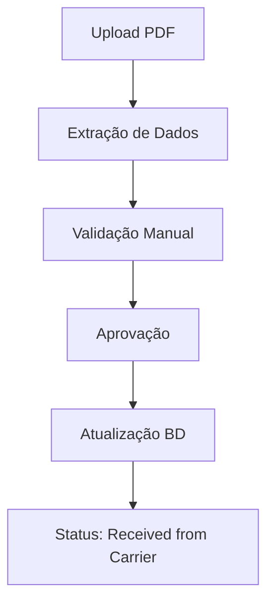
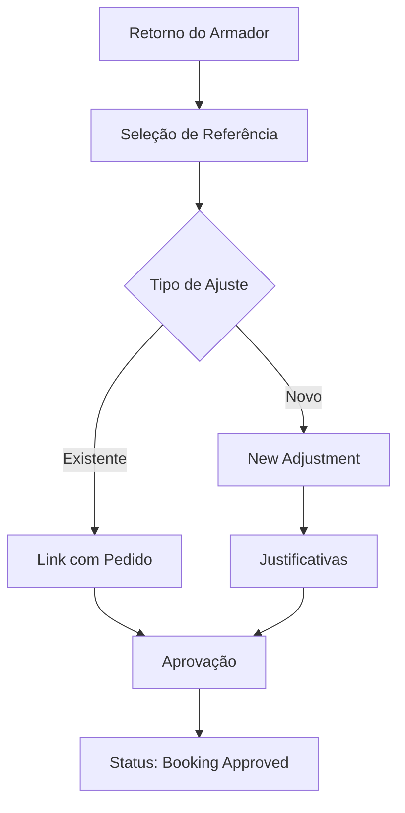

# 🏗️ Farol - Sistema de Gerenciamento de Embarques

[](https://python.org)
[](https://streamlit.io)
[](https://oracle.com)
[](LICENSE)

Sistema completo de gerenciamento de embarques marítimos com interface web intuitiva, desenvolvido em Python com Streamlit e integração com banco de dados Oracle.

## 📋 Índice

- [Visão Geral](#-visão-geral)
- [Funcionalidades Principais](#-funcionalidades-principais)
- [Arquitetura do Sistema](#-arquitetura-do-sistema)
- [Instalação e Configuração](#-instalação-e-configuração)
- [Guia de Uso](#-guia-de-uso)
- [Módulos do Sistema](#-módulos-do-sistema)
- [Estrutura do Banco de Dados](#-estrutura-do-banco-de-dados)
- [Fluxos de Trabalho](#-fluxos-de-trabalho)
- [API e Integrações](#-api-e-integrações)
- [Contribuição](#-contribuição)
- [Suporte](#-suporte)

## 🎯 Visão Geral

O **Farol** é um sistema de gestão logística que permite o controle completo do ciclo de vida de embarques marítimos, desde a criação inicial até a aprovação final. O sistema oferece rastreamento em tempo real, gestão de documentos, processamento automatizado de PDFs e controle de status avançado.

### 🌟 Principais Benefícios

- **Centralização**: Todas as informações de embarque em um só lugar
- **Automação**: Processamento inteligente de PDFs de booking
- **Rastreabilidade**: Histórico completo de todas as alterações
- **Flexibilidade**: Sistema de ajustes e splits para mudanças de última hora
- **Integração**: Conectividade total com sistemas Oracle existentes

## ⚡ Funcionalidades Principais

### 📦 Gestão de Embarques
- **Criação de novos embarques** com validação automática
- **Edição em tempo real** com controle de alterações
- **Sistema de splits** para divisão de cargas
- **Gestão de status** com workflow automatizado
- **Filtros avançados** e exportação de dados

### 📄 Processamento de Documentos
- **Upload e gestão de anexos** com suporte a múltiplos formatos
- **Processamento automático de PDFs** de booking recebidos por email
- **Validação inteligente** de dados extraídos
- **Histórico completo** de documentos por embarque

### 🔄 Controle de Status
- **Workflow personalizado** com múltiplos status
- **Aprovação de retornos** do armador com validação
- **Sistema de justificativas** obrigatórias para alterações
- **Rastreamento completo** do ciclo de vida

### 📊 Relatórios e Analytics
- **Dashboards interativos** com métricas em tempo real
- **Controle de performance** por período
- **Análise operacional** detalhada
- **Exportação** em múltiplos formatos

## 🏗️ Arquitetura do Sistema

```
┌─────────────────┐    ┌─────────────────┐    ┌─────────────────┐
│   Frontend      │    │   Backend       │    │   Database      │
│   (Streamlit)   │◄──►│   (Python)      │◄──►│   (Oracle)      │
└─────────────────┘    └─────────────────┘    └─────────────────┘
         │                       │                       │
         │                       │                       │
    ┌────▼────┐            ┌─────▼─────┐         ┌──────▼──────┐
    │  UI/UX  │            │ Business  │         │   Tables    │
    │Components│            │   Logic   │         │ & Triggers  │
    └─────────┘            └───────────┘         └─────────────┘
```

### 🔧 Stack Tecnológico

- **Frontend**: Streamlit (Interface Web Responsiva)
- **Backend**: Python 3.8+ (Lógica de Negócio)
- **Database**: Oracle Database (Armazenamento de Dados)
- **ORM**: SQLAlchemy (Mapeamento Objeto-Relacional)
- **Data Processing**: Pandas (Manipulação de Dados)
- **File Processing**: PyPDF2, openpyxl (Processamento de Arquivos)

## 🚀 Instalação e Configuração

### Pré-requisitos

- Python 3.8 ou superior
- Oracle Database 19c ou superior
- Oracle Instant Client
- Acesso à rede corporativa

### 1. Clone o Repositório

```bash
git clone https://github.com/sua-empresa/farol-sistema.git
cd farol-sistema
```

### 2. Configuração do Ambiente

```bash
# Criar ambiente virtual
python -m venv farol-env

# Ativar ambiente (Windows)
farol-env\Scripts\activate

# Ativar ambiente (Linux/Mac)
source farol-env/bin/activate
```

### 3. Instalar Dependências

```bash
pip install -r requirements.txt
```

### 4. Configuração do Banco de Dados

```python
# Configurar variáveis de ambiente ou editar database.py
ORACLE_HOST = "seu-servidor-oracle"
ORACLE_PORT = "1521"
ORACLE_SERVICE = "seu-servico"
ORACLE_USER = "seu-usuario"
ORACLE_PASSWORD = "sua-senha"
```

### 5. Executar o Sistema

```bash
streamlit run app.py
```

O sistema estará disponível em `http://localhost:8501`

## 📖 Guia de Uso

### 🏠 Tela Principal - Shipments

A tela principal oferece uma visão completa de todos os embarques:

1. **Filtros Avançados**: Use os filtros para localizar embarques específicos
2. **Edição em Linha**: Clique nas células para editar informações diretamente
3. **Seleção de Embarques**: Use os checkboxes para selecionar embarques
4. **Ações Rápidas**: Botões para criar, editar e gerenciar embarques

### 📋 Stages (Etapas)

- **Sales Data**: Informações iniciais de venda
- **Booking Management**: Gestão de reservas e bookings

### 🔄 Workflow de Status

```
New Request → Booking Requested → Received from Carrier → Booking Approved
     │              │                    │                     │
     └──────────────┼────────────────────┼─────────────────────┘
                    │                    │
              Adjustment Requested   Booking Rejected
                    │                    │
                    └────────────────────┘
```

## 🧩 Módulos do Sistema

### 📦 `shipments.py`
**Módulo principal** de gestão de embarques
- Interface principal do sistema
- Edição em tempo real de dados
- Controle de alterações e validações
- Sistema de filtros avançados

### 🛠️ `shipments_split.py`
**Sistema de ajustes e divisões**
- Divisão de embarques em múltiplas partes
- Ajustes de quantidades e destinos
- Validação de integridade de dados
- Justificativas obrigatórias

### 📜 `history.py`
**Histórico e aprovações**
- Visualização completa do histórico
- Sistema de aprovação de retornos
- Gestão de anexos e documentos
- Processamento de PDFs de booking

### 📄 `pdf_booking_processor.py`
**Processamento inteligente de PDFs**
- Extração automática de dados
- Validação e correção de informações
- Interface de confirmação
- Integração com sistema de anexos

### 🗄️ `database.py`
**Camada de dados**
- Conexões com Oracle Database
- Queries otimizadas
- Transações seguras
- Mapeamento de dados

### 📊 `operation_control.py`
**Controle operacional**
- Métricas de performance
- Dashboards executivos
- Análises operacionais

### 🎯 `performance_control.py`
**Análise de performance**
- KPIs em tempo real
- Relatórios de produtividade
- Análise de tendências

### 🔍 `tracking.py`
**Rastreamento e monitoramento**
- Rastreamento de embarques
- Alertas e notificações
- Integração com sistemas externos

## 🗃️ Estrutura do Banco de Dados

### Tabelas Principais

#### `F_CON_SALES_BOOKING_DATA`
Tabela principal com dados de embarques
```sql
- FAROL_REFERENCE (PK)
- S_CUSTOMER
- S_QUANTITY_OF_CONTAINERS
- S_PORT_OF_LOADING_POL
- S_PORT_OF_DELIVERY_POD
- B_VESSEL_NAME
- B_VOYAGE_CARRIER
- B_BOOKING_REFERENCE
- FAROL_STATUS
```

#### `F_CON_RETURN_CARRIERS`
Histórico de retornos e alterações
```sql
- ID (PK)
- FAROL_REFERENCE
- ADJUSTMENT_ID
- B_BOOKING_STATUS
- LINKED_REFERENCE
- AREA
- REQUEST_REASON
- ADJUSTMENTS_OWNER
- COMMENTS
```

#### `F_CON_ANEXOS`
Gestão de anexos e documentos
```sql
- ID (PK)
- FAROL_REFERENCE
- FILE_NAME
- FILE_EXTENSION
- ATTACHMENT (BLOB)
- UPLOAD_TIMESTAMP
```

### Relacionamentos

```
F_CON_SALES_BOOKING_DATA (1) ←→ (N) F_CON_RETURN_CARRIERS
F_CON_SALES_BOOKING_DATA (1) ←→ (N) F_CON_ANEXOS
```

## 🔄 Fluxos de Trabalho

### 1. Criação de Novo Embarque


### 2. Processamento de PDF



### 3. Sistema de Aprovação



## 🔌 API e Integrações

### Endpoints Internos

O sistema utiliza funções Python para comunicação com o banco:

```python
# Principais funções da API
get_data_salesData()           # Busca dados de vendas
get_data_bookingData()         # Busca dados de booking
insert_return_carrier_from_ui() # Insere dados de retorno
update_sales_booking_from_return_carriers() # Atualiza dados principais
```

### Integrações Externas

- **Oracle Database**: Conexão nativa via python-oracledb
- **Sistema de Email**: Processamento de PDFs recebidos
- **Sistemas ERP**: Integração via views e triggers

## 🎨 Interface do Usuário

### 🎯 Design Principles

- **Intuitividade**: Interface limpa e fácil de usar
- **Responsividade**: Adaptável a diferentes tamanhos de tela
- **Performance**: Carregamento rápido e operações eficientes
- **Acessibilidade**: Compatível com padrões de acessibilidade

### 🎨 Componentes Visuais

- **Cards Informativos**: Exibição de métricas importantes
- **Tabelas Interativas**: Edição direta de dados
- **Formulários Dinâmicos**: Campos que se adaptam ao contexto
- **Indicadores de Status**: Visualização clara do estado dos embarques

## 📈 Métricas e KPIs

### 📊 Dashboard Principal

- **Total de Embarques**: Quantidade total no período
- **Booking Requested**: Pedidos pendentes
- **Received from Carrier**: Retornos recebidos
- **Pending Adjustments**: Ajustes pendentes

### 📈 Análises Disponíveis

- **Performance por Período**: Análise temporal
- **Eficiência Operacional**: Tempos de processamento
- **Taxa de Aprovação**: Percentual de aprovações
- **Volume por Carrier**: Análise por transportadora

## 🔧 Manutenção e Monitoramento

### 📝 Logs do Sistema

- **Logs de Aplicação**: Registrados automaticamente
- **Logs de Banco**: Auditoria completa de transações
- **Logs de Performance**: Monitoramento de desempenho

### 🔍 Troubleshooting

#### Problemas Comuns

1. **Erro de Conexão com Banco**
   - Verificar configurações de rede
   - Validar credenciais Oracle
   - Testar conectividade

2. **Lentidão na Interface**
   - Verificar cache do Streamlit
   - Otimizar queries do banco
   - Limpar dados temporários

3. **Falha no Processamento de PDF**
   - Verificar formato do arquivo
   - Validar estrutura do PDF
   - Conferir logs de extração

## 🚀 Roadmap

### 📅 Próximas Funcionalidades

- [ ] **API REST**: Exposição de endpoints para integrações
- [ ] **Mobile App**: Aplicativo móvel complementar
- [ ] **BI Integration**: Conexão com Power BI/Tableau
- [ ] **Automated Reports**: Relatórios automáticos por email
- [ ] **Multi-tenancy**: Suporte a múltiplas empresas
- [ ] **Advanced Analytics**: Machine Learning para previsões

### 🔄 Melhorias Planejadas

- [ ] **Performance**: Otimização de queries complexas
- [ ] **UX/UI**: Redesign da interface principal
- [ ] **Security**: Implementação de 2FA
- [ ] **Backup**: Sistema automatizado de backup
- [ ] **Monitoring**: Dashboard de monitoramento em tempo real

## 🤝 Contribuição

### 📋 Como Contribuir

1. **Fork** o repositório
2. **Crie** uma branch para sua feature (`git checkout -b feature/AmazingFeature`)
3. **Commit** suas mudanças (`git commit -m 'Add some AmazingFeature'`)
4. **Push** para a branch (`git push origin feature/AmazingFeature`)
5. **Abra** um Pull Request

### 📝 Padrões de Código

- **PEP 8**: Seguir padrões Python
- **Docstrings**: Documentar todas as funções
- **Type Hints**: Usar anotações de tipo
- **Tests**: Incluir testes unitários

### 🔍 Code Review

Todos os PRs passam por revisão técnica focando em:
- **Funcionalidade**: A feature funciona conforme especificado?
- **Performance**: O código é eficiente?
- **Segurança**: Não há vulnerabilidades?
- **Manutenibilidade**: O código é fácil de manter?

## 📞 Suporte

### 🆘 Canais de Suporte

- **Email**: suporte@farol-sistema.com
- **Slack**: #farol-suporte
- **Wiki**: Documentação interna completa
- **Tickets**: Sistema interno de tickets

### 📚 Documentação Adicional

- [Guia de Instalação Detalhado](docs/INSTALLATION.md)
- [Manual do Usuário](docs/USER_GUIDE.md)
- [Guia de Desenvolvimento](docs/DEVELOPMENT.md)
- [FAQ - Perguntas Frequentes](docs/FAQ.md)

### 🐛 Reportar Bugs

Para reportar bugs, inclua:
- **Descrição detalhada** do problema
- **Passos para reproduzir** o erro
- **Screenshots** se aplicável
- **Logs relevantes** do sistema
- **Ambiente** (OS, Python version, etc.)

---

## 📄 Licença

Este projeto está licenciado sob a Licença MIT - veja o arquivo [LICENSE](LICENSE) para detalhes.

---

## 🙏 Agradecimentos

- **Equipe de Desenvolvimento**: Pela dedicação e excelência técnica
- **Usuários Beta**: Pelo feedback valioso durante os testes
- **Comunidade Open Source**: Pelas ferramentas e bibliotecas utilizadas

---

**Desenvolvido com ❤️ pela equipe Farol**

*Sistema de Gerenciamento de Embarques - Versão 2.0*
