# 🏗️ Farol - Sistema de Gerenciamento de Embarques

[](https://python.org)
[](https://streamlit.io)
[](https://oracle.com)
[](LICENSE)

Sistema completo de gerenciamento de embarques marítimos com interface web intuitiva, desenvolvido em Python com Streamlit e integração com banco de dados Oracle.

## 📋 Índice

- [Visão Geral](#-visão-geral)
- [Funcionalidades Principais](#-funcionalidades-principais)
- [Arquitetura do Sistema](#-arquitetura-do-sistema)
- [Instalação e Configuração](#-instalação-e-configuração)
- [Guia de Uso](#-guia-de-uso)
- [Módulos do Sistema](#-módulos-do-sistema)
- [Estrutura do Banco de Dados](#-estrutura-do-banco-de-dados)
- [Fluxos de Trabalho](#-fluxos-de-trabalho)
- [API e Integrações](#-api-e-integrações)
- [Boas Práticas](#-boas-práticas---identificação-de-carriers)
- [Contribuição](#-contribuição)
- [Suporte](#-suporte)

## 🎯 Visão Geral

O **Farol** é um sistema de gestão logística que permite o controle completo do ciclo de vida de embarques marítimos, desde a criação inicial até a aprovação final. O sistema oferece rastreamento em tempo real, gestão de documentos, processamento automatizado de PDFs e controle de status avançado.

### 🌟 Principais Benefícios

- **Centralização**: Todas as informações de embarque em um só lugar
- **Automação**: Processamento inteligente de PDFs de booking
- **Rastreabilidade**: Histórico completo de todas as alterações
- **Flexibilidade**: Sistema de ajustes e splits para mudanças de última hora
- **Integração**: Conectividade total com sistemas Oracle existentes

## ⚡ Funcionalidades Principais

### 📦 Gestão de Embarques
- **Criação de novos embarques** com validação automática
- **Edição em tempo real** com controle de alterações
- **Sistema de splits** para divisão de cargas
- **Gestão de status** com workflow automatizado
- **Filtros avançados** e exportação de dados

### 📄 Processamento de Documentos
- **Upload e gestão de anexos** com suporte a múltiplos formatos
- **Processamento automático de PDFs** de booking recebidos por email
- **Validação inteligente** de dados extraídos
- **Suporte a múltiplos carriers**: HAPAG-LLOYD, MAERSK, MSC, CMA CGM, COSCO, EVERGREEN, OOCL, PIL
- **Extração automática** de campos-chave (booking reference, vessel name, voyage, datas, portos)
- **Interface de validação** com correção manual de dados
- **Histórico completo** de documentos por embarque

### 🚢 Sistema de Tracking em Tempo Real
- **Integração com API Ellox** da Comexia para tracking marítimo
- **Autenticação automática** com credenciais configuráveis
- **Três modos de consulta**:
  - 🔍 **Busca Manual**: Consulta por navio, carrier e voyage
  - 📦 **Bookings Existentes**: Tracking automático de bookings do banco
  - 📅 **Cronograma**: Consulta de escalas futuras de navios
- **Status visual em tempo real**: 🟢 Online / 🟡 Lento / 🔴 Desconectado
- **Interface interativa** para configuração de credenciais
- **Métricas de performance**: IMO, MMSI, posição atual, ETA, atrasos

### 🔄 Controle de Status
- **Workflow personalizado** com múltiplos status
- **Aprovação de retornos** do armador com validação
- **Sistema de justificativas** obrigatórias para alterações
- **Rastreamento completo** do ciclo de vida

### 📊 Relatórios e Analytics
- **Dashboards interativos** com métricas em tempo real
- **Controle de performance** por período
- **Análise operacional** detalhada
- **Exportação** em múltiplos formatos

## 🏗️ Arquitetura do Sistema

```
┌─────────────────┐    ┌─────────────────┐    ┌─────────────────┐
│   Frontend      │    │   Backend       │    │   Database      │
│   (Streamlit)   │◄──►│   (Python)      │◄──►│   (Oracle)      │
└─────────────────┘    └─────────────────┘    └─────────────────┘
         │                       │                       │
         │                       │                       │
    ┌────▼────┐            ┌─────▼─────┐         ┌──────▼──────┐
    │  UI/UX  │            │ Business  │         │   Tables    │
    │Components│            │   Logic   │         │ & Triggers  │
    └─────────┘            └───────────┘         └─────────────┘
```

### 🔧 Stack Tecnológico

- **Frontend**: Streamlit (Interface Web Responsiva)
- **Backend**: Python 3.8+ (Lógica de Negócio)
- **Database**: Oracle Database (Armazenamento de Dados)
- **ORM**: SQLAlchemy (Mapeamento Objeto-Relacional)
- **Data Processing**: Pandas (Manipulação de Dados)
- **File Processing**: PyPDF2, openpyxl (Processamento de Arquivos)

## 🚀 Instalação e Configuração

### Pré-requisitos

- Python 3.8 ou superior
- Oracle Database 19c ou superior
- Oracle Instant Client
- Acesso à rede corporativa

### 1. Clone o Repositório

```bash
git clone https://github.com/sua-empresa/farol-sistema.git
cd farol-sistema
```

### 2. Configuração do Ambiente

```bash
# Criar ambiente virtual
python -m venv farol-env

# Ativar ambiente (Windows)
farol-env\Scripts\activate

# Ativar ambiente (Linux/Mac)
source farol-env/bin/activate
```

### 3. Instalar Dependências

```bash
pip install -r requirements.txt
```

### 4. Configuração do Banco de Dados

```python
# Configurar variáveis de ambiente ou editar database.py
ORACLE_HOST = "seu-servidor-oracle"
ORACLE_PORT = "1521"
ORACLE_SERVICE = "seu-servico"
ORACLE_USER = "seu-usuario"
ORACLE_PASSWORD = "sua-senha"
```

### 5. Executar o Sistema

```bash
streamlit run app.py
```

O sistema estará disponível em `http://localhost:8501`

## 📖 Guia de Uso

### 🏠 Tela Principal - Shipments

A tela principal oferece uma visão completa de todos os embarques:

1. **Filtros Avançados**: Use os filtros para localizar embarques específicos
2. **Edição em Linha**: Clique nas células para editar informações diretamente
3. **Seleção de Embarques**: Use os checkboxes para selecionar embarques
4. **Ações Rápidas**: Botões para criar, editar e gerenciar embarques

### 📋 Stages (Etapas)

- **Sales Data**: Informações iniciais de venda
- **Booking Management**: Gestão de reservas e bookings

### 🔄 Workflow de Status

```
New Request → Booking Requested → Received from Carrier → Booking Approved
     │              │                    │                     │
     └──────────────┼────────────────────┼─────────────────────┘
                    │                    │
              Adjustment Requested   Booking Rejected
                    │                    │
                    └────────────────────┘
```

## 🧩 Módulos do Sistema

### 📦 `shipments.py`
**Módulo principal** de gestão de embarques
- Interface principal do sistema
- Edição em tempo real de dados
- Controle de alterações e validações
- Sistema de filtros avançados

### 🛠️ `shipments_split.py`
**Sistema de ajustes e divisões**
- Divisão de embarques em múltiplas partes
- Ajustes de quantidades e destinos
- Validação de integridade de dados
- Justificativas obrigatórias

### 📜 `history.py`
**Histórico e aprovações**
- Visualização completa do histórico
- Sistema de aprovação de retornos
- Gestão de anexos e documentos
- Processamento de PDFs de booking

### 📄 `pdf_booking_processor.py`
**Processamento inteligente de PDFs**
- Extração automática de dados
- Validação e correção de informações
- Interface de confirmação
- Integração com sistema de anexos
- Dropdowns alimentados pelo banco (navios/terminais) via `F_ELLOX_SHIPS` e `F_ELLOX_TERMINALS`
- "Nome do Navio": busca case-insensitive e normalização, evitando duplicatas entre valor extraído do PDF e valor do banco
- Normalização de `port_terminal_city` com mapeamento para padrão Ellox (`standardize_terminal_name`)
- Limpeza de nomes de portos removendo parênteses e conteúdos após vírgula
- `voyage` normalizado removendo espaços internos (ex.: "002 E" → "002E")
- `Voyage do Navio`: campo de texto com sugestões via API exibidas como dica
- Cache de listas com `@st.cache_data(ttl=300)` para refletir atualizações
- Removida a validação "navio pertence ao carrier"

### 🗄️ `database.py`
**Camada de dados**
- Conexões com Oracle Database
- Queries otimizadas
- Transações seguras
- Mapeamento de dados

### 📊 `operation_control.py`
**Controle operacional**
- Métricas de performance
- Dashboards executivos
- Análises operacionais

### 🎯 `performance_control.py`
**Análise de performance**
- KPIs em tempo real
- Relatórios de produtividade
- Análise de tendências

### 🔍 `tracking.py`
**Sistema de Tracking via API Ellox**
- Interface completa para rastreamento de navios em tempo real
- Integração com API Ellox da Comexia
- Busca manual por navio, carrier e voyage
- Tracking automático de bookings existentes no banco
- Consulta de cronogramas de navios
- Status visual da conectividade da API
- Configuração interativa de credenciais
- Aba "🔔 Monitoramento" com subtabs:
  - "📝 Solicitar Monitoramento": POST `/api/monitor/navio` e `/api/monitor/shipowner`
  - "👁️ Visualizar Monitoramento": POST `/api/terminalmonitorings` e `/api/shipownermonitorings`
- Formatação e validação de CNPJ; checagem prévia de existência (`check_company_exists`)
- Autenticação automática (sem chave manual no sidebar) e indicador 🟢/🟡/🔴

### 🚢 `ellox_api.py`
**Cliente da API Ellox**
- Autenticação automática com email/senha
- Gestão de tokens de acesso
- Funções para consulta de tracking
- Padronização de nomenclaturas
- Teste de conectividade em tempo real
- Tratamento robusto de erros
- Base URL: `https://apidtz.comexia.digital`
- Autenticação em `/api/auth` com payload `{ email, senha }`
- `_make_api_request` padroniza chamadas com timeout e tratamento de erros
- `search_voyage_tracking` usa `/api/voyages?ship=NOME&terminal=CNPJ` e sugere voyages disponíveis
- `check_company_exists` verifica CNPJ em terminais Ellox
- Monitoramento: `POST /api/monitor/navio`, `POST /api/terminalmonitorings`, `POST /api/monitor/shipowner`, `POST /api/shipownermonitorings`

### 📝 `nomenclature_standardizer.py`
**Padronização de Dados**
- Normalização de nomes de carriers
- Padronização de nomes de navios
- Limpeza de códigos de voyage
- Normalização de nomes de portos
- Mapeamento consistente entre PDFs e API

### ⚙️ `app_config.py`
**Configurações Centralizadas**
- URLs base da API
- Configurações de banco de dados
- Caminhos de armazenamento
- Variáveis de ambiente

## 🗃️ Estrutura do Banco de Dados

### Tabelas Principais

#### `F_CON_SALES_BOOKING_DATA`
Tabela principal com dados de embarques
```sql
- FAROL_REFERENCE (PK)
- S_CUSTOMER
- S_QUANTITY_OF_CONTAINERS
- S_PORT_OF_LOADING_POL
- S_PORT_OF_DELIVERY_POD
- B_VESSEL_NAME
- B_VOYAGE_CARRIER
- B_BOOKING_REFERENCE
- FAROL_STATUS
```

#### `F_CON_RETURN_CARRIERS`
Histórico de retornos e alterações
```sql
- ID (PK)
- FAROL_REFERENCE
- ADJUSTMENT_ID
- B_BOOKING_STATUS
- LINKED_REFERENCE
- AREA
- REQUEST_REASON
- ADJUSTMENTS_OWNER
- COMMENTS
- PDF_BOOKING_EMISSION_DATE  -- string "YYYY-MM-DD HH:MM"
```

#### `F_CON_ANEXOS`
Gestão de anexos e documentos
```sql
- ID (PK)
- FAROL_REFERENCE
- FILE_NAME
- FILE_EXTENSION
- ATTACHMENT (BLOB)
- UPLOAD_TIMESTAMP
```

### Relacionamentos

```
F_CON_SALES_BOOKING_DATA (1) ←→ (N) F_CON_RETURN_CARRIERS
F_CON_SALES_BOOKING_DATA (1) ←→ (N) F_CON_ANEXOS
```

### Tabelas Ellox (Locais)

#### `F_ELLOX_TERMINALS`
Tabela de terminais obtidos via Ellox
```sql
- ID (PK)
- NOME
- CNPJ
- CIDADE
- UF
```

#### `F_ELLOX_SHIPS`
Tabela de navios obtidos via Ellox
```sql
- ID (PK)
- NOME
- CARRIER
- TERMINAL
```

#### `F_ELLOX_VOYAGES`
Tabela de viagens por navio/terminal
```sql
- ID (PK)
- NAVIO
- TERMINAL
- VIAGEM
```

#### `F_ELLOX_CARRIERS`
Tabela de carriers (armadores) e CNPJs
```sql
- ID (PK)
- NOME
- NOME_COMPLETO
- CNPJ
```

## 🔄 Fluxos de Trabalho

### 1. Criação de Novo Embarque


### 2. Processamento de PDF

```mermaid
graph TD
    A[Upload PDF] --> B[Extração de Dados]
    B --> C[Validação Manual]
    C --> D[Aprovação]
    D --> E[Atualização BD]
    E --> F[Status: Received from Carrier]
```



- Coleta automática de “PDF Print Date” (ex.: "Print Date:\n2024-09-06 18:23 UTC").
- Salvamento do campo como string no formato "YYYY-MM-DD HH:MM".
- Validação de duplicidade: bloqueia processamento se já existir registro com mesma combinação (Farol Reference, Booking Reference, Voyage Carrier, Voyage Code, Vessel Name, PDF Print Date).

## 🔌 API e Integrações

### Endpoints Internos

O sistema utiliza funções Python para comunicação com o banco:

```python
# Principais funções da API
get_data_salesData()           # Busca dados de vendas
get_data_bookingData()         # Busca dados de booking
insert_return_carrier_from_ui() # Insere dados de retorno
update_sales_booking_from_return_carriers() # Atualiza dados principais
```

### Integrações Externas

- **Oracle Database**: Conexão nativa via python-oracledb
- **API Ellox (Comexia)**: Tracking marítimo em tempo real
  - URL Base: `https://apidtz.comexia.digital`
  - Autenticação: Email/Senha com token JWT
  - Endpoints: `/api/auth`, `/api/terminals`, `/api/ships`, `/api/voyages`, `/api/monitor/navio`, `/api/terminalmonitorings`, `/api/shipownermonitorings`, `/api/monitor/shipowner`
- **Sistema de Email**: Processamento de PDFs recebidos
- **Sistemas ERP**: Integração via views e triggers

### 🔌 API Ellox - Funcionalidades

#### Autenticação
```python
# Exemplo de autenticação
POST https://apidtz.comexia.digital/api/auth
{
  "email": "user@example.com",
  "senha": "password"  # campo correto: "senha"
}

# Resposta
{
  "access_token": "eyJhbGciOiJSUzI1NiIs...",
  "id_token": "eyJhbGciOiJSUzI1NiIs...",
  "expiracao": 86400
}
```

#### Voyages
```text
GET /api/voyages?ship=NOME&terminal=CNPJ
```
Retorna viagens disponíveis para um navio e terminal. Útil para sugerir voyages quando não há correspondência exata.

#### Monitoramento
- Solicitar (Terminal): `POST /api/monitor/navio`
- Visualizar (Terminal): `POST /api/terminalmonitorings`
- Solicitar (ShipOwner): `POST /api/monitor/shipowner`
- Visualizar (ShipOwner): `POST /api/shipownermonitorings`
Observação: alguns CNPJs de clientes só são aceitos se estiverem na base interna de `companies` da Ellox. Utilize a verificação prévia via `check_company_exists`.

### 🏢 Boas Práticas - Identificação de Carriers

#### ⚠️ Importante: Uso de CNPJs vs Nomes de Carriers

**Recomendação**: Sempre utilize **CNPJs** ao invés de nomes de carriers para consultas e identificações no sistema.

#### 🚢 Casos Especiais de Fusões/Aquisições

**COSCO e OOCL - Mesmo CNPJ no Brasil:**
- **CNPJ**: `02.502.234/0001-62`
- **Razão Social**: COSCO SHIPPING LINES (BRASIL) S.A.
- **Motivo**: A COSCO adquiriu a OOCL em 2018, unificando as operações no Brasil
- **Implicação**: Ambas as marcas (COSCO e OOCL) operam sob o mesmo CNPJ no Brasil

#### 📋 Mapeamento de Carriers para CNPJs

| Carrier | CNPJ | Observações |
|---------|------|-------------|
| COSCO | `02.502.234/0001-62` | Inclui operações OOCL |
| OOCL | `02.502.234/0001-62` | Mesmo CNPJ da COSCO |
| MAERSK | `33.592.510/0001-54` | Maersk Line Brasil |
| MSC | `33.592.510/0001-54` | Mediterranean Shipping |
| HAPAG-LLOYD | `33.592.510/0001-54` | Hapag-Lloyd Brasil |
| CMA CGM | `33.592.510/0001-54` | CMA CGM Brasil |
| EVERGREEN | `33.592.510/0001-54` | Evergreen Line Brasil |
| PIL | `33.592.510/0001-54` | Pacific International Lines |

#### ✅ Benefícios do Uso de CNPJs

1. **Precisão Legal**: CNPJ é identificador único e oficial
2. **Evita Duplicatas**: Previne registros duplicados por variações de nome
3. **Compliance**: Atende requisitos regulatórios brasileiros
4. **Integração**: Facilita integração com sistemas fiscais
5. **Auditoria**: Melhora rastreabilidade e auditoria

#### 🔍 Como Implementar

```python
# ❌ Evitar - Uso de nomes
carrier_name = "COSCO"
carrier_name = "OOCL"

# ✅ Recomendado - Uso de CNPJ
carrier_cnpj = "02.502.234/0001-62"  # COSCO/OOCL
carrier_cnpj = "33.592.510/0001-54"  # MAERSK/MSC/etc
```

#### 📊 Impacto no Sistema

- **Consultas**: Sempre filtrar por CNPJ nas consultas de banco
- **Relatórios**: Agrupar dados por CNPJ para análise precisa
- **Integrações**: Usar CNPJ como chave primária nas integrações
- **Validações**: Validar CNPJ antes de inserir/atualizar registros

#### Endpoints Disponíveis
- **`/api/terminals`**: Lista terminais disponíveis
- **`/api/ships`**: Consulta navios por terminal
- **`/api/voyages`**: Consulta viagens por navio
- **`/api/monitor/navio`**: Monitoramento de navio específico
- **`/api/monitor/booking`**: Monitoramento por booking reference

#### Dados Retornados
- **IMO**: Número de identificação internacional
- **MMSI**: Sistema de identificação marítima
- **Status**: Estado atual do navio (navegando, atracado, etc.)
- **Posição Atual**: Latitude e longitude em tempo real
- **Próximo Porto**: Destino previsto
- **ETA**: Tempo estimado de chegada
- **Atrasos**: Informações sobre delays

## 🎨 Interface do Usuário

### 🎯 Design Principles

- **Intuitividade**: Interface limpa e fácil de usar
- **Responsividade**: Adaptável a diferentes tamanhos de tela
- **Performance**: Carregamento rápido e operações eficientes
- **Acessibilidade**: Compatível com padrões de acessibilidade

### 🎨 Componentes Visuais

- **Cards Informativos**: Exibição de métricas importantes
- **Tabelas Interativas**: Edição direta de dados
- **Formulários Dinâmicos**: Campos que se adaptam ao contexto
- **Indicadores de Status**: Visualização clara do estado dos embarques

## 📈 Métricas e KPIs

### 📊 Dashboard Principal

- **Total de Embarques**: Quantidade total no período
- **Booking Requested**: Pedidos pendentes
- **Received from Carrier**: Retornos recebidos
- **Pending Adjustments**: Ajustes pendentes

### 📈 Análises Disponíveis

- **Performance por Período**: Análise temporal
- **Eficiência Operacional**: Tempos de processamento
- **Taxa de Aprovação**: Percentual de aprovações
- **Volume por Carrier**: Análise por transportadora

## 🔧 Manutenção e Monitoramento

### 📝 Logs do Sistema

- **Logs de Aplicação**: Registrados automaticamente
- **Logs de Banco**: Auditoria completa de transações
- **Logs de Performance**: Monitoramento de desempenho

### 🔍 Troubleshooting

#### Problemas Comuns

1. **Erro de Conexão com Banco**
   - Verificar configurações de rede
   - Validar credenciais Oracle
   - Testar conectividade

2. **Lentidão na Interface**
   - Verificar cache do Streamlit
   - Otimizar queries do banco
   - Limpar dados temporários

3. **Falha no Processamento de PDF**
   - Verificar formato do arquivo
   - Validar estrutura do PDF
   - Conferir logs de extração

4. **Problemas com API Ellox**
   - **🔴 API Desconectada**: 
     - Verificar credenciais (email/senha)
     - Testar conectividade de rede
     - Confirmar URL base: `https://apidtz.comexia.digital`
   - **🟡 API Lenta**:
     - Verificar latência de rede
     - Confirmar carga do servidor
   - **Erro de Autenticação**:
     - Validar formato do payload JSON
     - Verificar se credenciais não expiraram
     - Testar manualmente via Postman/curl

#### Diagnóstico da API Ellox

```bash
# Teste manual da autenticação
curl -X POST https://apidtz.comexia.digital/api/auth \
  -H "Content-Type: application/json" \
  -d '{"email":"seu_email@exemplo.com","senha":"sua_senha"}'

# Resposta esperada (200 OK):
{
  "access_token": "eyJhbGciOiJSUzI1NiIs...",
  "expiracao": 86400
}
```

#### Códigos de Status da API

- **200**: ✅ Sucesso - API funcionando normalmente
- **401**: ❌ Credenciais inválidas ou expiradas  
- **429**: ⚠️ Limite de requisições excedido
- **500**: 🔧 Erro interno do servidor
- **503**: 🚧 Serviço temporariamente indisponível

## 🚀 Roadmap

### 📅 Próximas Funcionalidades

- [ ] **API REST**: Exposição de endpoints para integrações
- [ ] **Mobile App**: Aplicativo móvel complementar
- [ ] **BI Integration**: Conexão com Power BI/Tableau
- [ ] **Automated Reports**: Relatórios automáticos por email
- [ ] **Multi-tenancy**: Suporte a múltiplas empresas
- [ ] **Advanced Analytics**: Machine Learning para previsões

### 🔄 Melhorias Planejadas

- [ ] **Performance**: Otimização de queries complexas
- [ ] **UX/UI**: Redesign da interface principal
- [ ] **Security**: Implementação de 2FA
- [ ] **Backup**: Sistema automatizado de backup
- [ ] **Monitoring**: Dashboard de monitoramento em tempo real

## 🆕 Atualizações Recentes

### 🚢 Sistema de Tracking via API Ellox (v3.0)
- **Integração completa** com API Ellox da Comexia para tracking marítimo
- **Autenticação automática** com credenciais configuráveis (email/senha)
- **Interface interativa** com três modos de consulta:
  - 🔍 Busca manual por navio, carrier e voyage
  - 📦 Tracking automático de bookings existentes
  - 📅 Consulta de cronogramas de navios
- **Status visual em tempo real**: 🟢 Online / 🟡 Lento / 🔴 Desconectado
- **Configuração de credenciais** via interface clicável
- **Métricas detalhadas**: IMO, MMSI, posição atual, ETA, atrasos
- **Padronização automática** de nomenclaturas entre PDFs e API

### 📄 Processamento de PDFs Aprimorado (v2.5)
- **Suporte expandido** para carriers: OOCL e PIL adicionados
- **Extração automática** de campos específicos por carrier:
  - **OOCL**: PDF Print Date, Booking Reference, Vessel Name, Voyage, POL/POD, Transhipment Port, ETD/ETA
  - **PIL**: PDF Print Date, Quantidade de Containers, ETD/ETA específicos, Port Terminal City
- **Validação aprimorada** com correção manual de dados
- **Interface de confirmação** com preview dos dados extraídos

### 🔄 Melhorias Gerais (v2.4)
- Captura automática de "PDF Print Date" em PDFs (Maersk e genéricos) e exibição nas abas do histórico
- Persistência do campo `PDF_BOOKING_EMISSION_DATE` como string "YYYY-MM-DD HH:MM"
- Bloqueio de processamento de PDFs duplicados com base em (Farol Reference, Booking Reference, Voyage Carrier, Voyage Code, Vessel Name, PDF Print Date)
- Justificativas obrigatórias no "New Adjustment" (Area, Reason, Responsibility, Comentários) na aprovação de "Retornos do Armador"
- Replicação de Booking Reference e Vessel Name no fluxo de ajustes/split para `F_CON_RETURN_CARRIERS`
- Limpeza de cache após aprovações no histórico para refletir imediatamente na grade de `shipments.py`
- Renomeado "Splitted Booking Reference" para "Splitted Farol Reference" em todas as grades

### 🏗️ Arquitetura e Configuração (v2.3)
- **Módulos especializados** criados:
  - `ellox_api.py`: Cliente da API Ellox
  - `nomenclature_standardizer.py`: Padronização de dados
  - `app_config.py`: Configurações centralizadas
- **Tratamento robusto de erros** com logs detalhados
- **Sistema de cache** otimizado para melhor performance
- **Configurações flexíveis** via variáveis de ambiente

## 🤝 Contribuição

### 📋 Como Contribuir

1. **Fork** o repositório
2. **Crie** uma branch para sua feature (`git checkout -b feature/AmazingFeature`)
3. **Commit** suas mudanças (`git commit -m 'Add some AmazingFeature'`)
4. **Push** para a branch (`git push origin feature/AmazingFeature`)
5. **Abra** um Pull Request

### 📝 Padrões de Código

- **PEP 8**: Seguir padrões Python
- **Docstrings**: Documentar todas as funções
- **Type Hints**: Usar anotações de tipo
- **Tests**: Incluir testes unitários

### 🔍 Code Review

Todos os PRs passam por revisão técnica focando em:
- **Funcionalidade**: A feature funciona conforme especificado?
- **Performance**: O código é eficiente?
- **Segurança**: Não há vulnerabilidades?
- **Manutenibilidade**: O código é fácil de manter?

## 📞 Suporte

### 🆘 Canais de Suporte

- **Email**: suporte@farol-sistema.com
- **Slack**: #farol-suporte
- **Wiki**: Documentação interna completa
- **Tickets**: Sistema interno de tickets

### 📚 Documentação Adicional

- [Guia de Instalação Detalhado](docs/INSTALLATION.md)
- [Manual do Usuário](docs/USER_GUIDE.md)
- [Guia de Desenvolvimento](docs/DEVELOPMENT.md)
- [FAQ - Perguntas Frequentes](docs/FAQ.md)

### 🐛 Reportar Bugs

Para reportar bugs, inclua:
- **Descrição detalhada** do problema
- **Passos para reproduzir** o erro
- **Screenshots** se aplicável
- **Logs relevantes** do sistema
- **Ambiente** (OS, Python version, etc.)

---

## 📄 Licença

Este projeto está licenciado sob a Licença MIT - veja o arquivo [LICENSE](LICENSE) para detalhes.

---

## 🙏 Agradecimentos

- **Equipe de Desenvolvimento**: Pela dedicação e excelência técnica
- **Usuários Beta**: Pelo feedback valioso durante os testes
- **Comunidade Open Source**: Pelas ferramentas e bibliotecas utilizadas

---

**Desenvolvido com ❤️ pela equipe Farol**

*Sistema de Gerenciamento de Embarques - Versão 3.0*

### 📊 Estatísticas do Sistema

- **Linhas de Código**: ~15.000+ linhas Python
- **Módulos**: 15+ módulos especializados  
- **Carriers Suportados**: 8 carriers principais
- **Integrações**: Oracle DB + API Ellox
- **Funcionalidades**: 50+ funcionalidades ativas
- **Performance**: < 1s resposta média
- **Uptime**: 99.9% disponibilidade

### 🎯 Roadmap Técnico Detalhado

#### 🚀 Versão 3.1 (Próxima Release)
- [ ] **Cache Redis**: Implementação de cache distribuído
- [ ] **WebSocket**: Atualizações em tempo real
- [ ] **API GraphQL**: Query flexível de dados
- [ ] **Testes Automatizados**: Cobertura 90%+

#### 🔮 Versão 4.0 (Futuro)
- [ ] **Microservices**: Arquitetura distribuída  
- [ ] **Kubernetes**: Orquestração de containers
- [ ] **Machine Learning**: Previsão de atrasos
- [ ] **Mobile Native**: App iOS/Android
