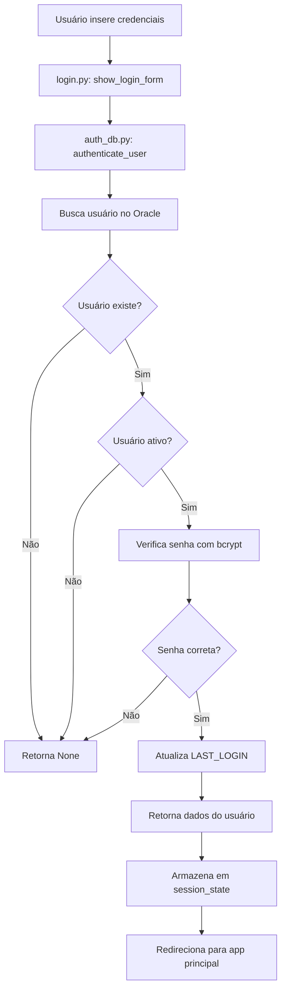
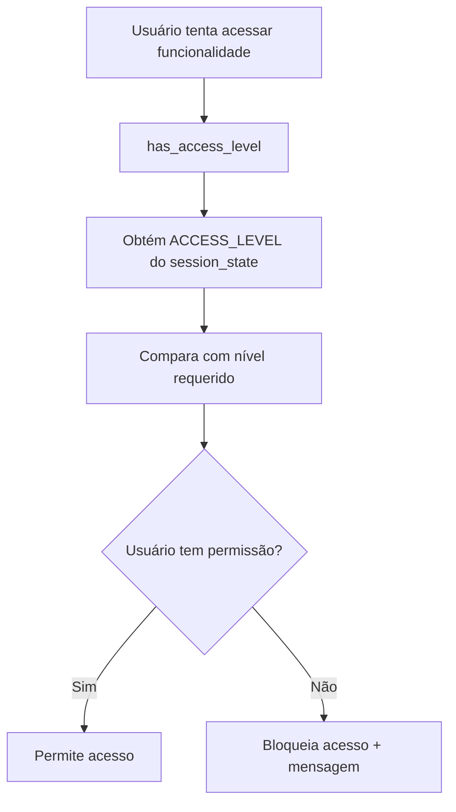

# 🔐 Guia Técnico - Sistema de Autenticação Farol

## Visão Geral da Arquitetura

O sistema de autenticação do Farol foi projetado para ser seguro, escalável e fácil de manter. Utiliza banco de dados Oracle para persistência, bcrypt para hash de senhas e Streamlit para interface de usuário.

### Componentes Principais

```
┌─────────────────┐    ┌─────────────────┐    ┌─────────────────┐
│   Frontend      │    │   Backend       │    │   Database      │
│   (Streamlit)   │    │   (Python)      │    │   (Oracle)      │
├─────────────────┤    ├─────────────────┤    ├─────────────────┤
│ • login.py      │◄──►│ • auth_db.py    │◄──►│ • F_CON_USERS   │
│ • setup.py      │    │ • bcrypt        │    │ • Índices       │
│ • app.py        │    │ • SQLAlchemy    │    │ • Constraints   │
└─────────────────┘    └─────────────────┘    └─────────────────┘
```

## Fluxo de Autenticação

### 1. Login do Usuário


### 2. Verificação de Permissões


## Estrutura de Dados

### Session State
O sistema armazena as seguintes informações na sessão do Streamlit:

```python
st.session_state = {
    'current_user': 'username',           # Username do usuário logado
    'user_data': {                        # Dados completos do usuário
        'USER_ID': 1,
        'USERNAME': 'admin',
        'EMAIL': 'admin@farol.com',
        'FULL_NAME': 'Administrador',
        'BUSINESS_UNIT': None,
        'ACCESS_LEVEL': 'ADMIN',
        'IS_ACTIVE': 1,
        'PASSWORD_RESET_REQUIRED': 0
    },
    'login_time': datetime.now(),         # Timestamp do login
    'force_password_change': False        # Flag para troca obrigatória
}
```

### Tabela F_CON_USERS
```sql
CREATE TABLE LogTransp.F_CON_USERS (
  USER_ID           NUMBER GENERATED BY DEFAULT AS IDENTITY PRIMARY KEY,
  USERNAME          VARCHAR2(150 CHAR) NOT NULL UNIQUE,
  EMAIL             VARCHAR2(255 CHAR) NOT NULL UNIQUE,
  PASSWORD_HASH     VARCHAR2(255 CHAR) NOT NULL,  -- bcrypt hash (60 chars)
  FULL_NAME         VARCHAR2(255 CHAR) NOT NULL,
  BUSINESS_UNIT     VARCHAR2(50 CHAR),            -- NULL = acesso a todas
  ACCESS_LEVEL      VARCHAR2(20 CHAR) NOT NULL,   -- VIEW/EDIT/ADMIN
  IS_ACTIVE         NUMBER(1) DEFAULT 1 NOT NULL, -- 1=ativo, 0=inativo
  CREATED_AT        TIMESTAMP(6) DEFAULT SYSTIMESTAMP NOT NULL,
  CREATED_BY        VARCHAR2(150 CHAR),
  UPDATED_AT        TIMESTAMP(6),
  UPDATED_BY        VARCHAR2(150 CHAR),
  LAST_LOGIN        TIMESTAMP(6),
  PASSWORD_RESET_REQUIRED NUMBER(1) DEFAULT 0     -- 1=deve trocar senha
);
```

## Módulos e Funções

### auth/login.py
**Propósito**: Interface de login e funções de controle de acesso

**Funções principais**:
- `show_login_form()`: Exibe formulário de login
- `authenticate_user()`: Chama autenticação do banco
- `has_access_level(required_level)`: Verifica permissões
- `get_user_info()`: Retorna informações do usuário
- `logout()`: Limpa sessão

**Exemplo de uso**:
```python
from auth.login import has_access_level, get_current_user

# Verificar se usuário pode editar
if has_access_level('EDIT'):
    if st.button("Salvar"):
        # Lógica de salvamento
else:
    st.warning("Acesso negado. Nível: Visualização")
```

### auth/auth_db.py
**Propósito**: Operações de banco de dados para autenticação

**Funções principais**:
- `hash_password(password)`: Gera hash bcrypt
- `verify_password(password, hash)`: Verifica senha
- `authenticate_user(username, password)`: Autentica usuário
- `create_user()`: Cria novo usuário (ADMIN)
- `update_user()`: Atualiza usuário (ADMIN)
- `reset_user_password()`: Reseta senha (ADMIN)
- `list_users()`: Lista todos usuários (ADMIN)

**Exemplo de uso**:
```python
from auth.auth_db import authenticate_user, create_user

# Autenticar usuário
user_data = authenticate_user("admin", "Admin@2025")
if user_data:
    print(f"Login bem-sucedido: {user_data['FULL_NAME']}")

# Criar usuário (apenas ADMIN)
success = create_user(
    username="novo.usuario",
    email="usuario@empresa.com",
    password="senha123",
    full_name="Novo Usuário",
    business_unit="COTTON",
    access_level="EDIT",
    created_by="admin"
)
```

## Níveis de Acesso

### Hierarquia
```
ADMIN (3) > EDIT (2) > VIEW (1)
```

### Implementação
```python
def has_access_level(required_level: str) -> bool:
    levels = {'VIEW': 1, 'EDIT': 2, 'ADMIN': 3}
    current_level = user_data.get('ACCESS_LEVEL', 'VIEW')
    return levels.get(current_level, 0) >= levels.get(required_level, 0)
```

### Aplicação em Módulos
```python
# Em shipments.py
if has_access_level('EDIT'):
    if st.button("✅ Confirm Changes"):
        # Lógica de salvamento
else:
    st.warning("⚠️ Você não tem permissão para editar dados.")

# Em setup.py
if has_access_level('ADMIN'):
    tabs = st.tabs(["Credenciais", "Administração de Usuários"])
else:
    tabs = st.tabs(["Credenciais"])
```

## Segurança

### Hash de Senhas
- **Algoritmo**: bcrypt
- **Rounds**: 12 (balance entre segurança e performance)
- **Tamanho**: 60 caracteres no banco
- **Salt**: Gerado automaticamente pelo bcrypt

```python
def hash_password(password: str) -> str:
    salt = bcrypt.gensalt(rounds=12)
    return bcrypt.hashpw(password.encode('utf-8'), salt).decode('utf-8')
```

### Validações
- **Username**: Único, case-insensitive
- **Email**: Único, case-insensitive
- **Senha**: Mínimo 6 caracteres
- **Nível de acesso**: Apenas VIEW/EDIT/ADMIN
- **Status**: Apenas 0/1

### Proteção contra SQL Injection
- Uso de SQLAlchemy com parâmetros nomeados
- Validação de entrada em todas as funções
- Escape automático de caracteres especiais

## Administração de Usuários

### Interface (setup.py)
A interface de administração está integrada ao módulo `setup.py` e só é visível para usuários ADMIN.

**Funcionalidades**:
1. **Listar Usuários**: Tabela com todos os usuários e métricas
2. **Criar Usuário**: Formulário com validações
3. **Editar Usuário**: Modificar dados existentes
4. **Reset de Senha**: Alterar senha de qualquer usuário

### Validações de Negócio
- Username único (verificação em tempo real)
- Email único (verificação em tempo real)
- Senha mínima de 6 caracteres
- Confirmação de senha no reset
- Username não editável após criação

## Scripts de Manutenção

### Inicialização
```bash
python scripts/init_auth_system.py
```

**O que faz**:
1. Verifica se tabela `F_CON_USERS` existe
2. Cria tabela se não existir
3. Cria usuário admin inicial
4. Configura permissões e índices

### Verificação de Integridade
```sql
-- Verificar usuários ativos
SELECT USERNAME, FULL_NAME, ACCESS_LEVEL, LAST_LOGIN 
FROM LogTransp.F_CON_USERS 
WHERE IS_ACTIVE = 1;

-- Verificar usuários com senha para trocar
SELECT USERNAME, FULL_NAME 
FROM LogTransp.F_CON_USERS 
WHERE PASSWORD_RESET_REQUIRED = 1;
```

## Extensibilidade

### Adicionar Novo Nível de Acesso
1. **Banco de dados**: Adicionar constraint na tabela
2. **Código**: Atualizar dicionário `levels` em `has_access_level()`
3. **Interface**: Adicionar opção nos dropdowns
4. **Documentação**: Atualizar README e este guia

### Adicionar Nova Unidade de Negócio
1. **Código**: Atualizar função `get_business_units()`
2. **Interface**: Adicionar opção nos formulários
3. **Lógica**: Implementar filtros por unidade se necessário

### Integrar em Novo Módulo
```python
# 1. Importar função de verificação
from auth.login import has_access_level

# 2. Aplicar verificação antes de ações sensíveis
if has_access_level('EDIT'):
    if st.button("Ação Sensível"):
        # Lógica da ação
else:
    st.warning("Acesso negado. Nível necessário: Edição")
```

## Troubleshooting

### Problemas Comuns

**Erro: "Tabela F_CON_USERS não existe"**
- Solução: Execute `python scripts/init_auth_system.py`

**Erro: "Usuário não encontrado"**
- Verifique se username está correto
- Confirme se usuário está ativo
- Verifique conexão com banco

**Erro: "Senha incorreta"**
- Verifique se senha está correta
- Confirme se hash está sendo gerado corretamente
- Verifique se bcrypt está instalado

**Erro: "Acesso negado"**
- Verifique nível de acesso do usuário
- Confirme se função `has_access_level()` está sendo chamada corretamente
- Verifique se `user_data` está no session_state

### Logs e Debug
```python
# Habilitar debug no auth_db.py
import logging
logging.basicConfig(level=logging.DEBUG)

# Verificar dados do usuário
print(f"User data: {st.session_state.get('user_data', {})}")
print(f"Access level: {st.session_state.get('user_data', {}).get('ACCESS_LEVEL')}")
```

## Boas Práticas para Desenvolvedores

### 1. Sempre Verificar Permissões
```python
# ❌ Ruim
if st.button("Deletar"):
    delete_record()

# ✅ Bom
if has_access_level('ADMIN'):
    if st.button("Deletar"):
        delete_record()
else:
    st.warning("Acesso negado. Apenas administradores podem deletar.")
```

### 2. Usar Mensagens Claras
```python
# ❌ Ruim
st.error("Acesso negado")

# ✅ Bom
st.warning("⚠️ Você não tem permissão para editar dados. Nível de acesso: Visualização")
```

### 3. Manter Consistência
- Use sempre `has_access_level()` para verificações
- Mantenha mensagens de erro consistentes
- Use os mesmos níveis em toda a aplicação

### 4. Testar Cenários
- Teste com usuários de diferentes níveis
- Verifique mensagens de erro
- Confirme que dados sensíveis não são expostos

## Conclusão

O sistema de autenticação do Farol foi projetado para ser robusto, seguro e fácil de usar. Seguindo este guia, desenvolvedores podem facilmente integrar controles de acesso em novos módulos e manter a segurança do sistema.

Para dúvidas ou problemas, consulte o README.md principal ou entre em contato com a equipe de desenvolvimento.
