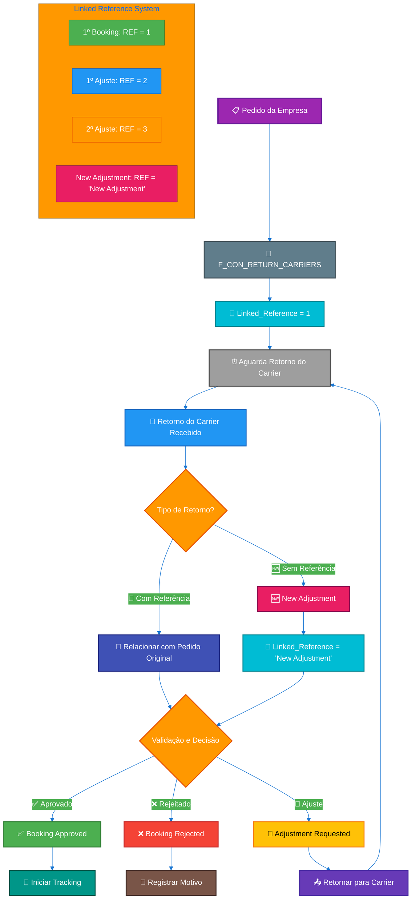
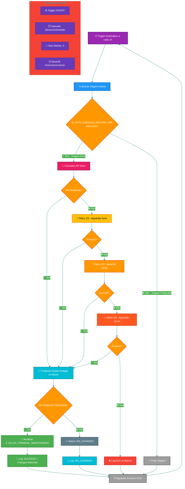
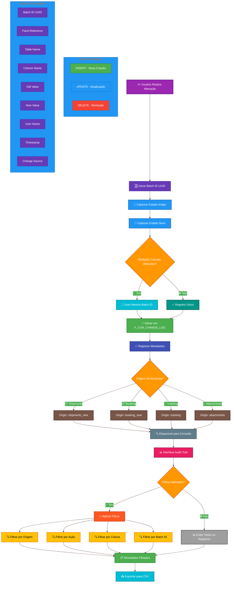
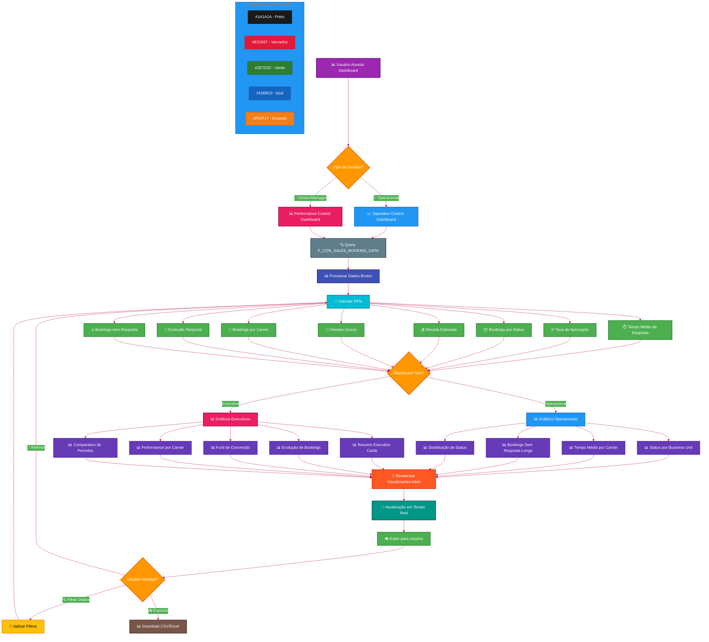

# 🎨 Fluxos Visuais do Sistema Farol

Este documento apresenta os principais fluxos de processos do Sistema Farol em formato visual interativo e colorido.

---

## 📊 Índice de Fluxos

1. [Fluxo Completo: Da Solicitação até Aprovação](#1-fluxo-completo-da-solicitação-até-aprovação)
2. [Fluxo de Processamento de PDF](#2-fluxo-de-processamento-de-pdf)
3. [Fluxo de Aprovação de Carrier](#3-fluxo-de-aprovação-de-carrier)
4. [Fluxo de Sincronização Automática Ellox](#4-fluxo-de-sincronização-automática-ellox)
5. [Fluxo de Autenticação e Sessão](#5-fluxo-de-autenticação-e-sessão)
6. [Fluxo de Audit Trail](#6-fluxo-de-audit-trail)
7. [Fluxo de Sistema de Splits](#7-fluxo-de-sistema-de-splits)
8. [Fluxo de Dashboards e Analytics](#8-fluxo-de-dashboards-e-analytics)
9. [Fluxo de Criação de Usuário](#9-fluxo-de-criação-de-usuário)

---

## 1. Fluxo Completo: Da Solicitação até Aprovação

> **Descrição**: Fluxo end-to-end desde a solicitação do booking até a aprovação final e tracking da viagem.

```mermaid
%%{init: {'theme':'base', 'themeVariables': { 'primaryColor':'#4CAF50','primaryTextColor':'#fff','primaryBorderColor':'#2E7D32','lineColor':'#1976D2','secondaryColor':'#FF9800','tertiaryColor':'#F44336'}}}%%
graph TD
    A[🆕 Solicitação do Booking]:::start --> B[📝 Criação no Farol]:::process
    B --> C[📋 Status: Cargill Shipment Requested]:::status
    C --> D[📤 Envio ao Carrier]:::action
    D --> E{Carrier Responde?}:::decision
    E -->|Sim| F[📨 Booking Request Recebido]:::success
    E -->|Não| G[⏰ Aguardando Resposta]:::waiting
    G --> E
    F --> H[📦 Status: Cargill Booking Request]:::status
    H --> I{Validação OK?}:::decision
    I -->|✅ Sim| J[✅ Booking Approved]:::success
    I -->|❌ Não| K[❌ Booking Rejected]:::error
    I -->|🔄 Ajuste| L[🔄 Adjustment Requested]:::warning
    L --> D
    J --> M[🚢 Tracking de Viagem]:::process
    M --> N[📍 Monitoramento Ellox API]:::integration
    N --> O[🏁 Viagem Concluída]:::end
    
    classDef start fill:#9C27B0,stroke:#6A1B9A,stroke-width:3px,color:#fff
    classDef end fill:#4CAF50,stroke:#2E7D32,stroke-width:3px,color:#fff
    classDef process fill:#2196F3,stroke:#1565C0,stroke-width:2px,color:#fff
    classDef decision fill:#FF9800,stroke:#E65100,stroke-width:2px,color:#fff
    classDef success fill:#4CAF50,stroke:#2E7D32,stroke-width:2px,color:#fff
    classDef error fill:#F44336,stroke:#C62828,stroke-width:2px,color:#fff
    classDef warning fill:#FFC107,stroke:#F57F17,stroke-width:2px,color:#000
    classDef status fill:#00BCD4,stroke:#00838F,stroke-width:2px,color:#fff
    classDef action fill:#3F51B5,stroke:#1A237E,stroke-width:2px,color:#fff
    classDef waiting fill:#9E9E9E,stroke:#424242,stroke-width:2px,color:#fff
    classDef integration fill:#E91E63,stroke:#880E4F,stroke-width:2px,color:#fff
```

### 📌 Legenda:
- 🟣 **Roxo**: Início do processo
- 🔵 **Azul**: Processamento/Ação
- 🟠 **Laranja**: Decisão/Validação
- 🟢 **Verde**: Sucesso/Aprovado
- 🔴 **Vermelho**: Erro/Rejeitado
- 🟡 **Amarelo**: Ajuste/Atenção
- 🔷 **Ciano**: Status intermediário
- ⚫ **Cinza**: Aguardando
- 🌸 **Rosa**: Integração externa

---

## 2. Fluxo de Processamento de PDF

> **Descrição**: Processo automatizado de extração de dados de PDFs de booking de 8 carriers diferentes.

```mermaid
%%{init: {'theme':'base', 'themeVariables': { 'primaryColor':'#2196F3','primaryTextColor':'#fff','primaryBorderColor':'#1565C0','lineColor':'#1976D2','secondaryColor':'#4CAF50','tertiaryColor':'#F44336'}}}%%
graph TD
    A[📄 Upload PDF Booking]:::start --> B{Carrier Identificado?}:::decision
    B -->|✅ Sim| C[🔍 Extração Automática]:::process
    B -->|❌ Não| D[❌ Carrier não suportado]:::error
    
    C --> E{Dados Válidos?}:::decision
    E -->|✅ Sim| F[🔗 Link com Farol Reference]:::process
    E -->|❌ Não| G[⚠️ Validação Manual]:::warning
    
    F --> H{PDF Duplicado?}:::decision
    H -->|❌ Não| I[💾 Salvar no Banco]:::success
    H -->|✅ Sim| J[🚫 Prevenção de Duplicidade]:::blocked
    
    I --> K[✅ Dados Disponíveis no Sistema]:::end
    G --> L[✏️ Correção Manual Necessária]:::manual
    L --> F
    
    J --> M[ℹ️ PDF já processado anteriormente]:::info
    
    subgraph "Carriers Suportados"
        N1[MAERSK]:::carrier
        N2[HAPAG-LLOYD]:::carrier
        N3[MSC]:::carrier
        N4[CMA CGM]:::carrier
        N5[COSCO]:::carrier
        N6[EVERGREEN]:::carrier
        N7[OOCL]:::carrier
        N8[PIL]:::carrier
    end
    
    classDef start fill:#9C27B0,stroke:#6A1B9A,stroke-width:3px,color:#fff
    classDef end fill:#4CAF50,stroke:#2E7D32,stroke-width:3px,color:#fff
    classDef process fill:#2196F3,stroke:#1565C0,stroke-width:2px,color:#fff
    classDef decision fill:#FF9800,stroke:#E65100,stroke-width:2px,color:#fff
    classDef success fill:#4CAF50,stroke:#2E7D32,stroke-width:2px,color:#fff
    classDef error fill:#F44336,stroke:#C62828,stroke-width:2px,color:#fff
    classDef warning fill:#FFC107,stroke:#F57F17,stroke-width:2px,color:#000
    classDef blocked fill:#E91E63,stroke:#880E4F,stroke-width:2px,color:#fff
    classDef manual fill:#FF5722,stroke:#BF360C,stroke-width:2px,color:#fff
    classDef info fill:#00BCD4,stroke:#00838F,stroke-width:2px,color:#fff
    classDef carrier fill:#673AB7,stroke:#4527A0,stroke-width:1px,color:#fff
```

### 🎯 Campos Extraídos Automaticamente:
- Booking Reference
- Vessel Name & Voyage
- Container Quantity
- POL (Port of Loading)
- POD (Port of Discharge)
- ETD/ETA
- Transhipment Port
- PDF Emission Date

---

## 3. Fluxo de Aprovação de Carrier

> **Descrição**: Sistema de controle de pedidos de alteração e aprovação de retornos de carriers.



### 📊 Status Possíveis:
- **Booking Requested**: Pedido enviado ao carrier
- **Received from Carrier**: Retorno recebido, aguardando validação
- **Booking Approved**: Aprovado e confirmado
- **Booking Rejected**: Rejeitado com justificativa
- **Adjustment Requested**: Solicitação de ajuste enviada

---

## 4. Fluxo de Sincronização Automática Ellox

> **Descrição**: Sistema de sincronização automática que consulta a API Ellox a cada hora para atualizar dados de tracking.



### 🔧 Campos Monitorados:
- ETD (Estimated Time of Departure)
- ETB (Estimated Time of Berthing)
- ATB (Actual Time of Berthing)
- ATD (Actual Time of Departure)
- ETA (Estimated Time of Arrival)
- ATA (Actual Time of Arrival)
- Container Gate Opening
- Draft Deadline

---

## 5. Fluxo de Autenticação e Sessão

> **Descrição**: Sistema seguro de autenticação com JWT, cookies HTTP e sessões persistentes de 8 horas.

```mermaid
%%{init: {'theme':'base', 'themeVariables': { 'primaryColor':'#673AB7','primaryTextColor':'#fff','primaryBorderColor':'#4527A0','lineColor':'#5E35B1','secondaryColor':'#4CAF50','tertiaryColor':'#F44336'}}}%%
graph TD
    A[👤 Usuário Acessa Sistema]:::start --> B{Tem Cookie JWT?}:::decision
    B -->|✅ Sim| C[🔐 Validar JWT Token]:::validate
    B -->|❌ Não| D[📝 Exibir Tela de Login]:::login
    
    C --> E{JWT Válido e não Expirado?}:::decision
    E -->|✅ Sim| F[✅ Restaurar Sessão Automaticamente]:::restore
    E -->|❌ Não| D
    
    D --> G[📧 Inserir Username + Senha]:::input
    G --> H[🔍 Verificar Credenciais no Oracle]:::check
    
    H --> I{Credenciais Corretas?}:::decision
    I -->|✅ Sim| J[🔐 Gerar JWT Token UUID]:::generate
    I -->|❌ Não| K[❌ Erro: Usuário ou senha incorretos]:::error
    
    J --> L[🍪 Criar Cookie HTTP Seguro]:::cookie
    L --> M[💾 Salvar Session State]:::session
    M --> N[📝 Atualizar LAST_LOGIN no Oracle]:::updatedb
    N --> O[✅ Acesso Concedido ao Sistema]:::success
    
    F --> O
    
    O --> P[🏠 Interface Principal do Farol]:::interface
    P --> Q{Ação do Usuário}:::decision
    
    Q -->|🚪 Logout Manual| R[🗑️ Destruir Sessão]:::logout
    Q -->|⏰ 8h Expiradas| R
    Q -->|🔄 Continuar Usando| P
    
    R --> S[🗑️ Limpar Cookie HTTP]:::clean
    S --> T[🗑️ Deletar Session JSON]:::delete
    T --> U[📝 Limpar Session State]:::clear
    U --> D
    
    K --> D
    
    subgraph "Níveis de Acesso"
        ACC1[👁️ VIEW - Visualização]:::view
        ACC2[✏️ EDIT - Edição]:::edit
        ACC3[⚙️ ADMIN - Administrador]:::admin
    end
    
    subgraph "Business Units"
        BU1[🌾 Cotton]:::bu
        BU2[🍔 Food]:::bu
        BU3[🌍 Todas]:::bu
    end
    
    classDef start fill:#9C27B0,stroke:#6A1B9A,stroke-width:3px,color:#fff
    classDef decision fill:#FF9800,stroke:#E65100,stroke-width:2px,color:#fff
    classDef validate fill:#2196F3,stroke:#1565C0,stroke-width:2px,color:#fff
    classDef login fill:#00BCD4,stroke:#00838F,stroke-width:2px,color:#fff
    classDef restore fill:#4CAF50,stroke:#2E7D32,stroke-width:2px,color:#fff
    classDef input fill:#673AB7,stroke:#4527A0,stroke-width:2px,color:#fff
    classDef check fill:#3F51B5,stroke:#1A237E,stroke-width:2px,color:#fff
    classDef generate fill:#009688,stroke:#004D40,stroke-width:2px,color:#fff
    classDef cookie fill:#795548,stroke:#3E2723,stroke-width:2px,color:#fff
    classDef session fill:#607D8B,stroke:#37474F,stroke-width:2px,color:#fff
    classDef updatedb fill:#00BCD4,stroke:#00838F,stroke-width:2px,color:#fff
    classDef success fill:#4CAF50,stroke:#2E7D32,stroke-width:2px,color:#fff
    classDef error fill:#F44336,stroke:#C62828,stroke-width:2px,color:#fff
    classDef interface fill:#E91E63,stroke:#880E4F,stroke-width:2px,color:#fff
    classDef logout fill:#FF5722,stroke:#BF360C,stroke-width:2px,color:#fff
    classDef clean fill:#9E9E9E,stroke:#424242,stroke-width:2px,color:#fff
    classDef delete fill:#757575,stroke:#212121,stroke-width:2px,color:#fff
    classDef clear fill:#BDBDBD,stroke:#616161,stroke-width:2px,color:#000
    classDef view fill:#4CAF50,stroke:#2E7D32,stroke-width:1px,color:#fff
    classDef edit fill:#2196F3,stroke:#1565C0,stroke-width:1px,color:#fff
    classDef admin fill:#F44336,stroke:#C62828,stroke-width:1px,color:#fff
    classDef bu fill:#FF9800,stroke:#E65100,stroke-width:1px,color:#fff
```



### 🔒 Segurança Implementada:
- Hash bcrypt para senhas
- JWT com 8 horas de validade
- Cookies HTTP-only e Secure
- Proteção CSRF
- Isolamento de sessões por navegador
- Limpeza automática de sessões expiradas

---

## 6. Fluxo de Audit Trail

> **Descrição**: Sistema completo de auditoria que rastreia todas as mudanças com Batch ID para agrupar alterações relacionadas.



### 📊 Benefícios do Batch ID:
- **Rastreabilidade**: Todas as mudanças de uma ação agrupadas
- **Análise**: Fácil identificação de padrões de alteração
- **Auditoria**: Histórico completo e navegável
- **Compliance**: Atende requisitos de auditoria corporativa

---

## 7. Fluxo de Sistema de Splits

> **Descrição**: Processo de divisão de bookings em múltiplos embarques menores.

```mermaid
%%{init: {'theme':'base', 'themeVariables': { 'primaryColor':'#FF5722','primaryTextColor':'#fff','primaryBorderColor':'#BF360C','lineColor':'#E64A19','secondaryColor':'#4CAF50','tertiaryColor':'#2196F3'}}}%%
graph TD
    A[📦 Booking Original]:::original --> B[🔀 Usuário Solicita Split]:::request
    B --> C[📝 Interface de Split]:::interface
    
    C --> D[📋 Definir Número de Splits]:::define
    D --> E[📊 Distribuir Containers]:::distribute
    E --> F[📝 Preencher Detalhes de Cada Split]:::details
    
    F --> G{Validação de Dados}:::decision
    G -->|❌ Erro| H[⚠️ Soma de Containers Incorreta]:::error
    G -->|❌ Erro| I[⚠️ Campos Obrigatórios Vazios]:::error
    G -->|✅ OK| J[✅ Validação Passou]:::success
    
    H --> C
    I --> C
    
    J --> K[🔢 Calcular Linked References]:::calculate
    K --> L[💾 Criar Novos Registros]:::create
    
    L --> M[📋 Split 1]:::split1
    L --> N[📋 Split 2]:::split2
    L --> O[📋 Split N]:::splitn
    
    M --> P[🔗 Linked_Reference = 2]:::ref
    N --> Q[🔗 Linked_Reference = 3]:::ref
    O --> R[🔗 Linked_Reference = N+1]:::ref
    
    P --> S[💾 Inserir em F_CON_RETURN_CARRIERS]:::database
    Q --> S
    R --> S
    
    S --> T[📝 Log de Auditoria]:::audit
    T --> U[✅ Split Concluído com Sucesso]:::end
    
    U --> V[📊 Atualizar Dashboards]:::dashboard
    V --> W[🔔 Notificar Usuário]:::notify
    
    subgraph "Exemplo de Split"
        EX1[Original: 20 containers]:::example
        EX2[Split 1: 8 containers REF=2]:::example
        EX3[Split 2: 7 containers REF=3]:::example
        EX4[Split 3: 5 containers REF=4]:::example
    end
    
    subgraph "Campos Copiados"
        FC1[Vessel Name]:::field
        FC2[Voyage Code]:::field
        FC3[Carrier]:::field
        FC4[POL/POD]:::field
        FC5[ETD/ETA]:::field
    end
    
    classDef original fill:#9C27B0,stroke:#6A1B9A,stroke-width:3px,color:#fff
    classDef request fill:#673AB7,stroke:#4527A0,stroke-width:2px,color:#fff
    classDef interface fill:#3F51B5,stroke:#1A237E,stroke-width:2px,color:#fff
    classDef define fill:#2196F3,stroke:#1565C0,stroke-width:2px,color:#fff
    classDef distribute fill:#00BCD4,stroke:#00838F,stroke-width:2px,color:#fff
    classDef details fill:#009688,stroke:#004D40,stroke-width:2px,color:#fff
    classDef decision fill:#FF9800,stroke:#E65100,stroke-width:2px,color:#fff
    classDef error fill:#F44336,stroke:#C62828,stroke-width:2px,color:#fff
    classDef success fill:#4CAF50,stroke:#2E7D32,stroke-width:2px,color:#fff
    classDef calculate fill:#FFC107,stroke:#F57F17,stroke-width:2px,color:#000
    classDef create fill:#FF5722,stroke:#BF360C,stroke-width:2px,color:#fff
    classDef split1 fill:#4CAF50,stroke:#2E7D32,stroke-width:2px,color:#fff
    classDef split2 fill:#2196F3,stroke:#1565C0,stroke-width:2px,color:#fff
    classDef splitn fill:#FF9800,stroke:#E65100,stroke-width:2px,color:#fff
    classDef ref fill:#00BCD4,stroke:#00838F,stroke-width:2px,color:#fff
    classDef database fill:#607D8B,stroke:#37474F,stroke-width:2px,color:#fff
    classDef audit fill:#795548,stroke:#3E2723,stroke-width:2px,color:#fff
    classDef end fill:#4CAF50,stroke:#2E7D32,stroke-width:3px,color:#fff
    classDef dashboard fill:#E91E63,stroke:#880E4F,stroke-width:2px,color:#fff
    classDef notify fill:#9C27B0,stroke:#6A1B9A,stroke-width:2px,color:#fff
    classDef example fill:#673AB7,stroke:#4527A0,stroke-width:1px,color:#fff
    classDef field fill:#00BCD4,stroke:#00838F,stroke-width:1px,color:#fff
```

### ⚙️ Casos de Uso de Split:
1. **Mudança de Navio**: Container não cabe na viagem original
2. **Múltiplos Destinos**: Carga vai para portos diferentes
3. **Múltiplas Datas**: Embarques em datas diferentes
4. **Ajuste de Quantidade**: Redução de volume solicitado

---

## 8. Fluxo de Dashboards e Analytics

> **Descrição**: Sistema de dashboards operacional e executivo com KPIs em tempo real.



### 📊 KPIs Principais:

**Operation Control:**
- Tempo médio de resposta do carrier
- Taxa de aprovação de bookings
- Bookings sem resposta do carrier
- Distribuição de status

**Performance Control:**
- Clientes únicos (com comparação período anterior)
- Freight rate médio
- Receita estimada
- Funil de conversão
- Performance por carrier

---

## 9. Fluxo de Criação de Usuário

> **Descrição**: Processo de criação e gerenciamento de usuários com validação e limpeza automática de formulário.

```mermaid
%%{init: {'theme':'base', 'themeVariables': { 'primaryColor':'#00BCD4','primaryTextColor':'#fff','primaryBorderColor':'#00838F','lineColor':'#0097A7','secondaryColor':'#4CAF50','tertiaryColor':'#F44336'}}}%%
graph TD
    A[⚙️ Admin Acessa Administração]:::start --> B[➕ Clicar em Novo Usuário]:::action
    B --> C[📝 Exibir Formulário Vazio]:::form
    
    C --> D[✍️ Admin Preenche Dados]:::input
    D --> E[📋 Username]:::field
    D --> F[📧 Email]:::field
    D --> G[👤 Nome Completo]:::field
    D --> H[🔐 Senha Inicial]:::field
    D --> I[🏢 Business Unit]:::field
    D --> J[🔑 Nível de Acesso]:::field
    
    E --> K[✅ Clicar em Criar Usuário]:::submit
    F --> K
    G --> K
    H --> K
    I --> K
    J --> K
    
    K --> L{Validações}:::decision
    
    L -->|❌ Campos vazios| M1[❌ Erro: Preencha todos os campos]:::error
    L -->|❌ Senha < 6 chars| M2[❌ Erro: Senha muito curta]:::error
    L -->|❌ Username existe| M3[❌ Erro: Username já existe]:::error
    L -->|❌ Email existe| M4[❌ Erro: Email já existe]:::error
    L -->|✅ Tudo OK| N[💾 Criar Usuário no Oracle]:::create
    
    M1 --> O[🔄 Manter dados no formulário]:::keep
    M2 --> O
    M3 --> O
    M4 --> O
    O --> D
    
    N --> P{Criação OK?}:::decision
    P -->|❌ Erro DB| Q[❌ Erro ao criar usuário]:::dberror
    P -->|✅ Sucesso| R[🔢 Incrementar form_counter]:::increment
    
    Q --> O
    
    R --> S[🗑️ Limpar Cache]:::cache
    S --> T[✨ Gerar Nova Chave do Formulário]:::newkey
    T --> U[🆕 Renderizar Formulário Vazio]:::newform
    
    U --> V[✅ Sucesso Exibido]:::success
    V --> W[🎈 Balloons Animation]:::balloons
    W --> X[📋 Lista de Usuários Atualizada]:::list
    
    X --> Y{Admin Quer Criar Outro?}:::decision
    Y -->|Sim| C
    Y -->|Não| Z[✓ Finalizar]:::end
    
    subgraph "Níveis de Acesso Disponíveis"
        AC1[👁️ VIEW - Visualização]:::level
        AC2[✏️ EDIT - Edição]:::level
        AC3[⚙️ ADMIN - Administrador]:::level
    end
    
    subgraph "Processo de Limpeza"
        CL1[form_counter = N]:::clean
        CL2[Sucesso: counter = N+1]:::clean
        CL3[Erro: counter = N]:::clean
        CL4[form_key = create_user_form_N]:::clean
        CL5[input_key = create_username_N]:::clean
    end
    
    classDef start fill:#9C27B0,stroke:#6A1B9A,stroke-width:3px,color:#fff
    classDef action fill:#673AB7,stroke:#4527A0,stroke-width:2px,color:#fff
    classDef form fill:#3F51B5,stroke:#1A237E,stroke-width:2px,color:#fff
    classDef input fill:#2196F3,stroke:#1565C0,stroke-width:2px,color:#fff
    classDef field fill:#00BCD4,stroke:#00838F,stroke-width:2px,color:#fff
    classDef submit fill:#009688,stroke:#004D40,stroke-width:2px,color:#fff
    classDef decision fill:#FF9800,stroke:#E65100,stroke-width:2px,color:#fff
    classDef error fill:#F44336,stroke:#C62828,stroke-width:2px,color:#fff
    classDef create fill:#4CAF50,stroke:#2E7D32,stroke-width:2px,color:#fff
    classDef keep fill:#FFC107,stroke:#F57F17,stroke-width:2px,color:#000
    classDef dberror fill:#FF5722,stroke:#BF360C,stroke-width:2px,color:#fff
    classDef increment fill:#00BCD4,stroke:#00838F,stroke-width:2px,color:#fff
    classDef cache fill:#607D8B,stroke:#37474F,stroke-width:2px,color:#fff
    classDef newkey fill:#3F51B5,stroke:#1A237E,stroke-width:2px,color:#fff
    classDef newform fill:#2196F3,stroke:#1565C0,stroke-width:2px,color:#fff
    classDef success fill:#4CAF50,stroke:#2E7D32,stroke-width:2px,color:#fff
    classDef balloons fill:#E91E63,stroke:#880E4F,stroke-width:2px,color:#fff
    classDef list fill:#00BCD4,stroke:#00838F,stroke-width:2px,color:#fff
    classDef end fill:#4CAF50,stroke:#2E7D32,stroke-width:3px,color:#fff
    classDef level fill:#673AB7,stroke:#4527A0,stroke-width:1px,color:#fff
    classDef clean fill:#00BCD4,stroke:#00838F,stroke-width:1px,color:#fff
```

### 🔑 Regras de Validação:
- **Username**: Único no sistema
- **Email**: Único e formato válido
- **Senha**: Mínimo 6 caracteres
- **Campos obrigatórios**: Username, Email, Nome, Senha
- **Hash bcrypt**: Aplicado automaticamente na criação

---

## 📖 Glossário de Cores

| Cor | Significado | Uso |
|-----|-------------|-----|
| 🟣 **Roxo** | Início | Pontos de entrada do processo |
| 🔵 **Azul** | Processamento | Ações e transformações |
| 🟠 **Laranja** | Decisão | Pontos de validação/decisão |
| 🟢 **Verde** | Sucesso | Operações bem-sucedidas |
| 🔴 **Vermelho** | Erro | Falhas e rejeições |
| 🟡 **Amarelo** | Atenção | Ajustes e warnings |
| 🔷 **Ciano** | Status | Estados intermediários |
| ⚫ **Cinza** | Aguardando | Processos em espera |
| 🌸 **Rosa** | Integração | Chamadas externas/API |
| 🟤 **Marrom** | Auditoria | Logs e rastreamento |

---

## 🎯 Como Usar Este Documento

### Para Apresentações:
1. Copie o código Mermaid desejado
2. Cole em [Mermaid Live Editor](https://mermaid.live/)
3. Exporte como PNG/SVG
4. Inclua nos slides

### Para Documentação:
- Cole diretamente em GitHub/GitLab
- Use em Notion, Confluence, Obsidian
- Renderiza automaticamente

### Para Treinamento:
- Use como material didático
- Explique cada etapa do fluxo
- Mostre relação com interface real

---

## 📝 Notas Importantes

- **Todos os fluxos são baseados na implementação real** do Sistema Farol v1.0.0
- **As cores seguem padrão consistente** para facilitar compreensão
- **Os diagramas são interativos** e podem ser editados conforme necessidade
- **Subgrafos destacam informações complementares** relevantes

---

**Documento criado para apresentação do Sistema Farol**  
**Versão**: 1.0.0  
**Data**: 2025-10-06  
**Autor**: Diego Moura  

🙏 **Que Deus abençoe sua apresentação!**

