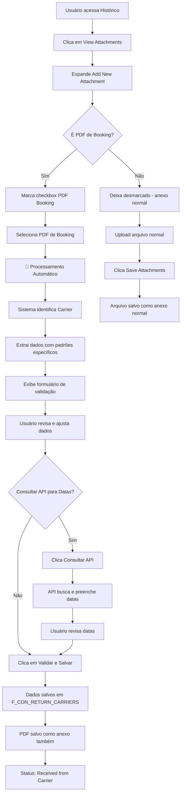

# 📄 PDF Booking Processor - Guia de Uso

## ✅ Funcionalidade Implementada

O sistema agora possui uma funcionalidade completa para processamento automático de PDFs de Booking recebidos por e-mail, integrando perfeitamente com o sistema de anexos existente.

## 🚀 Como Usar

### 1. **Acesso à Funcionalidade**
- Na tela de **Histórico** (`history.py`), clique no botão **"📎 View Attachments"**
- Expanda a seção **"📤 Add New Attachment"**

### 2. **Upload e Processamento do PDF**
1. **Marque o checkbox**: "📄 Este é um PDF de Booking para processamento automático"
2. **Selecione o arquivo**: O uploader mudará para "📄 Selecione o PDF de Booking" (apenas PDFs)
3. **Processamento automático**: O sistema processa automaticamente ao selecionar o arquivo (sem precisar clicar em botão)

### 2.1. **Upload de Outros Arquivos**
- **Deixe desmarcado** o checkbox para enviar outros tipos de arquivo (Word, Excel, imagens, etc.)
- Use "💾 Save Attachments" para arquivos normais

### 3. **Validação dos Dados Extraídos**
O sistema exibirá uma interface de validação com os dados extraídos:

#### **🚢 Informações do Navio**
- **Carrier/Armador**: Identificação automática (HAPAG-LLOYD, MAERSK, MSC, etc.)
- **Nome do Navio**: Extraído automaticamente do PDF
- **Voyage**: Código da viagem
- **Booking Reference**: Referência do booking do armador

#### **📦 Informações da Carga**
- **Quantidade de Containers**: Número extraído do PDF
- **Porto de Origem (POL)**: Port of Loading
- **Porto de Destino (POD)**: Port of Discharge

#### **📅 Datas Importantes e de Navegação**
Após extrair os dados do PDF, o sistema permite consultar a API Ellox para preencher automaticamente as datas:

**Datas Importantes:**
- **⏳ Deadline**: Prazo final
- **📝 Draft Deadline**: Prazo de rascunho
- **🚪 Abertura Gate**: Data de abertura do portão
- **🧊 Abertura Gate Reefer**: Data de abertura do portão reefer

**Datas de Navegação:**
- **🚢 ETD**: Estimated Time of Departure
- **🎯 ETA**: Estimated Time of Arrival
- **🛳️ ETB**: Estimativa Atracação
- **✅ ATB**: Atracação
- **📤 ATD**: Partida
- **📥 ATA**: Chegada

### 4. **Validação e Salvamento**
1. **Revise os dados**: Verifique se as informações extraídas estão corretas
2. **Ajuste se necessário**: Edite qualquer campo que precise de correção
3. **Consultar API (opcional)**: Clique em "🔍 Consultar API para Datas" para preencher automaticamente as datas
4. **Salve**: Clique em "✅ Validar e Salvar" para confirmar

### 5. **Resultado**
- Os dados são salvos na tabela `F_CON_RETURN_CARRIERS`
- Status automaticamente definido como **"Received from Carrier"**
- Registro fica disponível na tela de histórico

## 🎯 Carriers Suportados

### **Identificação Automática**
O sistema identifica automaticamente os seguintes armadores:

#### 🎯 **MAERSK** (Totalmente Implementado)
- **Booking Reference**: Extrai números de 9 dígitos (ex: 243601857)
- **Vessel Name**: Extrai do padrão MVS (Marine Vessel Schedule)
- **Voyage**: Extrai código da viagem (ex: 442E, 435B)
- **Quantity**: Extrai quantidade de containers (ex: 13, 21, 2)
- **POL**: Extrai porto de origem do campo "From:"
- **POD**: Extrai porto de destino do campo "To:"
- **ETD/ETA**: Extrai datas do padrão MVS (YYYY-MM-DD)
- **Cargo Type**: Extrai tipo de carga (ex: "Cot")
- **Document Type**: Identifica tipo do documento (Booking Amendment, Confirmation, etc.)
- **Gross Weight**: Extrai peso bruto em KGS

#### 🔧 **HAPAG-LLOYD** (Em Desenvolvimento)
- Padrões específicos para documentos da Hapag-Lloyd

#### 🔧 **MSC** (Em Desenvolvimento)
- Padrões específicos para documentos da MSC

#### 🔧 **Outros Carriers** (Em Desenvolvimento)
- **CMA CGM**: Padrões genéricos
- **COSCO**: Padrões genéricos
- **EVERGREEN**: Padrões genéricos
- **GENERIC**: Padrões genéricos para outros armadores

### **Padrões de Extração**
Cada armador possui padrões específicos de extração otimizados para seus formatos de PDF.

#### 🎯 **MAERSK - Padrões MVS Implementados**
- **Regex Patterns**: Padrões específicos para documentos Maersk com formato MVS
- **Limpeza de Dados**: Remove quebras de linha e texto extra
- **Normalização**: Formata campos de porto para "Cidade,Estado,País"
- **Extração Inteligente**: Identifica automaticamente tipo de documento

## 🔧 Recursos Técnicos

### **Extração Inteligente**
- **Regex Patterns**: Padrões específicos por armador
- **Normalização**: Limpeza e formatação automática dos dados
- **Validação**: Verificação de tipos de dados (datas, números, etc.)

### **Interface de Usuário**
- **Validação Visual**: Interface amigável para revisão
- **Campos Editáveis**: Possibilidade de ajustar dados extraídos
- **Feedback Visual**: Indicadores de sucesso/erro

### **Integração**
- **Sistema de Anexos**: Totalmente integrado ao sistema existente
- **Banco de Dados**: Inserção direta na `F_CON_RETURN_CARRIERS`
- **Status Management**: Definição automática de status

## 📋 Campos Extraídos e Mapeados

| Campo PDF | Campo Sistema | Descrição |
|-----------|---------------|-----------|
| Booking Reference | Splitted Booking Reference | Referência do armador |
| Vessel Name | Vessel Name | Nome da embarcação |
| Voyage | Voyage Code | Código da viagem |
| Carrier | Voyage Carrier | Nome do armador |
| Quantity | Quantity of Containers | Número de containers |
| POL | Port of Loading POL | Porto de origem |
| POD | Port of Delivery POD | Porto de destino |
| ETD | ETD | Data de partida |
| ETA | ETA | Data de chegada |

## ⚠️ Requisitos Técnicos

### **Dependências**
- **PyPDF2**: Biblioteca para extração de texto de PDFs
- **Streamlit**: Framework da interface
- **Pandas**: Manipulação de dados
- **SQLAlchemy**: Conexão com banco de dados

### **Instalação**
```bash
pip install PyPDF2
```

## 🎉 Benefícios

### **Automação**
- ✅ **Processamento automático** ao selecionar PDF (sem botão extra)
- ✅ **Extração automática** de dados de PDFs
- ✅ **Identificação inteligente** de armadores
- ✅ **Normalização** automática de dados
- ✅ **Consulta à API Ellox** para preenchimento automático de datas

### **Eficiência**
- ✅ **Reduz tempo** de entrada manual de dados
- ✅ **Minimiza erros** de digitação
- ✅ **Padroniza informações**

### **Integração**
- ✅ **Totalmente integrado** ao sistema de anexos existente
- ✅ **Interface única** para todos os tipos de arquivo
- ✅ **Fluxo intuitivo** com flag de seleção
- ✅ **Mantém** compatibilidade com anexos normais

## 🔄 Fluxo Completo



## 📞 Suporte

Para dúvidas ou problemas:
1. Verifique se o PyPDF2 está instalado
2. Confirme que o PDF contém texto extraível (não é apenas imagem)
3. Teste com PDFs de diferentes armadores
4. Verifique os logs do sistema para erros específicos

---

## 🔄 Mudanças Recentes (Última Atualização)

### **Melhorias Implementadas**

1. **Processamento Automático**
   - Ao selecionar um PDF, o processamento inicia automaticamente
   - Não é mais necessário clicar em "Process Booking PDF"
   - Sistema detecta arquivo novo via hash MD5

2. **Consulta à API Ellox**
   - Botão "Consultar API para Datas" dentro do formulário
   - Preenche automaticamente todas as datas importantes e de navegação
   - Consulta ocorre apenas ao clicar no botão (não automática)

3. **Formulário Unificado**
   - Formulário único com seção de dados + botão de consulta + seção de datas
   - Interface mais limpa e intuitiva
   - Botões: "🔍 Consultar API para Datas" e "✅ Validar e Salvar"

4. **Limpeza de Cache**
   - Ao trocar de PDF, dados antigos são limpos automaticamente
   - Campos sempre refletem o PDF atual

---

**🎯 A funcionalidade está pronta para uso e totalmente integrada ao sistema existente!**
